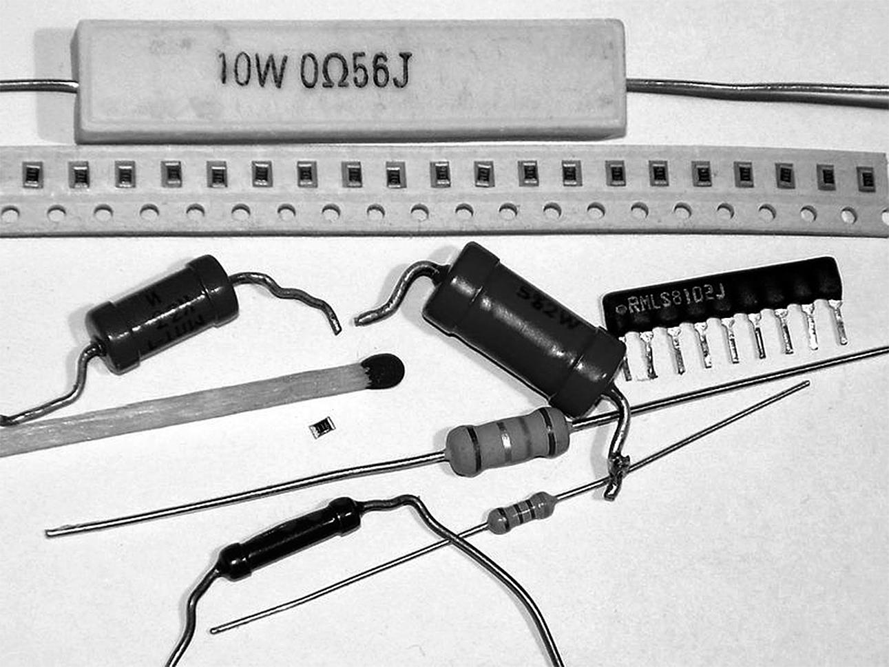

### 1.4.2 {#1-4-2}

Rezistory

Další součástky, bez nichž se neobejdete, jsou rezistory. Dříve se jim říkalo také „odpory“. Jenže odpor je označení fyzikální veličiny (jednotka je ohm, značíme Ω), a pak to špatně vypadá, když říkáte „odpor s odporem 100 ohmů“. Asi jako „dvoumetrový metr“. Proto se používá označení „rezistor“.

Rezistory se třídí do různých skupin – podle výkonu, podle přesnosti, podle výrobní technologie... Pro naše potřeby postačí ty nejmenší, nejobyčejnější a nejlevnější, takže něco jako „uhlíkový rezistor 0,25 W“ nebo „metalizovaný rezistor 0,25 W“. V kusovém množství to jsou korunové položky. Existuje ale možnost nakoupit celé sady rezistorů, třeba 100–200 kusů s různými hodnotami odporů. Při nákupu z Číny vás celá taková sada vyjde třeba na dvacet korun (ovšem dodací lhůta je nepoměrně delší).

Pořiďte si pro první pokusy rezistory o odporu 330 ohmů (označují se 330R), 1000 ohmů (1K) a 10 000 ohmů (10K). Kdo chce, pořídí si i 220R, 2K2, 4K7, 22K, ať můžeme experimentovat. Od každé velikosti tak deset kusů, ale víc se rozhodně neztratí. (O značení a jednotkách si za chvíli povíme víc.)

