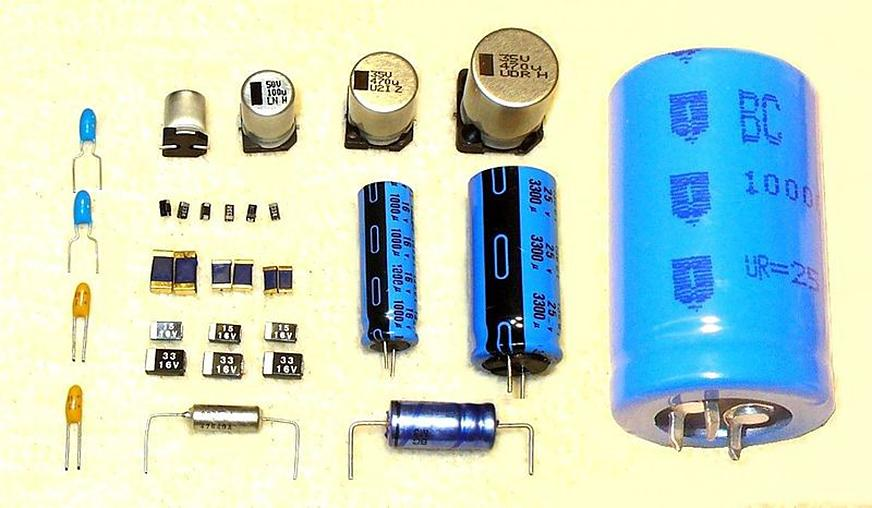

### 1.4.3 {#1-4-3}

Kondenzátory

Kromě rezistorů budete potřebovat i kondenzátory. Základní vlastností kondenzátorů je jejich kapacita, která se měří ve faradech (značíme F). Ještě začátkem 90\. let platilo, že nejčastější kapacity se udávají v pikofaradech, nanofaradech a mikrofaradech (bilióntina, miliardtina, milióntina), ovšem dnes jsou dostupné kondenzátory s kapacitou stovek faradů. V číslicové technice takové velké kapacity můžeme použít k napájení obvodů při výpadku, ale vy je teď potřebovat nebudete. Vystačíte si pro začátek s kapacitami 33 pikofaradů (pF), 100 nanofaradů (nF) a 10 mikrofaradů (µF; u tohoto se nenechte vylekat tím, že bude označený jako „elektrolytický“). Setkáte se taky se starším označením 33, 100K a 10M. Opět vezměte ty nejlevnější, na experimenty budou stačit. Kapacity 33 pF a 100 nF vypadají jako malý polštářek, 10 μf vypadá jako váleček.

