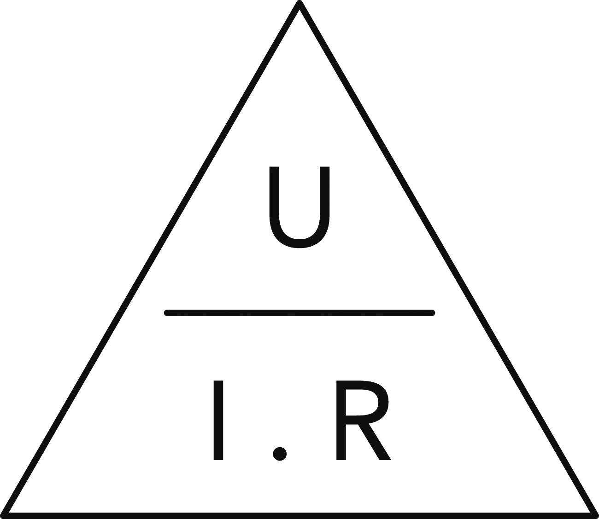

### 1.4.4 {#1-4-4}

Integrované obvody

A když už jsme v tom, tak si kupte i dva integrované obvody. Jeden má označení 74HCT00, druhý 74HCT04\. Pokud nebude k dispozici HCT, kupte klidně LS nebo ALS (74LS00, 74ALS04, …) Pozor! Vybírejte takové, které jsou v pouzdře DIL (někdy značeno jako DIP). Takové můžete zastrčit do nepájivého kontaktního pole. Vyhněte se pouzdrům SO, ty jsou určené pro povrchovou montáž pájením.

Později budete potřebovat i další součástky – tranzistory, diody, integrované obvody. Jejich seznam najdete na konci knihy, abyste nemuseli kupovat každou součástku zvlášť. Teď si vystačíme s tím, co je výše napsané. Vážně!

Pojďme si tedy postavit ten blikač...

2

Postavte si blikač – teď už to snad půjde lépe

2

Postavte si blikač – teď už to snad půjde lépe

Budete potřebovat:

•

Integrovaný obvod 7404 (v té variantě, jakou máte, tedy i 74LS04, 74ALS04, 74HCT04)

•

Elektrolytický kondenzátor 10 μF

•

Rezistor 330 Ω

•

Rezistor 10 kΩ

•

LED libovolné barvy

•

Nepájivé kontaktní pole

•

Napájecí obvod

•

Propojovací kabely (Poslední tři položky budete potřebovat vždy, tak už je nebudu opakovat)

Bez dalšího vysvětlování si pojďte poskládat obvod na nepájivém kontaktním poli. Výsledek bude vypadat nějak takto:

Nejprve se podívejte na nepájivé kontaktní pole. Všimněte si, jak je toto pole uspořádané. Nahoře a dole (z tohoto pohledu) jsou dvě oddělené lišty, označené červeným a modrým proužkem. To jsou napájecí lišty, které slouží k rozvádění napájecího napětí do obvodu. Jsou uspořádané do pětic a jsou spolu uvnitř pole vodivě propojeny horizontálně, jak je naznačeno na následujícím obrázku.

Střední část pole je uspořádána jinak – zde je horní a dolní polovina, a v nich jsou vždy jednotlivé pětice otvorů propojeny svisle (a-b-c-d-e, f-g-h-i-j). Je to výhodné uspořádání pro součástky, které mají dvě řady vývodů, jako náš integrovaný obvod 7404\. Takový obvod přesně sedne doprostřed, a každý jeho vývod je připojen ke čtyřem dalším otvorům, takže máte dostatečný prostor na propojování.

Než vytáhnete integrovaný obvod z obalu, tak se nejprve uzemněte. Sáhněte třeba na radiátor. Statická elektřina je prevít a některé citlivé obvody můžete zničit tím, že na ně sáhnete. Pokud máte 74ALS04 nebo 74LS04, tak ty tak citlivé nejsou, ale některé řady (74HCT04) a bez výjimky všechny složitější obvody jsou na statickou elektřinu velmi citlivé. Proto se většinou prodávají zapíchané v proužku vodivé pěny, která udržuje všechny vývody propojené, a tudíž se nestane, že by na jednom vývodu bylo velmi vysoké napětí oproti ostatním.

Jste uzemněni? Tak se podívejte na integrovaný obvod. Jsou na něm nejčastěji různé značky výrobce (ST, TI, F), pak čísla výrobních sérií, země původu, a někde mezi tím bude skryto i to označení 7404\. U mne to je konkrétně T74LS04B1\. „T“ označuje výrobce, 74LS04 je typ obvodu a technologie, a B1 je upřesňující označení – teplotní rozsah, pouzdro atd.

Vývody integrovaného obvodu jsou očíslované od 1, jenže na pouzdru tato čísla nikde nejsou. Proto si pamatujte základní poučky, jak zjistit orientaci:

•

Když si dáte obvod tak, aby označení bylo čitelné, tak většinou (ne vždy!) bývá vývod číslo 1 vlevo dole. Ale toto pravidlo není stoprocentně spolehlivé.

•

Podívejte se na pouzdro. Na jedné z kratších stran bude značka – vlys, výbrus, malý žlábek, … Když držíte pouzdro tak, aby tato značka byla vlevo, tak je vývod číslo 1 zase vlevo dole.

•

Někdy výrobce i na tuto značku kašle, a místo toho označí nějak vývod 1\. Buď barevnou tečkou, nebo třeba miniaturním důlkem.

•

Když všechno selže, podívejte se do datasheetu. Později si vysvětlíme, co to datasheet je.

Když víte, jak je obvod orientovaný, tak ho zasuňte do pole tak, jak je nakresleno na úvodním obrázku. Nepůjde to, vývody trochu nepasují – je to proto, že vývody jsou z výroby lehce „rozkročené“. Proto je decentním tlakem z obou stran o trochu narovnejte, aby byly rovnoběžné. Já k tomu používám plochu stolu. Stačí opravdu maličko. Pak obvod půjde bez problémů zasunout do nepájivého kontaktního pole. Zasuňte ho tak, aby vývod 1 byl vlevo dole, třeba v otvoru „10e“. Je to jedno, ale aspoň se v tom lépe vyznáte.

Máte-li vývod 1 vlevo dole, tak číslování pokračuje proti směru hodinových ručiček – napravo od 1 je 2, pak 3, 4, až k vývodu číslo 7\. Naproti němu je vývod číslo 8 (vpravo nahoře), a číslování pokračuje až k vývodu 14 (vlevo nahoře). Obvod 7404 totiž používá čtrnáctivývodové pouzdro (značí se DIL14 nebo DIP14). Některé obvody mají pouzdra větší – 16 vývodů, 24 vývodů, 28, 40, někdy i víc. Ale obvykle platí, že od určitého počtu vývodů se obvody primárně dělají v pouzdrech pro povrchovou montáž (SMD – Surface Mount Device), které mívají přes sto miniaturních vývodů. Ty ale my používat nebudeme.

Máte zasunutý obvod, je to tak? Nejprve k němu připojíme napájení. Vývod 7 připojte k modré (záporné) napájecí liště, vývod 14 k červené (kladné). Proč zrovna tyto dva a takto, to se později dozvíte, teď prosím jen následujte můj popis.

Pomocí propojovacích vodičů spojte vývody 2 a 3\. Dalším vodičem spojte vývody 4 a 5.

Zapojte rezistor 10 kΩ mezi vývody 1 a 2.

Aha? A který rezistor to je, že?

2.1

Který rezistor je ten pravý?

Na většině součástek je napsán alespoň typ, nebo základní hodnota. Rezistory, které používáme, ale vypadají jako takové miniaturní válečky s dvěma vývody. Bohužel, pokud máte miniaturní rezistory 0,25 W, tak na nich není moc prostoru k nějakému rozepisování. Místo toho na nich jsou barevné proužky, které udávají odpor a přesnost (toleranci). Pro odpor 10K to jsou hnědá, modrá a oranžová, takže – lupu do ruky, pořádné světlo, a hledat! Já nevím jak ostatní, ale já často na rezistor koukám, a přemýšlím, jestli to je hnědý proužek nebo červený, jestli ten vedle je modrý nebo černý, pak přemýšlím, jestli ho nedržím obráceně, a nakonec sáhnu pro multimetr a prostě jej změřím. Udělejte to taky tak.

Přemýšlel jsem, jestli sem tu tabulku dávat, a nakonec jsem ji nezařadil. Najdete ji kdekoli na internetu, stačí hledat „barevné značení rezistorů“, nebo v jakékoli jiné knížce o elektronice. Já si říkám, že se bez přesné znalosti v číslicové technice docela dobře obejdete. Stačí vám vědět, že něco takového je, a kde to popřípadě najdete.

2.2

Měření multimetrem

CC-BY-SA, autor André Karwath

K multimetru se dodávají dvě sondy, nejčastěji červená a černá. Černou zasuňte do zdířky, která bývá označena COM, popřípadě symbolem pro uzemnění (na obrázku úplně dole). Červenou zapojte do zdířky, která mívá označení VΩmA (na obrázku prostřední). Třetí zdířka je určená pro měření velkých napětí a proudů a je označená např. 10ADC, 10A MAX a podobně. Tu nebudete používat.

Multimetr má většinou uprostřed jeden otočný volič, kterým přepínáte měřenou veličinu (napětí, proud, odpor) a rozsah. U odporů (bývá značen velkým písmenem omega) to bývá 200, 2K, 20K, 200K a 2M. Začneme tím nejmenším, to je 200\. Přepněte volič do pozice 200, a na displeji by se měla ukázat jednička úplně vlevo – to znamená „větší odpor, než je rozsah“.

Teď zkuste na chviličku spojit oba hroty sond. Uvidíte, že číslo na displeji rychle klesne až skoro k nule. Právě jsme vytvořili zkrat – a ten má skoro nulový odpor (vlastně jen odpor samotných vodičů, a ten je minimální). Některé multimetry v takové chvíli taky pískají, to abyste věděli i bez sledování displeje, že jsou oba hroty vodivě spojeny.

Pro pořádek: symbolem „V“ a vodorovnou čárou volíte měření napětí ve voltech, případně milivoltech

Symbolem V s vlnovkou vybíráte rozsah měření pro střídavé napětí

Symbol A s vodorovnou čárkou znamená měření stejnosměrného proudu (v mikro - a miliampérech).

Symbol „omega“ (Ω) označuje rozsah pro měření odporů v ohmech a kiloohmech:

Jestli nevíte, jaký je přesně rozdíl mezi napětím a proudem, tak to teď nevadí, včas se to dozvíte. Teď jen přepněte multimetr na „200 Ω“.

Pojďme měřit. Jeden vývod rezistoru připojte na černý hrot, druhý vývod na červený, a sledujte displej. Pravděpodobně tam bude stále „1“ – tedy „odpor je větší než rozsah“. Přepněte tedy rozsah na větší – 2K. Pokud se na displeji objeví třeba „330“, tak to znamená, že měříte rezistor s odporem 330 ohmů. To není ten, co teď potřebujete (budete ho potřebovat až za chvilku). Přepněte na 20K – a pokud máte správný, tak se na displeji objeví hodnota okolo 10 – bývá to třeba 9,7, nebo 10,2 – to je stále v toleranci.

Pro zajímavost: Zkuste si teď rezistor otočit, prohodit červený a modrý hrot, a změřte si odpor tentokrát. Jaký je? Je stejný. Rezistor je součástka symetrická, a pokud jej otočíme, tak se nic nestane.

Zpátky k blikači. Zapojte rezistor 10K mezi vývody 1 a 2 integrovaného obvodu (IO). Na obrázku je rezistor nakreslený vlevo od IO a je připojen pomocí dvou vodičů. Je to proto, že vývody 1 a 2 jsou hned vedle sebe, a rezistor se mezi ně nevejde. Další možnost je zapojit rezistor našikmo, jedním vývodem do otvoru „d“, druhým do otvoru „a“, no a poslední možnost je zapojit jej „nastojato“ – jeden vývod zkrátíte, na druhém utvoříte ohyb o 180 stupňů, a tím se oba vývody dostanou vedle sebe a můžete je zapojit do sousedních otvorů.

Jsme v polovině! Jupí...

Teď zapojte kondenzátor 10 μF mezi vývody 1 a 4\. Na kondenzátory multimetr většinou nemá měřicí rozsah, ale naštěstí jsou kondenzátory větší a vejde se na ně popis. Ten váš hledaný bude vypadat jako černý nebo modrý váleček s dvěma vývody na jednom konci. U jednoho vývodu je po celé délce pouzdra bílý proužek se stylizovaným znakem „minus“. Ten vývod bývá také kratší (ale nespoléhejte na to, třeba ho někdo ucvaknul – spolehlivý je ten proužek na pouzdru). Elektrolytický kondenzátor totiž má „kladný“ a „záporný“ vývod. Zapojte jej kladným na vývod 1 integrovaného obvodu, záporným na vývod 4.

Kdybyste teď připojili napájecí napětí, tak na vývodu 6 získáte pravidelné pulsy. Jenže je neuvidíte, neuslyšíte, neucítíte… Takže vám nezbývá, než mi to věřit – nebo si to ověřit!

2.3

LED podrobněji

Nejjednodušší způsob, jak to udělat, je použít LED. LED je součástka, která za určitých podmínek mění procházející elektrický proud na světlo. Nejčastější typ LED vypadá jako takový malý klobouček s dvěma vývody.

Všimněte si několika věcí:

•

Jeden vývod je delší (pokud si ho nezkrátíte…).

•

Uvnitř diody je větší část s takovou miniaturní mističkou (už jsem říkal, že se vám bude hodit lupa?) a menší část. Větší část má kratší vývod, menší část delší (asi aby to bylo spravedlivé).

•

Na spodním okraji kloboučku je zvýrazněná hrana, a ta je v jednom místě seříznutá. Je to u té větší části s kratším vývodem.

Dioda je součástka, která má dva vývody, a protože se bavíme jako elektronici, tak si budeme pamatovat, že vývody jsou připojené k elektrodám, které se jmenují katoda (což je záporná elektroda) a anoda (to je kladná elektroda – mnemotechnická pomůcka: kladná elektroda tam má to ano, a ti, co umí rusky, vědí, že da znamená ano). Seříznutá hrana označuje katodu. Katoda je ten větší útvar uvnitř diody. Ten druhý vývod, bez seříznuté hrany a s menším útvarem, to je kladná elektroda, anoda. (Další mnemotechnická pomůcka: delší vývod si můžete zkrátit a ten ucvaknutý kousek přeložit napříč, abyste získali „+“)

Zapojte anodu na výstup číslo 6 integrovaného obvodu. Asi není dobrý nápad ji strkat přímo na místo. Dejte si ji kousek stranou, do jiné řady vývodů, a anodu propojte s vývodem 6 nějakým vodičem.

Předposlední krok: Katodu připojte přes rezistor s odporem 330 ohmů (rozpoznávání hodnot viz předchozí text) na zápornou napájecí lištu. Pamatujte si: LED vždy s rezistorem! Jinak ji spálíte.

Teď připojte zdroj k nepájivému kontaktnímu poli. Modrou – zápornou – napájecí lištu na záporný pól (budeme mu říkat zem, proč, to si řekneme později), červenou na kladný (+ 5 V). Můžete si zdroj ještě proměřit na multimetru: nastavte rozsah 20 V, černou sondu připojte na zem (tedy na zápornou, modrou lištu), červenou na + 5 V, a pokud se na displeji ukáže něco okolo 5, je to v pořádku. Pokud se ukáže záporné číslo, máte prohozené plus a mínus.

Nezapomeňte propojit horní napájecí lištu se spodní dvěma vodiči tak, jak je naznačeno na obrázku. Lišty spolu nejsou vodivě spojené, o to se musíte postarat sami.

Máte? Ještě jednou si to prosím překontrolujte podle výše uvedeného postupu a obrázku. Pro jistotu stručné shrnutí:

1.

Integrovaný obvod 74LS04 (74ALS04, 74HCT04) zasunutý tak, aby měl vývod číslo 1 vlevo dole – to znamená potisk čitelný, ne vzhůru nohama, a na levém okraji značku.

2.

Vývod 14 (vlevo nahoře) připojený na +, vývod 7 (vpravo dole) připojený na -.

3.

Spojené vývody 2 a 3 integrovaného obvodu (IO)

4.

Spojené vývody 4 a 5 IO.

5.

Mezi vývody 1 a 2 IO zapojený rezistor 10 K (před zapojením změřte!).

6.

Mezi vývody 1 a 4 IO zapojený kondenzátor 10 μF. Vývod označený bílým proužkem na vývod 4 IO, druhý na vývod 1 IO.

7.

Vývod 6 IO připojený na anodu LED (anoda = menší útvar uvnitř, delší vývod, hladký lem).

8.

Katoda LED (= větší útvar, kratší vývod, seříznutý lem) připojená na jeden vývod rezistoru 330.

9.

Druhý vývod téhož rezistoru připojený na mínus (-).

10.

Horní i dolní napájecí lišty propojené – plus na plus, mínus na mínus.

11.

Zdroj 5 V zapojený správně, nepřepólovaný.

Zapněte napájení.

Bliká?

Pokud ano, tak hurá, sláva, haleluja, zvládli jste to. Pokud ne, nastává problém, a těch může být asi tak dvacet. Od těch banálních (na něco jste zapomněli, něco nemá správný kontakt, napájení nefunguje) přes závažnější (něco jste zapojili obráceně a je potřeba to otočit – nejčastěji LED, popřípadě jste použili nefunkční součástku) po fatální (něco jste zapojili obráceně, ono to potichu shořelo a přestalo fungovat a fungovat to nezačne, ani když to otočíte zpátky). Projděte si znovu celé zapojení, všechno si překontrolujte, změřte, jestli je na vývodech 7 a 14 napájecí napětí, zkuste otočit LED (prohodit vývody), jestli ji nemáte obráceně...

Pokud jste ale při sestavování postupovali pečlivě a přesně podle návodu, mělo by vše fungovat na první dobrou, takže se můžeme za intenzivního blikání naší první elektronické konstrukce podívat, co že se tam vlastně děje a proč. Protože cílem této knihy není ukázat vám, jak se postaví blikač, ale dát vám dostatek informací k tomu, abyste si ho dokázali navrhnout a postavit sami!

Ono to bohužel není tak úplně jednoduché a k tomu, abyste opravdu pochopili, proč blikač bliká, potřebujete spoustu teorie. Možná vás zklamu, ale nečekejte, že se ono tajemné mystérium blikače dozvíte hned v následující kapitole… Ale slibuju, že se k němu dostaneme – sice až v půlce knihy, ale věřte mi: to už budete vědět, jak funguje třeba kondenzátor a jakou má funkci, takže princip blikače bude naprosto zřejmý.

3

Hlava, koleno, zem…

3

Hlava, koleno, zem…

... zapikanej jsem, říkali jsme jako malí při rozpočítávání. Když jsem přemýšlel nad tím, jak vysvětlit základní pojmy, bez kterých se neobejdeme, totiž pojem napětí a proudu, tak mě napadlo právě toto říkadlo.

Pohodlně se usaďte, na chvíli si odpočineme od sestavování konstrukcí, beztak to byla příliš velká nálož novinek. Teď zapojíme místo diody vlastní hlavu...

Schválně, jak vysoko nad zemí je vaše hlava, když stojíte? U sebe to vím celkem přesně, jsou to dva metry. Koleno 60 centimetrů. Zem je od země přesně nula centimetrů – to jen pro pořádek. Když vezmu vajíčko a upustím ho na koberec – ne, prosím, tento pokus nemusíte nutně dělat, jen si to představte – z výšky svého kolene, tak vydrží. Když ho pustím z výšky svojí hlavy na tentýž koberec, rozkřápne se. Jak to, že totéž vejce puštěné z různých výšek dopadne pokaždé jinak?

Odpověď je: „To je přeci jasné!“ No dobře, jasné to je, ale nějaké vysvětlení by tu být mohlo. Je zde, a jmenuje se „potenciální energie“ (též „polohová“). V našem případě je to potenciální energie v gravitačním poli Země. Tato energie je tím vyšší, čím výš nad zemí předmět, v našem případě vejce, je (samozřejmě s omezeními, protože v dostatečně velké vzdálenosti už bude gravitační síla, která to vajíčko přitahuje, tak malá, že nebude mít na vejce podstatný vliv). Dokud držím vejce v ruce, má potenciální energii. Jakmile ho upustím, začne se tato potenciální energie přeměňovat v energii kinetickou, pohybovou, a vajíčko bude padat k zemi. Čím níž vejce bude, tím vyšší bude jeho kinetická energie – a podle zákona o zachování energie bude součet kinetické a potenciální energie konstantní. Jakmile vejce doputuje k zemi, bude jeho potenciální energie nulová a kinetická bude rovna té původní potenciální. A tato kinetická energie se v okamžiku dopadu na zem opět přemění v jinou energii a vykoná práci (v našem případě destrukci skořápky).

Výška nad zemí tedy určuje potenciální energii – pozice „hlava“ má vyšší než pozice „koleno“, a pozice „koleno“ má vyšší než pozice „zem“. Pozice „zem“ má potenciální energii nulovou. Když vejce leží na zemi, nemá kam padat a nemá tedy nic, co by se proměnilo v kinetickou energii. Tohle všechno je empiricky pochopitelné, úplně jasné a každý si to dokážeme představit.

Proč v knížce o elektřině vysvětluju padání vajec na zem, navíc tak zdlouhavě? Protože nám to poslouží jako dobrá analogie s elektřinou. Všimněte si, že potenciální energie se neměří „sama od sebe“, vždycky se měří „mezi dvěma body“. Třeba mezi zemí a předmětem nad ní. Stejně tak se neříká, že „Sněžka je sto kilometrů daleko“ – je to úplně prázdné sdělení, pokud neřekneme odkud je to těch sto kilometrů.

3.1

„Nemá to něco společného s atomy?“

S elektřinou je to podobné, jako s gravitací. Jen místo gravitační síly fungují síly elektrické. Nositelem elektrické energie jsou subatomární částice, elektrony a protony. To si určitě pamatujete ze středoškolské fyziky: každá látka je složena z atomů, a v těchto atomech je jádro, sestávající z protonů a neutronů, a kolem jádra jsou elektrony. Když jsem já chodil do školy, tak se pro zjednodušení používal „planetární model“, v němž elektrony vypadaly jako malé kuličky, co létají okolo jádra po různých drahách, podobně jako planety. Dnešní fyzikální výklad je mnohem subtilnější, ale pro pochopení elektrické energie nám stačí ten model planetární.

Elektrony i protony nesou malý náboj. Elektrony záporný, protony kladný – a v obou případech je stejně velký. Za ideálního stavu (ideální stav je ten, který pozorujeme pouze na obrázcích v učebnicích středoškolské fyziky) je v atomu přesně tolik elektronů, kolik je v něm protonů, jejich elektrické náboje jsou tedy stejně velké, a navenek má tedy atom nulový náboj.

Věci s kladným nábojem a věci se záporným nábojem se navzájem přitahují – podobně jako gravitace způsobuje, že se k sobě přitahují předměty. U gravitace ale nepozorujeme, že by fungovala obráceně. U elektřiny (a magnetismu) tomu tak je: stejně nabité částice se odpuzují.

Jak je tedy možné, že se kladně nabité protony mačkají spolu v jádru, a nerozletí se od sebe? Drží je u sebe jiná fyzikální síla, zvaná silná interakce – tento jev ale působí pouze na velmi malé vzdálenosti, takže s ním nemáme každodenní zkušenost.

Ve skutečnosti se atomy nevyskytují samy. Ve hmotě je jich spousta vedle sebe. Stává se, že elektrony, které jsou od jádra atomu nejdál, se vzdálí od toho svého jádra a bloumají meziatomárním prostorem. V původním atomu se tím poruší rovnováha, atom získá kladný náboj (protože v něm bude víc protonů než elektronů), a bloumající elektron ponese zase záporný náboj. Po čase tento volný elektron najde nějaký atom, kde elektron chybí, a stane se jeho elektronem – a toto se děje v hmotě neustále. Neustále se od atomů uvolňují elektrony a chytají se k jiným atomům. Některé látky, třeba kovy, mají atomy s velmi promiskuitními elektrony, které rády cestují prostorem – v každé chvíli je k dispozici velké množství volných elektronů. Jiné látky, třeba sklo, mají takových volných elektronů málo.

Elektrony přeskakují z jednoho atomu do druhého

3.2

Napětí

Určitě si vzpomínáte na ten školní pokus, kdy fyzikář třel ebonitovou tyč liščím ohonem a tvořil tak statickou elektřinu, kterou pak nechával vybít za působivého jiskření. Vzpomenete si na to vždycky, když se v oblečení z umělých vláken posadíte na křeslo z podobného materiálu, a při vstávání dostanete ránu, až vás zabrní ruka. „Jojo, statická elektřina,“ řeknete si. Ale jak vlastně vznikla?

Když se o sebe třou dva předměty z nevodivé látky, tak za určitých okolností přejdou volné elektrony z povrchových atomů jednoho předmětu na povrch druhého předmětu. Počet takto přešlých elektronů závisí na spoustě faktorů, od složení látek přes rychlost vzájemného tření až po vzdušnou vlhkost. Předmět, který elektrony získal, má teď elektronů víc než ten, který je ztratil. Ten, který elektrony přijal, má vůči tomu druhému záporný náboj (elektrony nosí záporný náboj), předmět, který elektrony ztratil, má stejně velký kladný náboj.

Takovýto elektrický náboj můžeme přirovnat k výše zmíněné potenciální energii. Čím větší je rozdíl v náboji, tím větší „potenciální energie“ mezi předměty vznikla. Říkáme, že tyto předměty mají rozdílný elektrický potenciál. Velikost toho rozdílu se označuje elektrické napětí, označuje se U (v anglické literatuře někdy V jako Voltage) a měří se ve voltech (značka V).

Elektrické napětí je tedy rozdíl potenciálů mezi dvěma body. Jeden, ten, kde je elektronů méně, označujeme za kladný, ten, kde je elektronů víc, označujeme za záporný. Když se podíváte na obyčejnou baterii, najdete záporný a kladný pól. Všude v elektronice je záporný a kladný pól, a napětí je udávané mezi těmito dvěma póly. (A platí to i pro střídavé napětí, ačkoli tam se, jak si za chvíli řekneme, oba póly neustále prohazují, střídají.)

Aby se to celé nepletlo, tak se zavedl koncept nulového potenciálu, a dohoda zní, že tímto tělesem je Země. To je naše „vztažná soustava“, to je bod 0.

Vrátím se na chvíli ke svému říkadlu a stvořím analogii: Hlava je u mne 200 centimetrů nad zemí, rozdíl „potenciálů“ je tedy 200 (centimetrů). Koleno je 60 centimetrů nad zemí, rozdíl potenciálů koleno-zem je tedy 60 cm. Rozdíl hlava-koleno je tedy 140 centimetrů. Pokud budeme brát směr „nad zem“ jako kladný, tak koleno má + 60, hlava + 200\. Teď si představte, že mám zem měkkou jako těsto a zabořím se do ní až po kolena. Co se stane? Hlava bude mít proti zemi potenciál + 140, kolena budou ve stejné výšce jako Země, takže jejich potenciál bude 0, a paty budou mít potenciál - 60 (budou pod povrchem).

Proč o tom mluvím? Protože stejný princip platí i pro napětí. Představte si, že vezmu obyčejný tužkový monočlánek – typu AA, 1,5 V – a postavím ho na zem záporným pólem (to je ten plochý. Na kladném, to je ten s tím hrbolkem, by nestála, to dá rozum). Tím vznikne spojení mezi zemí a záporným pólem baterie. Kladný pól tedy bude mít potenciál 1,5 voltu proti zemi. Když vezmu druhou baterii stejného typu a postavím ji na tu první, tak potenciál jejího kladného pólu bude + 3 volty proti zemi. Kdybych to celé postavil obráceně, bude mít volný pól potenciál - 3 volty.

[eknh.cz/tribat](https://eknh.cz/tribat)

3.3

Proud

Napětí a proud se lidem často pletou. Je to stejná dvojice, jako třeba Žebrák a Točník, nebo Laurel a Hardy – všichni vědí, že patří k sobě, ale lidé obvykle nevědí, který je který. My si zase pomůžeme analogií – tentokrát ale ne s vajíčkem, ale s nádrží plnou vody, která bude mít u dna výpust. Když takovou nádrž postavíte na zem, tak se nic nestane. Nádrž bude stát, vodní hladina se bude jemně otřásat (protože nad ní proudí vzduch, vedle v místnosti někdo jde, venku jezdí auta, zkrátka máme kolem sebe neustále nějaké zdroje vibrací, i když jsou mizivé), a nic se nebude dít. Analogická situace je u naší baterie: mezi jejími póly je napětí neustále, ale za normálního stavu se nic neděje.

Teď výpust otevřete. Voda začne téct, nejprve rychle a prudce, a jak bude hladina klesat, bude vodní proud slábnout a slábnout, až nakonec ustane. Dalo by se říct, že síla vodního proudu (což není fyzikální veličina, ale pro představu stačí) je závislá na výšce vodní hladiny nad zemí. Čím vyšší vodní hladina, tím silnější proud.

Stejný jev nastane, když vodivě spojíte kladný a záporný pól baterie. Elektrony začnou přecházet od záporného pólu ke kladnému, začnou proudit vodičem, a vzniká elektrický proud. Ten se označuje písmenem I (velké i, nikoli malé L – z francouzského intensité de courant – intenzita proudu) a měří se v ampérech (označení A).

Toto je důležitý rozdíl. Velmi důležitý! Proto to teď několikrát zopakuju v různých formulacích, aby bylo naprosto jasno.

•

Napětí je statické, proud je dynamický.

•

Napětí je, proud teče.

•

Proud teče vodičem mezi dvěma body, mezi nimiž je napětí.

•

Napětí může existovat samo (viz třeba baterie, kde je napětí), aniž by tekl proud. Proud bez napětí ale nemůže existovat.

Aby to nebylo tak jednoduché, tak je tu jedna nelogická věc. Proud vzniká tehdy, pokud vodičem prochází elektrony. Elektrony se vždy pohybují od záporného pólu ke kladnému, ovšem když se bavíme o směru proudu, je přesně opačný. Říkáme, že proud teče od kladného pólu k zápornému. Je to čistě konvence, která bohužel vznikla dřív, než se přišlo na to, co přesně se pohybuje a že to jsou záporně nabité elektrony. Tak si to prosím pamatujte: proud teče od + k –, ale elektrony se pohybují obráceně!

3.4

Vodič a nevodič

Z běžného života víte, že některé látky elektřinu vedou – říkáme jim vodiče, jiné látky nevedou – těm se říká nevodiče nebo izolanty. Záleží na tom, kolik má která látka k dispozici volných elektronů. Pokud jich je hodně, jako třeba v kovech, tak takové látky elektřinu vedou, pokud je jich málo (dřevo, plast, sklo, suchý vzduch), tak elektřinu nevedou.

Jak vlastně ta elektřina vodičem putuje? Představme si běžný drát, třeba železný nebo měděný. V něm je velké množství volných elektronů, které jsou rovnoměrně rozptýlené. Teď připojíme vodič jedním koncem na záporný pól baterie. Jak víme, záporný pól má nadbytek elektronů. Ty se budou tlačit do vodiče, a protože se částice se stejným nábojem odpuzují, budou před sebou tlačit volné elektrony, co jsou uvnitř drátu. Na druhém konci vodiče tedy vznikne zase přebytek elektronů, a ten se stane „záporným“. Pokud tento konec připojíme ke kladnému pólu a uzavřeme tak obvod, přejdou elektrony na kladný pól, kde jich je nedostatek.

Průtok elektronu vodičem. Každý urazí jen krátkou dráhu, ale rychlost šíření informace je obrovská.

Analogicky si můžeme vodič představit jako vodovodní trubku, která vede z vodárny k vám domů. Je plná vody, a ta v ní stojí. Jakmile otočíte kohoutkem, tak voda začne vytékat. Není to ta, která v tu chvíli teče ve vodárně do trubky, ale ta, kterou před sebou tato čerstvá voda tlačí v potrubí. Stejné to je i s proudem ve vodiči. Elektrony samotné se pohybují velmi rychle, ale ve vodiči urazí jen několik centimetrů za sekundu. Ovšem „tlak“ od záporného pólu dorazí na konec vodiče téměř rychlostí světla.

3.5

Odpor

Vraťme se k našemu vědru s vodou, akváriu, nádrži… Síla proudu, který vytéká výpustí, je dána nejen výškou hladiny (tedy v naší analogii napětím), ale i dalším faktorem, totiž velikostí výpusti (respektive jejím průřezem). Čím větší výpust, tím větší proud, a obráceně.

Ve světě elektřiny existuje analogická vlastnost, totiž vodivost. Vodivost vlastně udává, kolik volných elektronů má daná látka k dispozici. Vodiče, látky vodivé, mají vodivost velmi vysokou, látky nevodivé velmi nízkou (vakuum téměř nulovou). V elektronice ale používáme jinou veličinu, která je převrácenou hodnotou vodivosti, totiž odpor. Vodiče mají odpor velmi malý, nevodiče téměř nekonečný. Odpor měříme v ohmech (čteme [óm] a značíme Ω) Označení pro tuto veličinu je R (od slova „resistance“)

Odpor doplnil základní trojici elektrických veličin. Pardon za dlouhý výklad bez experimentů. Teď hned jdeme něco změřit!

3.6

Měření, měření!

Máte ještě na nepájivém kontaktním poli ten blikač? Tak ho zase rozpojte, vytáhněte integrovaný obvod, vytáhněte kondenzátor, rezistory, odpojte všechny propojky, nechte jen napájení. Máte?

Tak, a teď vezměte multimetr, přepněte ho na měření napětí, zvolte rozsah 20 V a připojte jej na napájecí napětí. Černý kablík na záporný pól, červený na kladný. Pokud používáte zdroj a stabilizátor a držíte se návodu, budete tam mít 5 voltů. Plus mínus… Zapište si někam naměřenou hodnotu.

Přepněte multimetr na rozsah 20 mA. Vezměte rezistor s odporem 10 000 ohmů (10 kΩ, značeno jako 10K) a zapojte ho jedním vývodem ke kladnému napětí. Ke druhému vývodu přiložte červený hrot multimetru. Černý připojte na záporný pól napájecího zdroje. Na displeji uvidíte hodnotu, která se bude pohybovat někde okolo 0,5\. Výsledek je v miliampérech, tedy 0,5 miliampéru, tedy 0,0005 ampéru.

Zkuste si pokus opakovat s jiným rezistorem, u kterého si změříte jeho odpor. Naměřené údaje si zapište do tabulky:

POZOR!!! Nikdy nepřipojujte multimetr v režimu „měření proudu“ (tedy rozsahy 2 mA, 20 mA, 200 mA a podobně) přímo na napájecí zdroj! Vždy jen přes rezistor!

| Napětí (V) | Odpor (Ω) | Proud (A) |
| --- | --- | --- |
| 5 | 10K (10000) | 0,0005 |
| 5 |  |  |
| 5 |  |  |

[eknh.cz/ohms](https://eknh.cz/ohms)

3.7

Ohmův zákon

Pokud jste měřili dobře, zjistíte, že pro výše uvedené hodnoty platí (s určitou mírou tolerance, danou nepřesností měření a použitých součástek) následující vztah:

proud = napětí / odpor (A; V, Ω)

Tomuto vztahu se říká Ohmův zákon a je to nejdůležitější pravidlo, které v elektrotechnice platí. Zapisuje se i ve tvaru napětí = proud × odpor, matematickým zápisem jako U = I . R

Pro snazší zapamatování se někdy používá zápis v trojúhelníku:

Stačí si pak jednu veličinu zakrýt, a zbývající dvě řeknou, jak ji spočítáme. U = I . R, I = U / R, R = U / I.

3.8

Výkon

Proud nám teče vodičem kolem dokola, to je moc hezké, ale sám o sobě nic užitečného nedělá. Musí se někde spotřebovávat. Nejjednodušší spotřebič je třeba stará dobrá žárovka – to je tenké kovové vlákno, které má poměrně vysoký odpor. Pokud proud překonává odpor, část elektrické energie se přeměňuje v tepelnou. Množství takto přeměněné energie se nazývá výkon, měří se ve wattech (W), označuje se P a jeho velikost je rovna součinu proudu a napětí, tedy P = U . I.

Elektrický výkon je pro nás velmi užitečná veličina, protože udává nejen to, jak silný spotřebič máme (žárovku, motor apod.), ale na druhé straně i to, kde elektřinu zbůhdarma pálíme. Pokud zapojíme rezistor 330 ohmů na baterii 1,5 V, poteče jím proud 4,54 mA, a to znamená, že výkon, který se na něm „protopí“, bude 6,8 mW. To zvládnou i miniaturní rezistory. Ovšem někdy se stane, že navrhneme obvod, kterým poteče velký proud, a pak se může snadno stát, že spotřebovaný výkon bude tak velký, že nezbyde než použít pořádně velké součástky a intenzivně chladit! Hodně „topí“ například stabilizátory napětí ve zdrojích, výkonové zesilovací prvky, nebo mikroprocesory.

Mimochodem, když si do předchozího výrazu P = U . I dosadíte podle Ohmova zákona (U = R . I), tak zjistíte, že lze výkon vyjádřit i pomocí odporu a proudu, jako P = R . I . I = R . I2\. Tedy že výkon je přímo úměrný odporu, který proud překonává, a druhé mocnině velikosti proudu. Což je důvod, proč se pro dálkový přenos elektřiny používá velmi vysoké napětí s malými proudy: snižují se tím ztráty ve vedení. Elektrické vedení o délce 100 kilometrů má nezanedbatelný odpor, a máme jedinou možnost, jak snížit „propálený výkon“: snížit procházející proud. A k tomu, abychom mohli snížit proud, potřebujeme zvýšit napětí.

Zkuste si to spočítat:

V zásuvce máme 230 voltů, odebrat z ní můžeme 6 ampérů. Výkon, který nám zásuvka poskytne, je tedy 230 . 6 = 1380 wattů (1,38 kW). Kdybychom tuto energii přenášeli od elektrárny až do domu napětím 230 voltů, potřebujeme přenést vodičem zmíněných 6 ampérů. Kdyby mělo vedení odpor 0,3 ohmu na kilometr, což je přibližně reálná hodnota, bude jeho celkový odpor 30 ohmů, a výkon, který se po cestě spálí, bude 30 . 62 = 1080 wattů!

Když zvýšíme pro přenos napětí tisícinásobně, tedy na 230 000 voltů (230 kV – ve skutečnosti se používá velmi blízká hodnota 220 kV, i vyšší), stačí nám tisíckrát menší proud, tedy 6 mA. Přenesený výkon stále odpovídá: 230000 . 0,006 = 1380\. Jenže na stejném vedení o odporu 30 ohmů spálí proud 0,006 A pouze 30 . 0,0062 = 0,00108 wattu. Ano, vidíte dobře: 1,08 miliwattu, což je miliontina oproti předchozímu případu.

To je důvod, proč je v dálkovém vedení velmi vysoké napětí. Není to proto, aby bylo nebezpečné dotýkat se drátů i na zem spadlých, ale proto, že při vedení na dlouhé vzdálenosti je výhodnější vést vyšší napětí a menší proud.

[eknh.cz/vedeni](https://eknh.cz/vedeni)

Jazyková vsuvka

Je „ten ampér“, nikoli „ta ampéra“. Takže doma máte jistič (třeba) na 25 ampérů, nikoli na 25 ampér. Důvod je jednoduchý: Ampér, jako jednotka proudu, je pojmenován po francouzském matematikovi, který se jmenoval André-Marie Ampère, a přestože tam může mást ta Marie, tak vězte, že to byl muž. Proto ten ampér a proud má velikost pět ampérů, nikoli pět ampér.

Volt problém nedělá – a přitom se fyzik, po kterém nese název jednotka napětí, jmenoval Alessandro Volta. Třetí do party je německý fyzik Georg Simon Ohm, po němž je pojmenována jednotka elektrického odporu. Jen pro jistotu – čte se to [óm].

Čtvrtý kolega je Skot James Watt, a s ním jsou taky obtíže. Leckdo je schopen říct, že „spotřeboval sto kilowatt“ – jenže ona není žádná „kilowatta“! Tu si schovejte, až budete nakupovat obvazy. V elektrotechnice vždy a pouze „sto kilowattů“. Navíc, a to dodávám na okraj, se spotřeba neměří ani v kilowattech, ani v kilowattách, ale v kilowatthodinách.

3.9

… a malé opáčko

Já bych se k tomu nevracel, ale ono je to fakt hodně důležité, tak mi připadá potřebné to znovu zmínit.

Napětí je statická veličina, která se vždy měří mezi dvěma body. Pokud jsou v těchto bodech různé elektrické potenciály, je mezi těmito body elektrické napětí.

Spojíte-li dva body, mezi nimiž je napětí, vodivým materiálem (vodičem), začne tímto vodičem protékat proud. Velikost tohoto proudu je přímo úměrná napětí a nepřímo úměrná odporu vodiče. Proud se proto měří v jednom bodě (vodiči), protože proud procházející vodičem je ve všech bodech tohoto vodiče stejný. V praxi tak, že jeden konec připojíte přes ampérmetr.