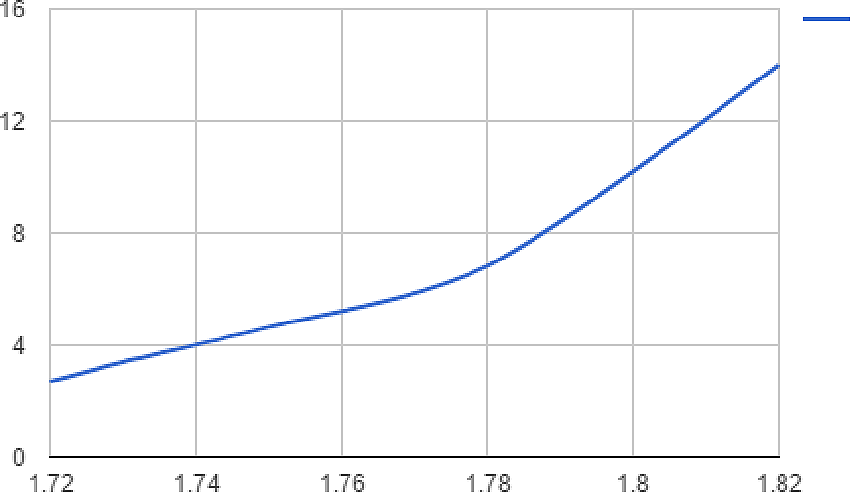
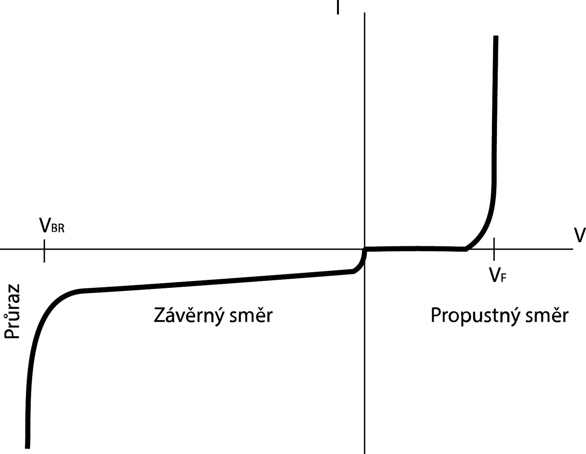
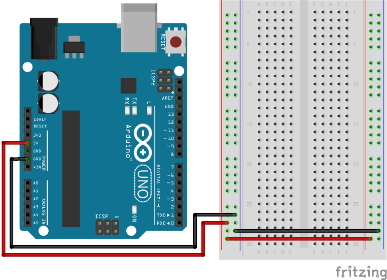

### 3.17.1 {#3-17-1}

Kroužek, nebo ne?

Některé součástky (tranzistory, diody) mívají schematické značky uzavřené do kroužku. Kroužek symbolizuje pouzdro součástky. Pokud se kreslí tranzistory v integrovaném obvodu, měly by se kreslit bez kroužku. Tak hovoří norma. Jenže zase platí, že norma něco říká, ovšem v praxi narazíte na leccos. Pokud používáte program pro kreslení schémat, jste odkázáni na to, jak autoři tuto problematiku pojali, jestli připravili značky s kroužkem, nebo bez. Máte dvě možnosti: buď se rozčilovat, že autoři neumí nakreslit značku tranzistoru s kroužkem podle normy, nebo se s tím smířit. Doporučuju druhý způsob, tedy přijmout fakt, že svět není dokonalý, a ušetřit čas, který byste strávili domalováváním kroužků do schémat, vytvořených v nějakém nástroji.

4

Zdroje napětí

4

Zdroje napětí

Ono se řekne – zdroj napětí! Ale jaký zvolit?

V číslicové technice potřebujeme nejčastěji napětí 5 voltů, navíc poměrně stabilní, bez výrazných výkyvů. Při nižším napětí nemusí naše zapojení fungovat, při vyšším se bude přehřívat, a může se i zničit. Kde ale napájecí napětí sehnat?

Jedna z možností je využít počítač a USB, popřípadě využít nejrůznější nabíječky k mobilním telefonům s rozhraním USB. Jejich výhoda je, že dokáží dát docela velký proud a stabilní napětí. Drobná nevýhoda je, že konektor většinou nelze zapojit do nepájivého kontaktního pole (NKP), a je potřeba vše řešit nějakou redukcí.

Pro NKP existují různé moduly, které lze koupit v kamenných obchodech i v e-shopech, a ty se starají o správné rozvedení napájecího napětí a jeho úpravu. Většinou obsahují stabilizátor, přepínač napájecího napětí 5 V / 3,3 V a napájecí konektor – většinou souosý pro různé adaptéry, a k tomu konektor USB.

Problém s těmito moduly je, že když do nich přivedete 5 voltů z USB, tak si stabilizátor vezme nemalou část a na výstupu, kde má být pět voltů, naměříte třeba 3,5 V. Což může být problém. Pokud chcete takový modul používat, pořiďte si k němu raději nějaký adaptér, který dá na výstupu okolo 7-9 voltů. Pokud použijete třeba 12 V adaptér, budou se stabilizátory intenzivně zahřívat.

Další možnost je využít baterie. Nejčastěji používané typy jsou AA / AAA monočlánky. Existují držáky, které spojují dva, tři či čtyři monočlánky sériově, takže výsledkem jsou 3 V, 4,5 V nebo 6 V. Obvody, které používáme, by měly bez problémů fungovat i při 4,5 voltech. Nevýhoda baterií je ta, že jejich kapacita je omezená, a po několika dnech zkoumání, zkoušení a testování se zkrátka vybijí. Nabíjecí monočlánky pomohou jen trochu – po několika dnech zkoumání, zkoušení a testování se vybijí taky, ale můžete je nabít. A nezapomeňte, že tyto monočlánky mají o něco nižší napětí, jen cca 1,2 voltu. Čtyři takové, zapojené sériově (tedy za sebou) dají dohromady 4,8 voltů. Pokud budete experimentovat intenzivněji, doporučuju pořídit si nějaký zdroj, napájený ze sítě.

Některá zařízení, vybavená vhodným měničem napětí, lze napájet i z destičkové baterie, která dává 9 voltů. Takové baterie se používají často k napájení např. multimetrů. Existují k nim konektory, které lze připojit například k výše zmíněným napájecím modulům. Ale napájení z takových baterií je vysloveně nouzové, protože pokud nemáte zapojení, navržené speciálně na malý odběr, tak kapacita takové baterie vystačí jen na pár hodin provozu.

Pokud vás elektronika zaujme víc, určitě si pořiďte laboratorní zdroj, u kterého můžete regulovat napětí i proud. Nemusí to být hned profesionální zařízení za několik tisíc Kč, vystačíte i s levnější variantou. Dbejte na to, aby zdroj dokázal dát alespoň 15 voltů a proud 1 A.

Zajímavá možnost je využít zdrojů pro počítače PC s konektorem ATX. Existují adaptéry pro tyto konektory, ze kterých pak lze odebírat napětí 5 V, 12 V i - 5 V. Dbejte na to, aby takový zdroj měl vždy nějaký minimální odběr – zapojte například na napájecí napětí žárovku. Pokud necháte ATX zdroj bez zátěže, přetíží se a shoří! No dobře, nebude hořet jasným plamenem, spíš tak jako zasmrdí a přestane fungovat. Důvodem je, že tyto zdroje jsou zapojeny jako takzvané „spínané zdroje“, a v nich slouží cívka jako akumulátor energie, z níž se odebírá přesně dané napětí. Výhodou těchto zdrojů je jejich velmi dobrá účinnost, nevýhodou to, že vyžadují zátěž, která energii z cívky odvede a zpracuje. Pokud ji neodvede, naakumulovaná energie se začne, laicky řečeno, spalovat přímo v cívce.

4.1

Společná zem

Představte si, že máte dva obvody. Jeden je napájený třeba z USB, například Arduino. Druhý obvod je napájený nějak jinak, třeba vlastní baterií, nebo adaptérem ze sítě – třeba ovladač dveřního zámku. A vy teď chcete, aby se nějaký signál z Arduina dostal k tomu ovladači, protože stavíte automatický kódový zámek… Jak to uděláte?

Tak samozřejmě, nejprve zjistíte, jestli jsou obě zařízení kompatibilní, jestli Arduino dá dost proudu na to, aby zámek sepnul, ale dejme tomu, že to je ověřené, že u zámku je napsáno „Arduino compatible, 5 V logic“, takže to spojit můžete.

Tak spojíte Arduino a vstup zámku vodičem, a budete se moc divit, že to nefunguje. Proč? Odpověď je prostá:

Arduino na výstup pošle + 5 voltů, třebas. Jenže jak jsme si říkali: volty jsou vždy „mezi něčím a něčím jiným“ – u Arduina to je + 5 voltů mezi výstupem a jeho zemí (GND). Elektronický zámek to má ale úplně stejně: očekává napětí 5 voltů mezi vstupem a svojí zemí.

Proto je potřeba zajistit, aby má zem byla i tvá zem (jak se říká vznešeně ve slavnostních řečech hned předtím, než vyhubí domorodce). Nejjednodušší způsob, jak to zajistit, je prostě to spojit. Spojte vodivě zem u Arduina se zemí u zámku, čímž zajistíte společnou neutrální úroveň a to, že všechno, co bude + 5 voltů nad potenciálem země u Arduina bude i + 5 voltů nad potenciálem země u elektronického zámku. A v tu chvíli se všechno jako zázrakem zprovozní a začne fungovat.

Nezapomeňte: Pokud spolu mají komunikovat dva obvody, musí mít spojené „zemní“ pól napájení. Tomuto spojení se říká společná zem, ještě na to několikrát narazíme, a je to docela důležité pravidlo, které si pamatujte!

S tím souvisí ještě jedno pravidlo, a to je to, že když spolu spojujete několik spotřebičů (například počítač a monitor), tak by měly být ve stejné zásuvce. Někdy se může stát, že dvě různé zásuvky mají různou fázi, což v důsledku vede k tomu, že jejich „země“ nejsou totožné a je mezi nimi napětí (nebudu se pouštět do podrobností, ale je to tak). Když zapojíte počítač do jedné zásuvky, monitor do druhé, je to OK – ale pak spojíte monitor s počítačem. V tu chvíli propojíte zem u obou spotřebičů. Pokud má každá zásuvka jinou fázi, a tudíž i jiný zemní potenciál, začne téct docela velký proud z jedné zásuvky skrz počítač, videokabel a monitor do druhé. A máte problém.

5

Vedle sebe, za sebou

5

Vedle sebe, za sebou

Pojďte, necháme teď chvíli značky značkami a teorii teorií, a zase si něco zapojíme a změříme.

5.1

Svítilna s LEDkou

Úplně nejjednodušší zapojení je taková obyčejná svítilna. Třeba právě s LEDkama. Jak funguje? No, je to jednoduché: máte zdroj energie, třeba baterii, a LEDku, a mezi tím rezistor. Nějak takhle:

Zkuste si to zapojit. Prozradím vám předem, že když na místě baterie použijete monočlánek s napětím 1,5 voltu, tak vám to svítit nebude. Musíte použít alespoň dva za sebou, ještě lépe plochou baterii (v níž jsou tři za sebou), nebo například Arduino, z něhož můžete odebírat + 5 voltů.

Rezistor použijte třeba náš oblíbený 330R. U baterie 4,5 voltů propustí 4,5/330 = 13 mA, což je dostatečný proud na to, aby LED svítila, a zároveň bezpečný natolik, aby se nepřepálila. Když chcete, aby LED svítila víc, můžete zkusit snížit velikost odporu – můžete jít třeba na 220R, pak bude proud skoro 20 mA, a to je pro většinu LED maximum.

Jenže co když chcete svítit víc, ještě víc? Jak na to? No, co třeba zapojit víc, víc diod? Zkuste si to. Zapojte si dvě najednou…

Jak? No, v zásadě máte čtyři možnosti, jak místo jedné LED zapojit dvě:

Možnosti 1 a 3 dávají smysl. Vyzkoušejte si je, při které z nich budou LED svítit nejvíc. Možnost 2 je nefunkční, takhle vám LED svítit nebudou. Možnost 4 je zajímavá v tom, že takhle vám bude svítit vždy alespoň jedna LED, i když přepólujete zdroj, přehodíte kladný a záporný pól, ale většího jasu nedosáhnete…

A co když zapojíte tři LED? Zvláštní – tři za sebou nebudou svítit vůbec, tři vedle sebe ano… Jak je to možné? Proč je v tom rozdíl? Přesně to se dozvíte v této kapitole.

[eknh.cz/lsp](https://eknh.cz/lsp)

5.2

Sériové zapojení

Zkuste udělat následující obvod:

Vidíte dva rezistory, zapojené „za sebou“ – tedy sériově. Proud teče od kladného pólu baterie (taková je konvence, vzpomeňte si) horním vodičem do rezistoru R1, skrz něj do rezistoru R2, a z něj spodním vodičem k zápornému pólu baterie.

Když si takové zařízení postavíte na kontaktním poli, nebude nijak zajímavé. Nebude blikat, svítit, bzučet – jen bude vybíjet baterii, tak jej prosím nenechte zapojený dlouho! Elektřina z baterie se zbůhdarma mění v rezistorech na teplo. Ale přeci jen si ho zapojte – ne proto, abyste viděli, jak se vybíjí baterie, ale abyste si změřili pár údajů.

Začneme napětím, a změříme si nejprve napětí mezi body A a C. Pokud zanedbáme odpor vedení, a ten se většinou zanedbává, tak je situace stejná, jako bychom měřili přímo na baterii. Tedy měli bychom naměřit 5 voltů, popřípadě míň, podle zdroje, jaký používáte. Já používám stabilizovaný zdroj 5 V, takže jsem naměřil 4,997 V – a to je plně v toleranci.

Teď je otázka: jak to bude s napětím v bodu B? Jaké bude napětí vůči bodu A a jaké vůči bodu C? Nebudu nic prozrazovat, změřte si to.

Máte? A vyšlo vám pokaždé totéž? Mělo by, pokud jste použili rezistory se stejnou hodnotou odporu, tedy 10 kiloohmů. Napětí mezi body A-B (říká se taky „napětí na rezistoru R1“) a B-C („na rezistoru R2“) je pokaždé 2,5 V, tedy polovina napájecího napětí. Samozřejmě počítejte s nepřesností součástek a měření, ale princip je, myslím, jasný. Ale ještě si to ověřte – zkuste zapojit třetí rezistor stejné velikosti R3 za rezistor R2, a změřit napětí na jednotlivých rezistorech teď. Mělo by být zhruba 1,6 voltů, tedy třetina napájecího napětí.

Jako by na každém rezistoru ubyla část napájecího napětí. A ono to tak opravdu je. Proto někdy hovoříme o takzvaném úbytku napětí na rezistoru (nebo obecně na jakémkoli spotřebiči). Tento úbytek napětí se promění na jinou energii – v případě rezistoru na teplo.

Dalo by se z toho odvodit, jaký je výsledný odpor dvou (nebo obecně několika) rezistorů za sebou? Zatím ještě ne, na to potřebujeme (vzpomeňte si na Ohmův zákon) znát proud, který obvodem protéká.

Změřte tedy proud v bodech A, B a C. Nezapomeňte, že při měření proudu musíte obvod rozpojit a ampérmetr zapojit do cesty proudu. Máte?

Tentokrát se, překvapivě, nic nedělí, a ve všech třech bodech je proud stejný. Nevím jak u vás, ale u mne to s rezistory 10K a napájecím napětím 5 voltů bylo 0,25 mA. Což by znamenalo, že výsledný odpor je 20 kΩ, tedy vlastně R1 + R2.

Prověřte to. Zkuste si místo jednoho rezistoru 10K dát třeba rezistor 4K7, nebo 1K. Zkuste si zapojit za sebe tři rezistory a měřte vždy protékající proud. Z něj spočítáte velikost celkového odporu. A mělo by vám vyjít, že výsledný odpor R sériově zapojených rezistorů R+, R2, ... je roven součtu všech odporů R1 + R2 + … + Rn

[eknh.cz/delnap](https://eknh.cz/delnap)

5.3

Dělič napětí

Když už máme ty rezistory takto zapojené, tak si zkuste změřit opět úbytek napětí na obou rezistorech (tedy mezi body A-B a B-C), pokud bude jejich hodnota různá. Zapište si výsledky:

| Odpor R1 | Odpor R2 | Napětí A-B | Napětí B-C | Napětí A-C | Proud |
| --- | --- | --- | --- | --- | --- |
| 10000 | 10000 | 2,5 | 2,5 | 5 | 0,00025 |
| 1000 | 10000 | 0,45 | 4,55 | 5 | 0,00045 |
| 1000 | 1000 | 2,5 | 2,5 | 5 | 0,0025 |

Co z naměřeného vyplývá? Že pokud jsou odpory obou rezistorů stejné, tak je napětí na nich rovněž stejné. Pokud se liší, je na jednom z nich menší úbytek, na druhém větší. V jakém poměru? Šlo by to spočítat…

Mějme sériové zapojení dvou rezistorů. Už víme, že výsledný odpor je roven součtu odporů obou rezistorů, tedy R1 + R2\. Označme si tento součet Rx. Proud, který teče obvodem, bude tedy I = U / (R1 + R2) =&gt; I = U / Rx. No a napětí na jednotlivých rezistorech (označme si je U1 a U2) bude zase podle Ohmova zákona U = I . R. Tedy: U1 = I . R1 a U2 = I . R2\. Vidíme, že větší úbytek napětí bude na rezistoru s větším odporem.

Když vzorec rozepíšeme, dostaneme podobu U1 = U . (R1 / Rx), U2 = U . (R2 / Rx). Vzorec jde zobecnit pro víc rezistorů: Un = U . (Rn / Rx)

5.4

Paralelní zapojení

Uděláme jen drobnou změnu. Místo „za sebou“ zapojíme rezistory „vedle sebe“ – tedy místo sériového zapojení zvolíme paralelní. Takto.

Na takové zapojení můžeme opět pohlížet jako na zapojení jednoho rezistoru s celkovým odporem Rx. Jaká bude jeho velikost? Schválně, zkuste hádat:

a.

Bude stejná jako u sériového zapojení

b.

Bude jiná

Logická úvaha: No, stejná asi nebude, to bych se na to neptal a nedělal s tím takové štráchy, že… Ale co když jen tak blufuju? Nebude lepší to zase změřit?

Tak jo, pojďme to změřit. Napájecí napětí je 5 V, napětí na rezistoru R1 (mezi body B-D) je… aha, a na rezistoru R2, tedy mezi body C-E…? Aha aha! Ono je to vlastně jasné – z hlediska měření napětí jsou si body A, B a C rovny – jsou spojeny vodičem, a ten má, jak jsme si řekli, pro nás zanedbatelný odpor. Totéž platí pro body D, E a F. Tedy je logické, že napětí mezi bodem A (nebo B, či C) a bodem F (nebo D, E) bude stále stejné. Tedy těch 5 voltů. Paralelní zapojení tedy nefunguje jako dělička napětí; na všech rezistorech je stejný úbytek napětí.

Úvaha: Bude na nich stejné napětí, i když bude mít jeden 10K a druhý jen 1K? Když se nad tím zamyslíte a uvědomíte si to, že jsou body A-B-C a D-E-F spojeny, tak by na nich mělo být stále stejné napětí. Mezi body B a C není nic, kde by mohlo dojít k úbytku, stejně tak mezi body D a E, takže není důvod, proč by se napětí B-D mělo lišit od C-E. Ale zkuste si to sami proměřit.

Než to změříte, tak jen připomenu, že vodiče samozřejmě svůj odpor mají, ovšem je tak nízký, že jej můžeme pro naše konstrukce zanedbat, a taky se to tak dělá. Pokud bychom ale přemýšleli nad vedením na velké vzdálenosti, musíme samozřejmě odpor vodičů započítat, protože už z jednotek ohmů naroste na vyšší hodnoty. Pro nás v elektronice jsou tyto hodnoty zanedbatelné, protože většina vodičů bude mít několik málo centimetrů. Ale kdyby vás napadlo, že zapojíte čidlo přes desetimetrový vodič, už se může snadno stát, že úbytek bude tak velký, že s ním je potřeba počítat.

Změřením ověřeno? Je to tak, jak jsem psal? Tak to se mi ulevilo. Pokud je tedy napětí na obou rezistorech stejné, jaké to bude s proudem? Při odpovědi můžete použít dva postupy. Buď změříte, nebo se zamyslíte. Já doporučuju zkombinovat obojí, tedy buď vymyslet a měřením ověřit, nebo změřit a úvahou podepřít naměřené.

[eknh.cz/delpro](https://eknh.cz/delpro)

Každopádně úvaha by se měla brát zhruba tudy: Když je na rezistoru Rn napětí U, tak víme, že skrz něj poteče proud In = U / Rn. Nějaký proud teče celým obvodem. Teď je otázka, jestli poteče oběma rezistory stejný proud, jako celým obvodem, nebo jestli se tam někde nahoře mezi body B a C rozdělí na dva, a pak zase spojí. Voda to tak dělá… Dělá to i proud?

Dělá! Odborně se tomu říká první Kirchhofův zákon a zní tak, že součet proudů do uzlu vstupojících je stejný jako součet proudů z uzlu vystupujících. Uzel zní hrozně odborně, ale pro nás je to prostě to místo vodivého spojení, tedy bod mezi body B a C, kam přichází proud z baterie a kde se dělí do dvou větví. Vstupuje do něj proud z baterie (I), a vystupují z něj dva proudy I1 (do rezistoru R1) a I2 (do rezistoru R2). Mělo by tedy platit, že I (vstupující) = I1 + I2 (součet vystupujících).

Stejná situace se odehrává mezi body D a E, v místě, kde se obě větve opět spojují do jedné. Tam zase proudy I1 a I2 vstupují, vystupuje proud I.

Teď to změříme. V bodě A a F bychom měli naměřit hodnotu proudu I (v obou stejnou), v bodech B a D proud I1, v bodech C a E proud I2\. Platí, že proud, který do rezistoru vstupuje, je stejný jako proud, který z něj vystupuje.

Pojďme zase na začátek úvah. Víme, jaký proud teče jakým rezistorem. Rezistor R1 pouští I1 = U / R1, rezistorem R2 prochází I2 = U / R2\. Celkový proud I by tedy měl být I1 + I2\. A ono to tak je. Pro napětí 5 V bude proud I1 a I2 roven 0,5 mA a celkový proud 1 mA. A pokud je celkový proud 1 mA, tak vychází, že celkový odpor bude 5 / 0,001 = 5000 ohmů, tedy 5k. Tedy poloviční.

Odvodíme si vzorec. Rx = U / I, kde I je celkový protékající proud. Ten je, jak víme, součtem obou proudů v obou větvích, tedy I1 + I2\. Po dosazení:

I = U / R1 + U / R2

Rx = U / (U / R1 + U / R2)

Rx = (R1 × R2) / (R1 + R2)

Nebo též 1 / Rx = 1 / R1 + 1 / R2

Tedy převrácená hodnota celkového odporu je rovna součtu převrácených hodnot jednotlivých odporů.

Dalo by se říct, že paralelní zapojení funguje jako „dělička proudu“. Při různých hodnotách dílčích odporů se dělí v různých poměrech, při stejných pak rovnoměrně 1:1\. Sice se říká, že „proud vždy teče cestou nejmenšího odporu“, ale není to tak úplně pravda. Správně bychom měli říct, že „oč je odpor menší, o to víc proudu jím protéká“.

Všimněte si, že u sériového zapojení je výsledný odpor vždy větší než největší z dílčích, při paralelním je celkový odpor vždy menší než nejmenší z nich.

5.5

Kirchhof 2

Zmínil jsem první Kirchhofův zákon. Je snad nějaký další? Samozřejmě že je, a nepřekvapivě se nazývá druhý Kirchhofův zákon. Ten říká, že součet úbytků napětí na (sériově zapojených) spotřebičích je roven součtu napětí (sériově zapojených) zdrojů. Čili řečeno polopaticky: pokud zdroje zapojíte tak, že budou dávat 5 voltů a připojíte k nim iks spotřebičů sériově, tak ty se mezi sebou budou muset o těch pět voltů podělit. A to tak, že celkový součet napětí pro každý z nich bude přesně těch pět voltů, nikam se nic neztratí ani nikde nic nevznikne.

Mimochodem, oba zákony se jmenují podle německého vědce Gustava Kirchhoffa, profesora fyziky, který mimo těchto zákonů objevil například záření černého tělesa.

Mimochodem, jak je to se zdroji a jejich spojováním?

5.6

Baterie sériově – paralelně

To je dobrá otázka, a bude se to hodit. Už jsme si ukázali, že dva monočlánky 1,5 V, zapojené sériově, tedy „za sebou“, dávají dohromady 3 V. Tedy Ux = U1 + U2\. Co když je zapojíme vedle sebe, paralelně? Výsledné napětí bude stejné, tedy 1,5 V, ale zdvojnásobí se velikost proudu, který je schopna baterie dodat.

Baterie totiž, nepřekvapivě, nedokáže dodat nekonečný proud. Pokud budeme odebírat stále víc a víc proudu, tak začne klesat její napětí. Pokud bychom, teoreticky, zvedali odběr do nekonečna, klesne její napětí na nulu. Ovšem v praxi je potřeba dodržovat nějakou minimální hodnotu napětí, proto není možné brát libovolné množství proudu.

Co když jednu z baterií otočíme? U sériového zapojení to povede k tomu, že výsledkem bude nula voltů, u paralelního jsme právě stvořili automatický vybíječ baterií.

5.7

Potenciometr

Potrenciometr je vlastně proměnný dělič napětí v hmatatelné podobě. Součástka, kterou všichni známe z každodenní zkušenosti. Kdo z nás alespoň jednou nezesílil či nezeslabil rádio pomocí otočného knoflíku? Tak ta součástka uvnitř, která zařizuje, že vlevo to nehraje vůbec a vpravo nejvíc, se jmenuje právě potenciometr.

Nejčastější typ je otočný potenciometr:

Ale existují i jiné – třeba tahové

Potenciometr je vlastně rezistor určité velikosti, například 10k, ale proti obyčejnému rezistoru má vyvedený ještě třetí vývod, který je spojený právě s ovládacím mechanismem. Uvnitř se tento vývod („jezdec“) dotýká odporové dráhy. Tím, jak jej přibližujeme k jednomu či druhému krajnímu vývodu, se mění odpor mezi jezdcem a oběma vývody.

Dá se tedy říct, že jde vlastně o známé sériové zapojení dvou rezistorů, které má vyvedený prostřední vývod, a které má vždy celkový součet odporu stejný. Když je jezdec (W) otočený úplně doleva (k vývodu A), je odpor A-W (téměř) nulový, a odpor W-B je rovný celkovému odporu (A-B). Když je jezdec uprostřed, je odpor A-W poloviční proti odporu A-B (a stejný jako W-B). Když je jezdec ve čtvrtině dráhy, je odpor A-W roven jedné čtvrtině, W-B pak třem čtvrtinám celkového odporu...

Pozor – tak to je pouze u takzvaných lineárních potenciometrů. V audiotechnice, pro zesilování signálů a podobně se používá jiný typ, takzvaný logaritmický. Tam neplatí, že uprostřed je hodnota odporu poloviční.

Vlevo americký symbol, vpravo evropský.

Nám se potenciometr v číslicové technice moc nehodí, ale hodí se nám pro experimenty s elektřinou. Ukážeme si s ním jednoduchý pokus.

5.8

Úbytek napětí na LED

Zapojte si LED s rezistorem tak, aby LED svítila. Vyberte si třeba červenou LED a rezistor 220 ohmů. Napájecí napětí bude 5 V. Víme, že proud, protékající rezistorem, bude U / R = 5 / 220 = 0,022 A, tedy 22 mA. To je pro většinu LED proud na hranici bezpečného provozu. Pokud byste zapojili LED bez omezujícího odporu, poteče jí plný proud, který může zdroj dát, a LED spálíte! Pozor na to!

Je pravda, že ve mne teď hlodá zlomyslný červíček, který vám chce doporučit, abyste si to zkusili. Fakt, vzít zdroj, třeba nabíječku k telefonu, připojit k němu holou LED, a sledovat to prsk, kterým se s vámi LEDka rozloučí. Abyste si to pamatovali. Ale myslím, že se vám to určitě brzy podaří neúmyslně…

Změřte proud, který obvodem teče, a změřte, jaký je úbytek napětí na LED a na rezistoru. Pokud máte červenou LED, tak úbytek napětí na ní bude zhruba 1,8 voltů, na rezistoru pak ten zbytek do celkového napájecího napětí (při 5 V to bude zhruba těch 3,2 voltů).

Všimněte si, že jsem v předchozím textu nenapsal, jestli máte zapojit rezistor mezi katodu a zem, nebo mezi anodu a kladné napětí. Je v tom nějaký rozdíl? Neptejte se, zkuste si to, přinejhorším si zničíte diodu.

Máte? Teď už asi víte, že jste si diodu nezničili, a že je úplně jedno, jestli rezistor zapojíte před diodu, nebo za diodu...

Zkuste zapojit druhou diodu do série s tou první. Tedy třeba mezi katodu a záporný pól připojte druhou LED tak, že anodu zapojíte na katodu předchozí diody, a katodu diody 2 zapojíte na zem. Svítí? Svítí. A co třetí dioda do série, svítí i ta? Za chviličku si řekneme víc...

Teď do série zapojíme potenciometr – třeba 1k, ale klidně i s větším odporem. Využijeme jeden z krajních vývodů a prostřední vývod, druhý krajní necháme nezapojený. Když budeme teď potenciometrem otáčet, uvidíme, že se LED rozsvěcí a zhasíná podle toho, jak otáčíme. K pevnému rezistoru 220 ohmů se přičítá proměnný odpor rezistoru, a podle natočení kolísá od 0 do Rmax.

[eknh.cz/ledpot](https://eknh.cz/ledpot)

Máte? Teď si zkuste změřit proud, který teče LEDkou, a napětí, jaké na ní je, a to pro různá nastavení jezdce. Můžete zapojit i výpočetní techniku, zanést si hodnoty do tabulky a udělat si graf, kde na vodorovné ose bude úbytek napětí na diodě, na svislé pak proud.

Pokud si takový graf nakreslíte, získáte tak něco, čemu se říká „voltampérová charakteristika“. Mně to vyšlo nějak takto:

(Vodorovně volty, svisle miliampéry)

Když si tedy spočítám, jaký je odpor LED (R = U / I), tak zjistím, že se mění podle velikosti proudu. Čím větší proud, tím menší odpor. Součástky, jako jsou diody (tedy i LED, což je „Light Emitting Diode“), se nazývají nelineární, protože jejich odpor není konstatntní a proud, který jimi prochází, není čistě závislý na napětí. Rezistory jsou lineární (pokud tedy zanedbáme změny odporu v důsledku zahřívání procházejícím proudem).

Když budeme proud, tekoucí skrz LED, snižovat, bude její odpor růst, naopak při zvyšování proudu odpor klesá a při překročení určité meze dojde k nevratnému poškození.

Všimněte si, že úbytek napětí na LED je víceméně konstantní a pohybuje se okolo 1,8 voltů. Toto napětí je dáno fyzikálními vlastnostmi – u červených LED se pohybuje pod hranicí dvou voltů, u infračervených (např. v dálkových ovladačích TV) je okolo 1,5 V, u zelených nad 2 V, u modrých pak i přes 3 volty. Obecně se dá říct, že čím kratší vlnová délka světla, tím vyšší úbytek napětí.

U normálních polovodičových diod, tedy těch, co nesvítí, je tento úbytek zhruba 0,7 voltu (opět se mění podle proudu, který diodou teče). Toto napětí se může lišit podle technologie, u starších a dnes už méně běžných germaniových diod to bývá okolo 0,2 voltu, u takzvaných Schottkyho diod to bývá mezi 0,15 – 0,4 voltu. Úbytek napětí se v literatuře označuje VF (z anglického Voltage Forward).

| Vlnová délka (nm) | Světlo | VF při proudu 20 mA | Materiál |
| --- | --- | --- | --- |
| 940 | Infračervené | 1,5 V | GaAlAs / GaAs |
| 635 | Červené | 2 V | GaAsP / GaP |
| 570 | Zelené | 2 V | InGaAlP |
| 430 | Modré | 3,8 V | SiC / GaN |

5.9

Co jsou vlastně ty diody zač?

Dioda je dnes většinou polovodičová součástka (dříve i v podobě elektronky), jejíž nejvýraznější vlastností je, že vede proud pouze jedním směrem. Má dva vývody, anodu a katodu, a vede proud pouze ve směru od anody ke katodě.

O diodách se ještě budeme bavit později, zde jen stručně…

Napětí určité výše je potřeba, aby se dioda vůbec „otevřela“, aby vedla proud. Takový je princip polovodičových přechodů, což si vysvětlíme později. Pokud je na diodě napětí menší, je zavřená – tedy její odpor je velmi vysoký a neteče skrz ni žádný proud, v žádném směru. Jakmile je na diodě napětí vyšší, dioda se skokově otevře (její odpor se velmi výrazně sníží) a proud může procházet – ovšem pouze v jednom směru.

Však si to sami zkuste. Nechte LED svítit, a pak ji otočte o 180 stupňů, prohoďte její vývody. Svítit nebude. V druhém směru („závěrném“) je dioda zavřená. Zase až do určité velikosti napětí, tentokrát zvaného průrazné. Pokud zapojíme vyšší napětí v závěrném směru, dioda se rychle zničí. Viz následující obrázek, který ukazuje závislost proudu na napětí, připojeném k (obecné) diodě.

V pravé části grafu je dioda zapojená v dopředném – průchozím směru. Proud teče velmi malý, a až u hranice VF se dioda otvírá a vede proud velmi dobře, téměř s nulovým odporem.

V závěrném směru, tedy vlevo od svislé osy, prochází velmi malý proud. V bodě VBR (Breaking Voltage, průrazné napětí) se dioda zničí, „prorazí“, a přestane fungovat. Dopředné napětí bývá nízké, okolo desetin až nízkých jednotek voltů, průrazné je o řády větší – podle typu třeba 50 voltů, ale i 1000.

Speciální variantou diody je Zenerova dioda. Ta se při určitém napětí v závěrném směru „prorazí“, ale vratně. Proto se používá ke stabilizaci či přepěťové ochraně. Jakmile napětí překročí danou mez, dioda se otevře, vede proud, a tím snižuje napětí.

[eknh.cz/dioda](https://eknh.cz/dioda)

V číslicové technice se s diodami setkáme poměrně často. Používají se například k ochraně obvodů před přepólováním. Dříve se diody používaly v těch nejjednodušších přijímačích – krystalkách, což byly vděčné obvody pro amatéry, s nimiž jste pomocí několika součástek mohli poslouchat rozhlasové vysílání v pásmech AM. Diody se také používají k usměrňování střídavého napětí. V této knize se ale těmto oblastem nebudu věnovat šířeji a zájemce odkážu na jinou literaturu.

Ale myslím, že je právě teď vhodná chvíle udělat opět malou odbočku. Podíváme se, kde zjistit ta čísla, kterými tu šermuju, jako 0,7 V a 50 V. To jsem tak chytrý a Aštar Šeran mi ta čísla vnukl skrz alobalovou čepičku? Ale kdepak, podíval jsem se do datasheetu.

Do čeho že?

Do datasheetu!

5.10

Datasheet

Co je recept pro kuchaře, co jsou noty pro houslistu, to je datasheet pro elektronika. Datasheet se česky nazývá též „katalogový list“. Dřív to platilo doslova – výrobce vydával katalogy součástek (my starší si pamatujeme katalog Tesly Eltos), kde každé součástce, kterou vyráběl, byla věnována jedna či více stran, kde bylo napsané všechno podstatné, co pro práci se součástkama potřebujete. Tedy – teoreticky. Někdy jste byli rádi, když platilo aspoň zapojení vývodů.

Dnes je situace díky internetu o mnoho jednodušší – k téměř libovolné součástce najdete její datasheet (klíčová slova: Google, název součástky, „datasheet“). Na stránkách výrobců bývají i různé vyhledávače a srovnávače, takže když například hledáte vhodnou součástku, můžete si z portfolia vybrat tu nejvhodnější na základě požadavků – třeba napájecího napětí, frekvence, pouzdra, funkce, ceny, …

Každopádně datasheet je klíčová věc, kterou budete potřebovat téměř vždy.

Zkuste si teď cvičně vyhledat pár datasheetů. Pro diodu 1N4004, pro tranzistor BC547, pro integrovaný obvod 74HCT04…

Tyto součástky vyrábí vícero výrobců, proto je můžete nalézt v různých provedeních a s různým obsahem. Některé speciální obvody vyrábí jen jeden výrobce, tam jste odkázáni pouze na jeho dokumentaci.

Co ale v datasheetu zjistíte vždy:

1.

Přesné označení typu. Hlavně u integrovaných obvodů je to docela podstatné – 65C02 je něco jiného než 6502C, i když je obojí vlastně jen mírně vylepšené 6502\. Součástí značení je i informace o pouzdru – 74HCT04N je funkčně shodný s obvodem 74HCT04D, ale jeden z nich je v pouzdru DIL (DIP), druhý v pouzdru SO. Pro nás to je podstatný rozdíl, protože zatímco ten první můžeme použít přímo v nepájivém kontaktním poli, ten druhý je určený pro povrchovou montáž pájením, má proto krátké nožičky a do kontaktního pole jej nedostaneme.

2.

Informace o tom, který vývod u jakého pouzdra má jakou funkci.

3.

Informace o napájecím napětí, o odběru a dalších charakteristikách obvodů a součástek.

4.

Důležité informace o maximálních přípustných hodnotách – především napětí, proudu a teploty.

5.

U integrovaných obvodů je popsaná jejich funkce, u těch nejsložitějších, jako jsou jednočipy a procesory, může být i informace o programování.

6.

U diskrétních součástek bývají k dispozici různé grafy, například změna odporu v závislosti na teplotě apod.

7.

Je popsáno chování za určitých standardních hodnot.

8.

Pokud je více variant jednoho typu, je popsáno, čím se od sebe liší. Například tranzistor BC547 má tři varianty, A, B a C, které se liší maximálními přípustnými hodnotami napětí a proudů.

9.

U složitých obvodů, například klopných obvodů, pamětí či některých digitálních senzorů, je popsán i komunikační protokol a průběhy signálů, ze kterých vyčteme třeba to, v jakém pořadí musí přijít řídicí signály, aby obvod fungoval správně.

Z dobře napsaného datasheetu zkrátka zjistíte vše, co o součástce potřebujete vědět. Třeba:

•

Jaký je úbytek napětí na diodě 1N4007?

•

Jaký je maximální proud kolektor-emitor u tranzistoru BC547B?

•

Je u tranzistoru BC547 uprostřed báze, nebo kolektor?

•

Kam se připojuje napájecí napětí u obvodu 74HCT00? Jak velké má být?

V datasheetech najdete i ta čísla, kterými jsem tu v minulých kapitolách šermoval. Pamatujete? 0,7 voltu na diodě, 10 mA proud LEDkou atd.

U některých dostatečně obecných součástek, jako jsou rezistory, keramické kondenzátory nebo obyčejné LED, často datasheet ani nenajdeme, protože nezjistíme typ součástky. Jde vlastně o takovou „bižuterii“. Přesto – zkuste si najít datasheet pro „červenou LED“.

6

Základní elektronické součástky

6

Základní elektronické součástky

Už jsme se seznámili s několika různými součástkami, tak je skoro načase udělat si takové drobné shrnutí, a při té příležitosti si ukážeme i pár součástek dalších.

Součástky, s nimiž jsme se zatím podrobněji seznámili, se nazývají diskrétní – dělají nějakou jednu elementární funkci, například omezují procházející proud. Ale už jsme použili i jeden integrovaný obvod – to je komplexní součástka, sestavená z mnoha jednoduchých součástek, které jsou uzavřeny v jednom pouzdru. S integrovanými obvody se budeme setkávat v celém zbytku knihy, takže ještě bude hodně příležitostí si je popsat podrobněji.

Mezi diskrétní součástky, s nimiž jsme se už seznámili, patří rezistory, potenciometry a světlo emitující diody (LED). V prvním zapojení (blikač) jsme použili i kondenzátor, o kterém ještě nebyla řeč.

6.1

Rezistor

Rezistor spolu s kondenzátorem a cívkou tvoří základní trojici součástek. V číslicové technice budeme používat nejčastěji rezistory, kondenzátory jen okrajově a cívky ještě méně, ale je na místě se s nimi seznámit.

Rezistor je diskrétní součástka se dvěma vývody, jejíž zásadní vlastností je, že klade odpor procházejícímu proudu. Rezistory se vyrábějí v různých velikostech, pro naše účely postačí ty nejmenší. Pokud je třeba, aby rezistorem procházely vyšší proudy (a tím byly vyšší tepelné ztráty), musíte použít rezistory s velkým ztrátovým výkonem.

6.2

Kondenzátor

Kondenzátor je součástka, která umí uchovat elektrický náboj. Pokud připojíme kondenzátor k baterii, nabije se a náboj si udrží i po odpojení. Když pak připojíme k vývodům spotřebič, náboj do něj může přejít. Množství náboje, které kondenzátor dokáže pojmout, určuje jeho charakteristika, zvaná kapacita. Jednotkou kapacity je farad, v praxi se ale používají jednotky v řádech miliontin (mikrofarad) až biliontin (pikofarad). Dlouho platilo, že reálně dostupné kapacity jsou tisíce mikrofaradů (milifarady), ale v posledních letech s rozvojem nových materiálů začaly být dostupné i superkondenzátory s kapacitou v řádech stovek faradů, které dokáží napájet obvody po dlouhou dobu, vyrovnávat proudové odběry atd.

Kondenzátor v té nejjednodušší podobě tvoří dvě destičky, které jsou velmi blízko sebe, ale mezi nimi je izolant. V minulosti byly hojně používané např. svitkové kondenzátory, což byly vlastně dvě pásky z tenké hliníkové fólie, proložené izolační fólií a stočené do ruličky.

Dnes se nejčastěji v číslicové technice setkáme s kondenzátory keramickými a elektrolytickými. Keramické kondenzátory se hodí pro menší kapacity v řádech nano- a pikofaradů. Pro větší kapacity v mikrofaradech se používají kondenzátory elektrolytické, v nichž je v roli izolantu speciální roztok – elektrolyt. Tyto kondenzátory mají několik nectností. V první řadě jsou citlivé na přepólování, proto mají označený kladný a záporný vývod a je potřeba dodržet orientaci. Druhá nectnost těchto kondenzátorů je, že časem degradují, vysychají a ztrácejí svoje vlastnosti. Pokud jde o levnější kusy, mohou přestat fungovat už po několika letech. Elektrolytické kondenzátory bývají nejčastější příčinou toho, že i relativně nová elektronika přestane fungovat. Používají se hlavně v napájecích obvodech, a to proto, že dokážou udržet velký náboj a pokrýt okamžiky zvýšeného odběru. Jakmile ale takový kondenzátor zestárne, ztratí schopnost udržet náboj a zařízení pak funguje s chybami, vypíná se nebo nefunguje vůbec. Leckdy stačí pouze tyto kondenzátory vyměnit a vše bude zase fungovat.

Když kondenzátor zapojíme sériově do obvodu, například s LED, kde prochází stejnosměrný proud, zjistíme, že proud prochází jen velmi krátkou dobu po zapnutí, pak přestane. Kondenzátor stejnosměrný proud nevede – ostatně je uvnitř izolant. Ovšem vlivem elektrické indukce vyvolá změna napětí (změna!) na jednom vývodu změnu náboje na vývodu druhém. Při rychlých změnách napětí na jednom pólu může tímto způsobem proud skrz kondenzátor procházet. Čím větší kapacita, tím pomalejší změny (tedy nižší frekvence) skrz kondenzátor projdou.

Proto se kondenzátor používá jako filtr. Tam, kde potřebujete například odfiltrovat příliš rychlé změny ze signálu (protože víte, že to je třeba rušení), připojíte paralelně kondenzátor. Rychlé změny projdou skrz něj (do zkratu).

Minipokus: Zapojte si takovýto obvod:

[eknh.cz/cap](https://eknh.cz/cap)

Co se bude dít? Jakmile stisknete tlačítko, začne svítit dioda, a zároveň se začne nabíjet kondenzátor C1 (a část proudu poteče skrz něj, ovšem jak se bude kondenzátor nabíjet, bude tento proud klesat k nule). Když tlačítko po chvíli pustíte, přestane do LED téct proud z baterie, ale LED bude dál svítit. Bude ji pohánět náboj z kondenzátoru, který se pomalu vybíjí přes rezistor R1 do diody. Poznáme to podle toho, že dioda nezhasne hned, ale bude postupně zhasínat, zhasínat, až zhasne. To se stane ve chvíli, kdy napětí na kondenzátoru poklesne pod prahové napětí, nutné k rozsvícení a otevření diody.

Zkuste si pokus opakovat s různými kondenzátory a různými velikostmi rezistoru. Když budete měřit, jak dlouho to trvá, než LEDka přestane svítit, zjistíte, že tato hodnota je přímo úměrná kapacitě i odporu; čím větší je odpor a čím větší je kapacita, tím pomaleji se kondenzátor vybíjí a tím déle bude svítit. Samozřejmě, jakmile bude rezistor příliš velký, bude proud LEDkou tak malý, že LED bude svítit nepozorovatelně.

6.3

Cívka

Cívka je součástka, bez níž se neobejdete v radiotechnice a příbuzných oborech. Jde o vodič, navinutý okolo jádra (které může být kovové, z nějaké slitiny, nebo i takzvaně „vzduchové“). Její základní vlastností je impedance, což je v podstatě odpor, kladený střídavému proudu – obecněji jakýmkoli rychlejším změnám proudu.

Cívka při průchodu elektrického proudu vytváří kolem sebe magnetické pole (jedním z oblastí využití cívek jsou elektromagnety), které při svém vzniku nebo zániku vytváří v cívce proud. Tento proud působí vždy proti směru změny. Jakmile zapnete zdroj, cívkou začne protékat proud, vzniká magnetické pole, to zase zpětně vytváří proud, ovšem opačného směru. Výsledkem je, že ze začátku teče ze zdroje proud malý (indukce v cívce jej snižuje) a postupně se zvýší až na plnou velikost. Když zdroj odpojíte, zase se změní magnetické pole (zmizí), a tato změna opět indukuje proud opačného směru, který postupně slábne.

Cívkou tedy bez problémů prochází stálý proud, ale proud, který se rychle mění, cívkou neprochází, protože rychlé změny magnetického pole pracují proti němu. Čím vyšší frekvence změn, tím větší odpor proudu cívka klade. Impedance cívky závisí na několika faktorech, ale především na počtu závitů, průměru závitů, materiálu, z něhož je vytvořeno jádro, ...

Cívky a kondenzátory se používají ke generování pravidelných kmitů, bez nichž se ve spoustě aplikací neobejdete. V číslicové technice ale nejsou moc používány, jejich nejčastější využití je v napájecím zdroji, kde slouží k tomu, aby propouštěly stálý proud, bez výkyvů a případných změn, popřípadě v tzv. spínaných zdrojích, kde fungují jako akumulátor pro elektrický náboj.

Z této „svaté trojice“ elektronických součástek budete nejčastěji používat rezistory, a v některých případech i kondenzátory. Cívkám se blíže věnovat nebudeme.

6.4

Transformátor

Transformátor je známá součástka, se kterou máme všichni každodenní zkušenost. Transformátor slouží k tomu, abychom určitou úroveň napětí – třeba 230 voltů v zásuvce – snížili na nižší hodnotu, nebo naopak na vyšší. Transformátor je fyzicky tvořen dvěma cívkami na společném jádru. Změna proudu v jedné z těchto cívek vyvolá změnu magnetického pole, a tato změna v druhé cívce vyvolá indukci proudu. Poměr počtu závitů obou cívek udává poměr, v němž se transformuje proud, a tedy i napětí. Pokud transformujeme napětí 230 V přes transformátor s poměrem závitů např. 1000:10000, získáme napětí 23 voltů, tedy desetinové, ovšem procházející proud bude desetinásobný.

Toho se využívá například při indukčním ohřevu – pod indukční deskou je cívka s mnoha závity, druhou cívku tvoří dno hrnce – které můžeme považovat za jeden závit. V něm se indukcí vytváří velmi nízké napětí, ovšem prochází jím obrovský proud, který ohřívá vodič – v našem případě dno.