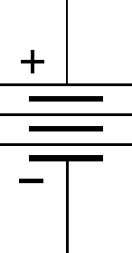
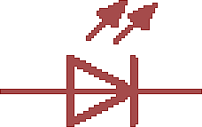

### 3.9.1 {#3-9-1}

Násobky a podíly

Kolik ampérů je jeden miliampér a kolik ohmů má jeden kiloohm? Já myslím, že to všichni víte, ale pro jistotu to tu sepíšu.

|  | Předpona | Napětí | Proud | Odpor | Kapacita | Výkon |
| --- | --- | --- | --- | --- | --- | --- |
| Základní jednotka | - | 1 V (Volt) | 1 A (Ampér) | 1 Ω (Ohm) | 1 F (Farad) | 1 W (Watt) |
| × 1000 (103) | kilo- | 1 kV | 1 kA | 1 kΩ | 1 kF | 1 kW |
| × 106 | mega- | 1 MV | 1 MA | 1 MΩ | 1 MF | 1 MW |
| × 109 | giga- | 1 GV | 1 GA | 1 GΩ | 1 GF | 1 GW |
| × 10-3 | mili- | 1 mV | 1 mA | 1 mΩ | 1 mF | 1 mW |
| × 10-6 | mikro- | 1 μV | 1 μA | 1 μΩ | 1 μF | 1 μW |
| × 10-9 | nano- | 1 nV | 1 nA | 1 nΩ | 1 nF | 1 nW |
| × 10-12 | piko- | 1 pV | 1 pA | 1 pΩ | 1 pF | 1 pW |

V tabulce jsem sepsal všechny kombinace jednotek a jejich násobků, i když některé jsou příliš velké nebo naopak příliš malé na to, abychom se s nimi v praxi běžně setkávali. Kilovolty potkáte třeba v rozvodné síti, mega- a gigavolty nejspíš nikde, totéž platí pro ampér. U napětí se setkáte nejčastěji s volty a milivolty, u proudu s jednotkami ampérů, a pak s mili- a mikroampéry. Odpor zase budete nejčastěji měřit v ohmech, kiloohmech a megaohmech, zlomky ohmů v praxi nepotkáte. U kapacity naopak budete pracovat s mikrofarady, nanofarady a pikofarady. Elektrický výkon nejčastěji potkáte v mikroelektronice jako watt a miliwatt, doma třeba i kilowatt, a když budete číst o elektrárnách, narazíte na mega- a gigawatty.

3.10

Zkratky u značení

Ujalo se nám mezi elektroniky takové zkracování. Třeba hodnotu 2,2 kiloohmu nepíšeme jako 2,2k (ohm vynecháme, u rezistoru je jasné, že jde o ohmy), ale jako 2k2\. Prostě to písmenko, co označuje předponu, posuneme na místo desetinné tečky. Takto:

| Hodnota | Značení |
| --- | --- |
| 2,2 | 2R2 |
| 22 | 22R (nebo jen 22) |
| 220 | 220R (nebo jen 220) |
| 2 200 | 2K2 |
| 22 000 | 22K |
| 220 000 | 220K (nebo M22) |
| 2 200 000 | 2M2 |
| 22 000 000 | 22M |

A jak je to třeba u kondenzátorů? Úplně stejně, ale za základ se bere 1 pF. Kondenzátor 22K = 22 000 pF = 22 nF. Kondenzátor 4M7 bude tedy 4,7 × 106 pF = 4,7 µF.

3.11

Vyvolená čísla

Dobrá, a teď prakticky: Co když mi výpočtem vyjde, že potřebuju rezistor 283 ohmů? Vyrábí někdo takovou hodnotu?

No, budete se možná divit, ale ne. Pro rezistory, kondenzátory a součástky se ujalo, že se vyrábí v určité řadě a toleranci, a tyto řady se značí E6, E12, E24, E48, … V každé řadě je mezi hodnotami 1 a 10 definováno 6 (12, 24, 48, …) hodnot pomocí takzvaných vyvolených čísel. To jsou čísla, která jsou zvolená tak, že poměr mezi sousedními členy je přibližně stejný.

Pro řadu E6 to jsou následující hodnoty: 1,0 – 1,5 – 2,2 – 3,3 – 4,7 – 6,8

Zkuste si to sami:

•

1 · 1,5 = 1,5

•

1,5 · 1,5 ≈ 2,2

•

2,2 · 1,5 ≈ 3,3

•

3,3 · 1,5 ≈ 4,7

•

4,7 · 1,5 ≈ 6,8

Řada E12 má prvky 1,0 – 1,2 – 1,5 – 1,8 – 2,2 – 2,7 – 3,3 – 3,9 – 4,7 – 5,6 – 6,8 – 8,2

Proto píšu o „rezistoru 2K2“ a ne třeba 2K9 – protože součástky se nevyrábějí ve „všech možných“ hodnotách, ale pouze v hodnotách z určitých řad.

Řada E6 zajišťuje, že pro každou zvolenou hodnotu existuje v této řadě vyvolené číslo, odlišné maximálně o 20 %. U řady E12 to je 10 %, u řady E24 pak 5 %

V amatérských konstrukcích s číslicovými obvody se nejčastěji setkáte s řadami E6 a E12, které jsou dostatečně přesné pro zamýšlené použití. Málokdy bývá hodnota naprosto kritická – snad s výjimkou časování.

Samozřejmě, dát místo rezistory 330R rezistor 3K3 už je rozdíl o řád, to už se může projevit negativně na funkci, ale nahradit jej například rezistorem 470R ve většině případů nejspíš neudělá problém. (Problém to udělá například v obvodu časovače...)

Každopádně doporučuju udělat si doma zásobu nejčastějších nejpoužívanějších hodnot rezistorů. Pro číslicovou techniku bych volil hodnoty mezi 100R a 100k – především 220R a 330R, které se hodí k LED, pak 1K, 2K2, 4K7, 6K8, 10K, 22K, 68K a 100K.

U kondenzátorů pak 22p, 33p, 100K (= 100 nF), 4M7, 10M (= 10 µF). To je naprostý a nezbytný základ.

3.12

Pro lepší představu

Pro mnoho začátečníků jsou jednotky příliš abstraktní, těžko si pod nimi něco představí. Jeden ampér – kolik to je? Je to hodně, nebo málo? No, jak se to vezme…

Pokud se budeme pohybovat v oblasti číslicové techniky, které je tato kniha primárně věnována, budeme pracovat nejčastěji s napětím 5 voltů, někdy i mírně vyšším – třeba 12 voltů. Proudy, které našimi obvody potečou, se budou měřit na miliampéry. 200 miliampérů (0,2 A) už pro nás bude poměrně velký proud. Třeba skrz LED budeme pouštět maximálně 20 mA (větší proud by ji pravděpodobně zničil).

Rozvodná a přenosová soustava pracuje s vyšším napětím – doma v zásuvkách máme 230 voltů, ale v „páteřní síti“ se pracuje s napětím 400 kV, 220 kV či 110 kV.

Rezistory budeme používat v řádech stovek ohmů až desítek tisíc ohmů. Měděný vodič má odpor blízký nule. Záleží na jeho délce, průřezu a na teplotě. Suchý vzduch je považován za izolant, ale není ideální. Vakuum je téměř ideální izolant. U vody záleží na složení – tvrdá voda s velkým množstvím solí vede elektrický proud docela dobře, měkká voda, třeba dešťová, hůř. Destilovaná voda bez jakýchkoli příměsí proud nevede skoro vůbec. Ovšem od určité meze dochází ve vodě k jejímu rozkladu (elektrolýze) na vodík a kyslík, a pak proud protéká.

Nevěříte?

Vezměte si prosím dvě tuhy z tužky. Třeba náhradní náplně do verzatilky, ať nemusíte zbytečně ničit dřevěné tužky. Ideálně tak 10 centimetrů dlouhé. K jedné připojte kladný pól, ke druhé záporný pól zdroje. Do sklenice nalijte vodu a obě uhlíkové elektrody do ní ponořte tak, aby se nedotýkaly. Zapněte napájení a změřte protékající proud. V závislosti na čistotě a „měkkosti“ vody naměříte nějaký malý procházející proud. Platí, že čím měkčí voda, tím menší proud.

Stále měřte, a zkuste do vody přidat třeba lžičku soli, nebo octa.

Proud začne procházet, a u elektrod se budou tvořit bublinky plynů. U záporné je to vodík, u kladné kyslík – ale to určitě znáte ze školy.

Pro člověka není nebezpečné ani tak napětí, jako proud, který prochází tělem. Navíc lidská kůže má tu vlastnost, že její odpor není konstantní, mění se v závislosti na napětí. Nízkému napětí klade vyšší odpor, jak napětí roste, tak se odpor snižuje. Za bezpečné bývá považované napětí do 24 voltů, které člověka sice zabrní, ale neuškodí. Napětí 230 voltů, které je v zásuvkách, už může být za jistých okolností smrtící. Některé elektrické paralyzéry vytvářejí napětí v řádech tisíců voltů, ale s malým proudem, takže rána je velmi citelná, člověk je na chvíli ochromen, může upadnout do bezvědomí, ale díky malému proudu není takový zásah pro zdravého jedince smrtící.

3.13

Střídavý proud

Až dosud jsme mlčky předpokládali, že zdroj napětí má svůj kladný a záporný pól, elektrony proudí od záporného ke kladnému, proud od kladného k zápornému, a tak to je a v čase se to nemění. Proud má stále stejný směr, proto se mu říká stejnosměrný. Anglicky Direct Current, neboli DC.

Kromě stejnosměrného proudu se v elektrotechnice využívá i proud střídavý. Takový proud mění svůj směr, chvíli teče jedním směrem, chvíli druhým. Takový proud má své výhody – lze jej velmi dobře transformovat v transformátorech, proto se používá k rozvodu elektrické energie. Střídání směrů si ale nepředstavujte jako přepínání „dopředu – dozadu“. Ve skutečnosti se směry plynule mění. Když si průběh takového proudu nakreslíme v čase, dostaneme hezkou sinusovku:

Samozřejmě že střídavý proud může mít i jiný průběh – obdélníkový, trojúhelníkový, pilový, nepravidelný apod. To uvádím jen pro úplnost. Nejčastěji se pod pojmem „střídavý proud“ myslí právě takovýto sinusový.

A teď otázka pro chytré hlavy: Jak u zdroje střídavého proudu poznáme, kde je plus a kde mínus? No, nepoznáme. U zdrojů střídavého proudu nemá takové dělení smysl. Proto se používá označení jiné: jeden z vývodů se bere jako neutrální – říká se mu nulový (též nulák), druhý vývod je fáze. Napětí mezi fází a nulovým vodičem se v čase mění, chvíli je kladné, chvíli záporné.

V zásuvkách máme 230 voltů (možná vás učili hodnotu 220, ale to už od 90\. let minulého století neplatí). To ale neznamená, že maximální napětí (když je sinusovka v maximu nebo v minimu) je 230 voltů. To číslo označuje takzvané „efektivní napětí“. Maximální je skoro jedenapůlkrát vyšší (asi 325 voltů) – přesněji je to (odmocnina ze dvou) krát (cca 1,4142). Efektivní napětí násobené proudem udává skutečný výkon střídavého proudu, proto se používá právě tato hodnota.

Směr proudu v rozvodné síti se změní padesátkrát za sekundu – tedy u nás. Třeba v USA je to jinak, tam je frekvence o něco vyšší – 60 změn za sekundu (kmitočet se udává v jednotkách „změn za sekundu“, jednotka je Hertz, zkratka Hz, to jen pro pořádek). Navíc v USA nepoužívají 230 voltů, ale 120 voltů…

Rozdíl ve frekvencích nezpůsobuje jen potíže při dovozu elektroniky z USA (pokud není uzpůsobený napájecí obvod). Způsobil například i to, že evropské systémy televizí PAL / SECAM používaly obnovovací frekvenci 25 Hz, americký NTSC používal ~ 30 Hz (polovina síťového). Ačkoli dnes se už z frekvence sítě pracovní kmitočty neodvozují, tyto rozdíly zůstaly… Tak až si někdy všimnete při konvertování videa otázky na FPS (Frames Per Second) a budete přemýšlet, proč 25, 30 a 29,970… Těch 29,970 je proto, že při 30 docházelo k interferencím s nosným kmitočtem barvy, proto byla frekvence obrazu o něco snížena – ale jedovatá přezdívka NTSC jako „Never The Same Color“ zůstala.

3.14

Zkrat

Též v tajné řeči bratří drátů „kraťas“, neboli „krátké spojení“, nastává, když spojíte kladný pól zdroje se záporným nějakým vodičem napřímo, bez rezistoru. Odpor vodiče je minimální, to znamená, že – podle Ohmova zákona – poteče obrovský proud, a to může způsobit několik věcí.

Zaprvé: zvedne odběr na maximum. Zdroj dá všechnu elektřinu co má, vymáčkne ze sebe ochotně každý elektron, takže už na další zařízení, která mají větší odpor, nezbude. Bohužel, takovéhle množství energie jen zbůhdarma ohřeje dráty a vyzáří se jako teplo bez jakéhokoli užitku.

Zadruhé: toho tepla bude hodně moc. Tak moc, že může zničit věci v okolí, roztavit plasty, zapálit je…

Zatřetí: zdroj to nemusí vydržet a zničí se.

Obrana proti zkratu je docela jednoduchá: Pojistky, jističe, ochrany proti velkým proudům. Když se vám náhodou doma podaří vytvořit zkrat – stačí šikovně navrtat kabely ve zdi, nebo zapojit do zásuvky spotřebič s uklepaným kablíkem – stane se přesně to, co jsem popisoval, ale naštěstí doma máte jističe (popřípadě snad ještě někde staré porcelánové pojistky). Jistič je zařízení, které měří protékající proud, a jakmile stoupne nad danou mez (třeba 6 ampérů u světel, 10 ampérů u zásuvek atd.), tak přeruší napájení. Páčkou je pak potřeba jej opět „nahodit“.

U pojistek je tenký drátek, který se velkým proudem roztaví a tím přeruší přívod elektřiny. Pojistka se takzvaně „spálí“ a je potřeba ji – samozřejmě až po odstranění příčiny – nahradit novou.

Třetí možnost, kterou jsou vybavené třeba laboratorní zdroje napětí, jsou proudové ochrany. Jakmile odběr překročí nastavenou mez, elektronika zasáhne, vypne napětí a rozsvítí varovný signál.

3.15

Multimetr jako zkrat?

Už jsem to tu taky psal, ale pro jistotu to ještě jednou zopakuju:

Multimetrem měříte napětí mezi dvěma body. Multimetr má, když je přepnutý na měření napětí, mezi sondami velmi velký odpor, takže skrz něj teče jen minimální proud. Čím větší vnitřní odpor má, tím méně ovlivňuje měřený obvod.

Když multimetrem měříte proud, tak vždy v jednom bodě tak, že proud teče skrz multimetr. Multimetr, přepnutý na měření proudu, má vnitřní odpor minimální – právě proto, aby skrz něj tekl proud bez problémů a byl měřením co nejméně ovlivněn.

Co se stane, když přepnete multimetr na měření proudu a připojíte jej na póly baterie? Nedělejte to, fakt ne! Bude mít téměř nulový odpor, a vy jím vlastně zkratujete baterii. Dále platí všechno to, co jsme si řekli o zkratu výš. V tomto případě bude pravděpodobným výsledkem zničení multimetru.

A teď ruku na srdce – co byste jako chtěli měřit? „Proud baterie“? Pokud si myslíte, že baterie má „proud“, tak jsem jako lektor selhal. Zkuste se prosím vrátit ještě jednou na začátek této kapitoly, třeba jste to jen v roztržitosti zapomněli…

A protože jeden obrázek vydá za tisíc slov, tak zde máte… Vlevo správný způsob, vpravo nesprávný. Zapamatujte si to!

3.16

Elektromagnetická indukce

Já před vámi v téhle knize hodně věcí zatajím. Tedy přesněji řečeno: nebudu o nich psát. Třeba namátkou celou širokou oblast nízkofrekvenčních signálů, silovou elektřinu, audiotechniku, radiotechniku, magnetostrikci, elektrický oblouk i katodové paprsky, elektronky, Teslův transformátor, Van der Graafův generátor, varikap, transil, tříbodový souběh superhetu i Čebyševův filtr třetího řádu. Ale tuhle věc o elektřině byste měli vědět. Sice ji ze školy už určitě znáte a máte ji někde uloženou v hlavách, ale nejspíš jako zlomkovitou znalost – něco s pravou rukou tam bylo a s vodičem v magnetickém poli a tak.

Vodič, kterým protéká proud, okolo sebe vytváří magnetické pole. Můžete si to vyzkoušet, pokud máte kompas a drát. Když položíte kompas na drát a pustíte skrz něj proud, třeba do žárovky, tak se střelka kompasu vychýlí.

Nebo: Vezměte vodič, třeba ten, co máte k propojování na kontaktním poli, a větší hřebík. Vodič omotejte okolo hřebíku a na jeho konce připojte třeba plochou baterii. Hřebík začne fungovat jako magnet, což se dá ověřit tím, že se k němu chytají menší kovové předměty – maličké šroubky, kovové sponky na papír a tak. Díky tomu, že jste delší drát namotali na menší prostor, působí magnetická síla koncentrovaněji.

Funguje to i obráceně?

Odpojte baterii, místo ní připojte multimetr, přepnutý na měření milivoltů, a teď k hřebíku přibližujte magnet a zase ho vzdalujte. Sledujte, co se děje.

Funguje to? Funguje, ale trochu jinak.

Ve vodiči v magnetickém poli vzniká elektrické napětí, ovšem pouze ve chvíli, kdy se mění intenzita tohoto magnetického pole. Třeba když se vodič pohybuje, nebo když magnetické pole odstraníte nebo vytvoříte.

Když si k výše zmíněnému hřebíku namotáte podobně druhý vodič (klidně přes ten první), máte možnost zkusit, jak se to celé bude chovat. Jeden vodič použijte jako elektromagnet, tzn. připojte k němu baterii, k druhému vodiči připojte měřicí přístroj, a uvidíte, že se nic neděje. Děje se jen ve chvílích, kdy baterii připojujete a odpojujete... V takových chvílích se na měřicím přístroji objeví pulsy.

Kdybychom tedy na vstupu ten signál pravidelně přerušovali, tak... No, zkuste si to.

A tomu efektu, kdy změnou magnetického pole vzniká elektrické napětí, se říká elektromagnetická indukce.

Tohle jsem před vámi utajit nemohl. Ale věřte mi – chtěl jsem! Nakonec se ukázalo, že to nepůjde, protože indukce může za spoustu věcí, někdy špatných (rušení signálů), někdy dobrých (třeba výroba elektrické energie v dynamu).

Později na indukci ještě několikrát narazíme...

3.17

Značky pro schémata

Když se podíváte na zapojení našeho blikače na nepájivém kontaktním poli, zjistíte, že není moc přehledné. Není z toho jasné, co se tam děje a proč. Proto se používají schematické značky a nákresy – schémata. Prosím, čtěte to [schéma], ne [šéma]! Schéma obsahuje všechny součástky a jejich spojení tak, aby bylo člověku, který obvod staví, jasné, co má kde použít a s čím propojit. Schematické značky slouží, podobně jako třeba notový zápis nebo vývojový diagram, k tomu, aby bylo jasné, co a jak je v obvodu zapojené, i když to v reálu vypadá naprosto jinak.

Na schématu neřešíte velikosti, vzdálenosti, nic z toho. Nejdůležitější je, aby schéma bylo dobře čitelné a srozumitelné. Proto se vynechávají detaily, které nejsou podstatné – například u schématu blikače nakreslím jen někam značku „tady bude zem a tady + 5 voltů“, a neřeším, jak a kde se tam vezme. Když nakreslím zem na schématu někam vlevo a pak nakreslím zem někde vpravo, tak není potřeba explicitně udávat, že jsou ty vývody ve skutečnosti propojené, protože jsou oba vodivě připojeny do jednoho místa. To si každý konstruktér pořeší sám. Dál je dobrým zvykem postupovat stejně jako v textu, tedy kreslit schéma tak, že signál jde zleva doprava a shora dolů.

Na značky samozřejmě existují normy a výklady a vykladači, schopní se kdykoli pohádat o kanonickém tvaru té které značky, ale v praxi se setkáte třeba se schématy, které nakreslil někdo v USA a použil lehce jiné značky, než jaké známe my. Důležitější je proto srozumitelnost a pochopitelnost. Pokud je třeba jedno, jestli se zařízení napájí z baterie, nebo ze stabilizovaného zdroje, tak někam prostě jen nakreslím značku, k ní připíšu „+ 5 V“, a každému je jasné, že se do toho bodu musí nějak dostat + 5 voltů, a že tedy někde bude nějaký bod, označený jako „zem“ (silnější vodorovná čárka), a tam přijde druhý pól napájení.

Základem jsou symboly pro vodiče a jejich spojení. To je prostá čára. Pokud se dvě čáry kříží, neznamená to, že jsou spojené. Pokud mají být spojené, je v místě křížení výrazná tečka.

Projděte si nejčastější symboly, s nimiž se setkáte. Za chvíli si o součástkách, které představují, řekneme víc.

V tabulce uvádím značky tak, jak jsou v databázi programu Eagle – de facto standardu pro amatérskou tvorbu schémat a desek plošných spojů. A přidávám i anglické názvy, protože se s nimi často setkáte.

Vodič (Wire)

Křížení vodičů bez spojení (Wire crossing)

Spojení vodičů (Junction)

Monočlánek (Power cell)

Baterie (Battery)

Rezistor (vlevo evropský symbol, vpravo americký) (Resistor)

Rezistor s proměnným odporem (potenciometr), trimr (Potentiometer, variable resistor)

Kondenzátor (vlevo evropský symbol, vpravo americký) (Capacitor)

Polarizovaný (elektrolytický) kondenzátor (vlevo evropský symbol, vpravo americký) (Electrolytic capacitor)

Cívka (Coil)

Transformátor (Transformer)

Dioda (Diode)

LED (Světlo vyzařující dioda)

Schottkyho dioda

Bipolární tranzistor NPN (Bipolar Junction Transistor – BJT, NPN type)

Bipolární tranzistor PNP (Bipolar Junction Transistor – BJT, PNP type)

Tranzistory v Darlingtonově zapojení (Darlington BJT)

Tranzistor JFET-N (JFET N-type)

Tranzistor MOSFET-N (MOSFET N-channel, N-type)

Tranzistor MOSFET-P (MOSFET P-channel, P-type)

Spínače a přepínače (Switch, Momentary Switch)

Tlačítko (Push button)

Napájení, uzemnění (Voltage, Power, Supply; Ground)

A to jsou všechny značky? Ale kdepak, kdepak, ještě jich bude spousta, nebojte… Včas si je ukážeme.