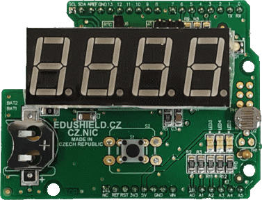
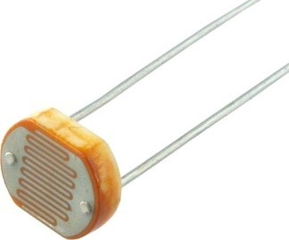
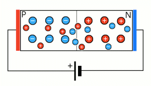
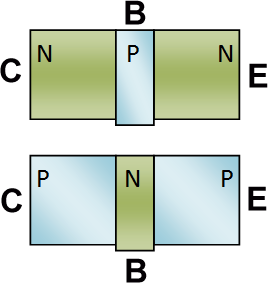

### 6.4.3 {#6-4-3}

7805

Označení 7805 nese součástka, kterou vyráběla už Tesla za socialismu. Jde o napěťový stabilizátor, který dokáže snížit napětí v rozsahu 7,5 V – 35 V na napětí 5 voltů. Jeho zapojení je velmi jednoduché: je to součástka se třemi vývody. Prostřední je společná zem, a dva krajní jsou vstup a výstup. Zapojuje se spolu se dvěma kondenzátory:

Někde se setkáte i s doporučením použít elektrolytické kondenzátory s řádově vyšší kapacitou, třeba i 10 µF. To může pomoci s vykrýváním odběrových špiček, ale zase má zdroj pomalejší náběh.

Takto zapojený stabilizátor dá dostatek proudu pro napájení číslicového obvodu. Pokud je potřeba větší proud, počítejte s tím, že se stabilizátor bude zahřívat, a přidejte k němu chladič. Chladič je tvarovaný hliníkový profil, který má velkou plochu a odvádí dobře teplo. Uprostřed je otvor pro šroub, stejný, jako má obvod 7805.

Obvod 7805 je levný, dobře dostupný a jednoduchý k použití. Bohužel má i své nevýhody, především vysokou vlastní spotřebu (ale k tomu se ještě dostaneme v kapitole o nízkopříkonových zařízeních). Pro stabilizaci napětí z baterií proto není příliš vhodný, ale pro zapojení, poháněné transformátorem (třeba starým napájecím adaptérem pro mobilní telefony nebo notebooky), jde o řešení použitelné.

7

Polovodiče

7

Polovodiče

Zatímco všechny dosavadní součástky se skládaly z vodičů, tedy látek, které vedou proud, tak teď přichází na scénu látky, které jej vedou „tak trochu“, nebo přesněji řečeno „za jistých podmínek“.

Polovodič si nepředstavujte, prosím, tak, že když máte vedle sebe vodič a polovodič, tak že polovodič vede míň proudu, kdepak. Polovodiče jsou látky, které vedou proud za jistých okolností, a ty jsou dané jednak typem polovodiče, a jednak elektrickými poměry, které na něm panují.

Polovodiče, třeba křemík nebo germanium, nemají moc volných elektronů. V jejich krystalové mřížce jsou atomy pravidelně uspořádány, každý atom sousedí se čtyřmi dalšími, a sdílí s nimi své čtyři valenční elektrony (tedy ty na nejvzdálenějších drahách). Což je poměrně stabilní uspořádání. Není v něm moc volných elektronů, takže látka proud nevede.

Stabilitu ovšem může narušit přidání energie zvenčí – kupříkladu světla či tepla. Dodaná energie excituje atomy, dojde k porušení těchto vazeb mezi atomy, a elektrony začnou opět nám známým způsobem putovat po látce. U původního atomu tak vznikne „díra“. Elektron nese záporný náboj, díra kladný. Čím víc energie dodáváme, tím víc podobných párů „elektron-díra“ vzniká. Většina z nich ale opět zanikne – nějaký volný elektron zaplní díru, ne nutně u stejného atomu.

Pokud ale do takové struktury zaneseme příměs, která má víc valenčních elektronů (například fosfor, arsen, antimon), stanou se atomy této látky součástí mřížky. Čtyři elektrony vytvoří páry se sousedními atomy, ale pátý elektron bude „volný“, a začne se potulovat hmotou. Vzniklá hmota bude vodivá, a protože vodivost zajišťují elektrony s negativním nábojem, říkáme, že se jedná o polovodič typu N.

Když do krystalu polovodiče naopak přidáme příměs takového prvku, který má pouze tři valenční elektrony (bór, hliník, galium, indium), bude v mřížce jeden elektron chybět, a vznikne tak (kladně nabitá) díra. Do ní může přeskočit elektron ze sousedního atomu – a tak se díra vlastně přesune o atom dál. Takto pozměněný polovodič bude rovněž vodivý, ovšem bude to polovodič typu P – protože jeho vodivost je založena na dírách, které mají kladný (= pozitivní) náboj.

Zatím to je nuda. Polovodič vede občas, a můžeme do něj přidat příměsi, co z něj udělají buď P, nebo N. A dál?

7.1

P-N přechod

No, teď si představte, že do cesty elektrickému proudu postavíte oba polovodiče za sebou, že vytvoříte takzvanou oblast P-N přechodu.

Co se vlastně stane, když k sobě připojíme polovodiče P a N? Víme, že polovodič N má nadbytek elektronů. Ty, co jsou blízko přechodu, přeskočí do polovodiče P, tam zaplní prázdné díry, a výsledek je, že v bezprostředním okolí přechodu vznikne vyprázdněná oblast bez volných nosičů. Ve zbytku polovodiče N tak po odchodu některých volných elektronů bude převaha kladného náboje, v polovodiči P po zaplnění některých děr bude převaha záporného náboje, a na přechodu tak vznikne difúzní napětí Ud (Jazykový koutek: difúze se píše s čárkou, nikoli s kroužkem.)

Teď na přechod přivedeme napětí – kladný pól na N, záporný na P. Co se stane? Kladný pól přitáhne k sobě volné elektrony, záporný jako by přitáhne volné díry (ve skutečnosti odtlačí blízké elektrony do vzdálených volných děr), a tím to hasne.

Když napětí přepólujete, dojde k opačnému jevu. Kladný pól, připojený k polovodiči P, odtlačí volné díry a přitáhne elektrony, které přešly přes přechod z polovodiče N. Záporné napětí, připojené k polovodiči N, bude naopak odtlačovat elektrony směrem k přechodu a do polovodiče P. Pokud bude napětí větší než difuzní, tak se vyprázdněná oblast opět zaplní. Tím se z nevodivého přechodu stane přechod vodivý.

To je důležitý jev, a já s dovolením zdůrazním: Přechodem P-N prochází proud pouze jedním směrem!

Pokud si vzpomenete na předchozí kapitolu, tak zazněla zmínka o tom, že jedna ze součástek má přesně stejnou funkci…

7.2

Dioda

Ano, polovodičová dioda je ve skutečnosti přesně toto – jsou to dva maličké kousky polovodičů P a N, spojených dohromady tak, že tvoří přechod. K těmto polovodičům jsou připojeny vývody – u P je to anoda, u N katoda.

Teď už je jasné, jak je možné, že diodou prochází proud jen jedním směrem. Ostatně – dobrou pomůckou je už samotný symbol diody, kde trojúhelník tvoří malou šipku. Ta ukazuje směr, kterým diodou teče proud – od anody ke katodě.

Mimochodem, když už je řeč o schematických značkách – víte, jaký je rozdíl mezi následujícími symboly?

Všechny symboly označují totéž: diodu. Jen se v různých dobách kreslily různě. Dřív se hodně dbalo na ten kroužek okolo symbolu (kroužek symbolizuje pouzdro součástky). Setkáte se ale při čtení schématů se všemi. Hlavní rozdíl je, že jen jeden z nich je podle platné normy (je to ten druhý zleva). Měli byste tedy používat ten normovaný. Co ale naděláte, když zrovna ten váš program, který ke kreslení použijete, bude mít symbol pro diodu jiný? Upřímně řečeno: neřešil bych to. Pokud bude poznat, že to je dioda, tak v pořádku. (Což je zase rada strýčka bastlíře.)

Když se místo klasického křemíku použijí jiné látky, například galiumarsenid (GaAs), bude energie, která se v diodě ztrácí při „zapadávání elektronů do děr“ (laicky řečeno) vyzářena jako viditelné světlo. Vzniká tak LED, neboli světlo emitující dioda (Light Emitting Diode). Různé látky vydávají různé barvy světla, a tak máme k dispozici celou škálu barev LED. Nejstarší byly červené, pak přišly žluté a zelené, a když byla objevena látka, která vydává modré světlo, bylo možné sestrojit RGB LED a vytvářet libovolnou barvu světla. Existují i LED, které vydávají světlo ultrafialové a infračervené (infračervené LED se používají u dálkových ovladačů televizí apod.)

P-N přechod je samozřejmě stále citlivý na dodávání energie zvenčí – proto jsou polovodičové součástky většinou v neprůsvitném obalu, aby je neovlivňovalo světlo. I tak je ale může ovlivňovat teplo a měnit jejich charakteristiku. Se vzrůstající teplotou klesá jejich odpor a roste šum.

Někdy je ale citlivost na světlo vítaná – existují speciální diody, které mají průsvitné pouzdro, a u nich se právě citlivost na světlo a snižování odporu v závěrném směru používá k detekci světla. Proto se jim říká fotodiody.

Samotný P-N přechod, pokud je osvětlen, dokonce elektrické napětí vytváří přímo ze světla. Jestli tipujete, že to je princip solárních článků a panelů, jste na správné stopě.

Jak se říká – kdo nevěří, ať tam běží. Zkuste si to sami: Vezměte LED, připojte k jejím vývodům voltmetr, přepnutý na hodně nízký rozsah, a posviťte na ni jasným světlem…

Můžete si zkusit různobarevné LED, a uvidíte, pro kterou barvu se vám podaří získat největší napětí.

Diod existuje víc typů – už jsem zmínil Zenerovu diodu, která slouží ke stabilizaci napětí. Zajímavým typem diod jsou Schottkyho diody – zde je na místě jedné elektrody použit místo polovodiče kov. Taková dioda má nižší dopředné napětí a je rychlejší – rychleji se uzavírá a otevírá.

7.3

Tranzistor

Moje babička tohle slovo znala. Vždycky na mne volala: „Zeslab ten tranzistor, huláká to tu jak na lesy“ nebo „Vypni ten tranzistor a pojď jíst“! Nemyslela tím elektronickou součástku, ale tranzistorové rádio. To byl velký hit 60\. až 80\. let – radiopřijímač, kde se několik tranzistorů staralo o to, aby signál byl hezky hlasitý, a navíc to fungovalo na baterky, takže to bylo přenosné.

Tranzistor ale není radiopřijímač. Tranzistor je druhý typ polovodičové součástky, s nímž se seznámíme. Místo dvou elektrod, připojených na polovodiče P a N a jednoho P-N přechodu má hned tři elektrody a dva P-N přechody. Podle typu uspořádání rozlišujeme tranzistory NPN a PNP.

Elektrody se jmenují Kolektor (C), Báze (B) a Emitor (E). Tranzistor má tu vlastnost, že proud, tekoucí mezi bází a emitorem, zároveň otvírá cestu mnohem větším proudům, které tečou mezi kolektorem a emitorem. Proud mezi kolektorem a emitorem je úměrný proudu mezi bází a emitorem, a tak se tranzistor používá jako jednoduchý zesilovač. Nejdůležitější vlastnost tranzistoru se nazývá proudový zesilovací činitel (značí se h21e, někdy taky beta, β nebo hFE, a v anglických materiálech se setkáte s označením DC Current Gain) a udává, kolikrát je proud kolektorem vyšší než proud bází.

Ovšem audiotechnika, do níž zesilovače signálu patří, je sice krásná oblast elektroniky, ale mimo záběr této knihy, a proto se tu omezím pouze na konstatování, že tomu tak je. V číslicové technice, kde nezáleží ani tak na velikosti napětí a proudu, jako spíš na tom, jestli proud teče či neteče a jestli napětí je, nebo není, se tranzistory používají jiným způsobem – ne jako zesilovače, ale jako spínače.

Pokud připojíte na bázi kladné napětí vůči emitoru, tranzistor se otevře a vede proud z kolektoru do emitoru (u typu NPN; pro PNP platí totéž, ale obráceně – ovládá se záporným napětím a proud teče z emitoru do kolektoru). Když je na bázi napětí menší než 0,7 voltu (u křemíkových tranzistorů), tak je tranzistor zavřený a proud mezi kolektorem a emitorem neteče.

Ostatně je to vidět i na schematické značce – emitor je vždy označen šipkou, a ta udává směr proudu.

A opět mnemotechnické pravidlo: NPN (čtěte samozřejmě [en pé en]) – šipka ven!

Kromě těchto tranzistorů NPN a PNP, které jsou označovány jako bipolární, existují i tranzistory typu FET (tranzistory řízené polem – míněno elektrickým): JFET a MOSFET.

V číslicové technice se tranzistory používají nejčastěji jako budiče proudově náročných zařízení – relé, motorů, běžných žárovek atd. Číslicové integrované obvody totiž dávají na výstupu poměrně malý proud, který třeba pro LED stačí, ale pro sepnutí relé už je nedostatečný. Tranzistor nabízí jednoduchý způsob, jak tento výstup „posílit“. Ale o tom se pobavíme později.

Já vím, relé je opravdu stará součástka a ne každý ji pamatuje. Proto vězte, že relé je „elektromagnetický spínač“, kde je elektromagnet (cívka) a dva kovové kontakty. Když cívkou prochází proud, tvoří se okolo ní magnetické pole, a to přitáhne kontakty, které se tak spojí (nebo rozpojí, podle konstrukce). Tak lze nízkým napětím (5 V) spínat třeba síťových 230 voltů. Ale o relé ještě bude řeč.

7.4

Rozsvítíme prstem LED!

Pamatujete se na staré televize, které měly přepínání kanálů pomocí senzorů? Ne, teď nemyslím senzor jako že snímač, myslím senzor jako dotykové tlačítko. Vypadalo nějak takto:

Senzor v tehdejším pojetí byly dva plíšky, oddělené nevodivou mezerou. Když jste se těchto dvou plíšků dotknuli prstem, spojili jste je (kůže je trochu vodivá), a řídicí elektronika to vyhodnotila jako stisknutí tlačítka.

Pojďme si to zkusit zapojit. Žádné složitosti, jen senzor, klidně nasimulovaný dvěma dráty vedle sebe, a dotykem rozsvítíte LED.

Co třeba takhle?

Ty dvě kolečka vlevo symbolizují dvě dotykové plošky, které budeme prstem spojovat. Vzhledem k tomu, že kůže má poměrně velký odpor, je potřeba, aby byly co nejblíž u sebe, třeba milimetr, dva…

Zkuste se dotknout – a co? Nesvítí, že? A když ty plošky spojíte třeba hřebíkem, tak to funguje. Stvořili jsme dotykový senzor pro kyborgy s kovovými prsty, ovšem pro lidi nic moc.

V čem je problém? Prozradím vám to: lidská kůže má fakt hodně velký odpor, na těch dvou milimetrech vzdálenosti klidně několik megaohmů. Ostatně zkuste si to sami změřit!

Pokud baterie dává 5 voltů, tak z Ohmova zákona vyplývá, že skrz prst (ne, to není jazykolam) poteče nějakých pár µA. Jenže to je na LED málo… Můžete si zkusit prst naslinit, odpor klesne třeba desetkrát, ale to stále není žádná výhra.

Kéž bychom měli součástku, která malým proudem dokáže sepnout velký, že?

Nebudu vás napínat – právě jsem jinými slovy zopakoval to, co jste četli o několik stránek dřív: tranzistor malým proudem (mezi bází a emitorem) spíná velký proud (mezi kolektorem a emitorem).

Velký proud, to bude to, co poteče LEDkou, malý proud bude to, co teče senzorem. Co třeba takhle?

„Velký proud“ teče – pokud tedy teče! – z kladného pólu baterie přes rezistor a LED do kolektoru u tranzistoru, skrz tranzistor emitorem ven a do záporného pólu baterie. „Malý proud“ teče z kladného pólu téže baterie do senzoru, tam protéká vaším prstem, zpátky do druhého pólu senzoru, odtamtud do báze tranzistoru, a přes emitor ven a do baterie. Což samozřejmě platí pro situaci, kdy je prst přiložen. Když prst přiložen není, tak žádný malý proud neteče, a tím pádem neteče ani velký proud.

Jako tranzistor použijte třeba BC548C, ten má hodně velký proudový zesilovací činitel. Co je „hodně velký“? No, podle datasheetu je to nějakých 500 (čeho? Jablek? Voltů? Ohmů? Ničeho; zesilovací činitel je bezrozměrný, nemá jednotku) při proudu kolektorem 2 mA. Na takový proud stačí tedy 500 × menší proud bází – tedy 4 µA. To by mohlo fungovat, i když svit LED při dvou mA nebude nijak přehnaný…

