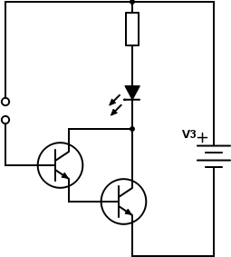
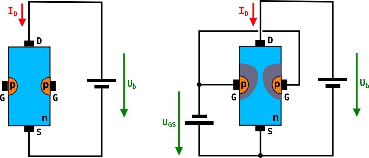
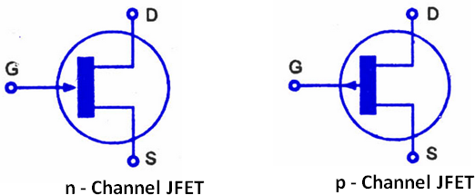
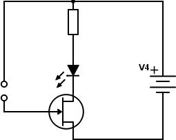
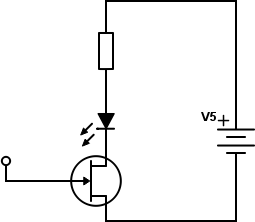
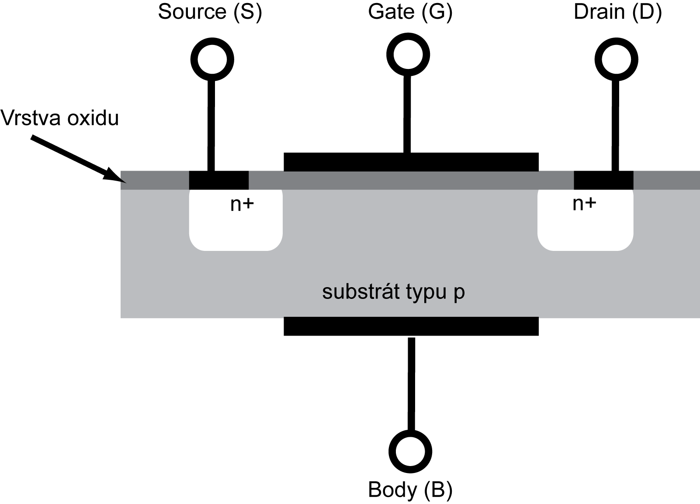
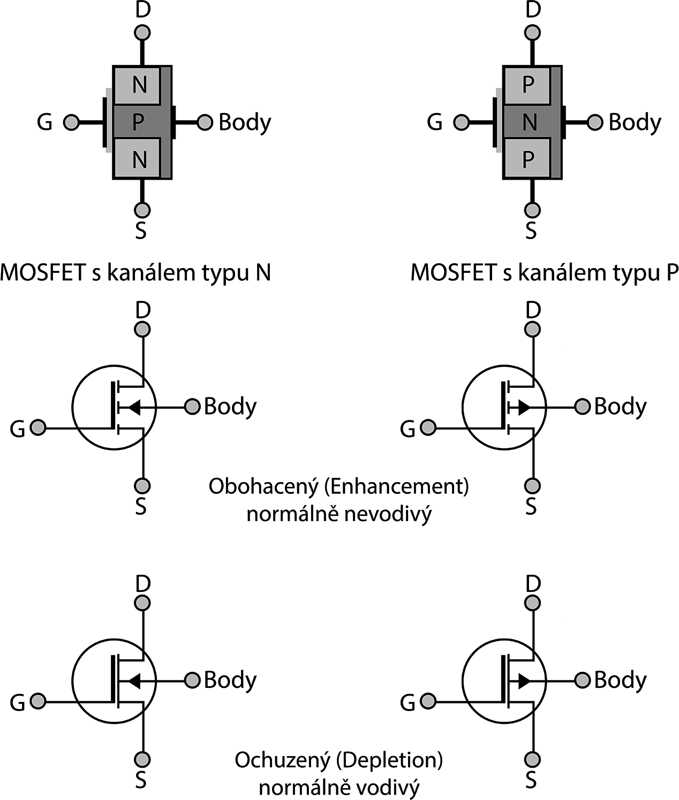

### 7.4.1 {#7-4-1}

Více světla!

Co když i ten „velký proud“ je pro nás stále malý? Co kdybychom chtěli do LED pouštět víc, třeba 10 mA. Nebo kdybychom chtěli zapojit žárovku, co si bere desítky až stovky miliampérů? Nebo když máme obzvlášť suché prsty a „malý proud“ je příliš malý?

Prozradím vám trik zvaný Darlingtonovo zapojení. V něm použijeme dva tranzistory. První udělá z malého proudu střední, druhý ze středního velký.

7.5

Tranzistor řízený polem (FET)

Tranzistory NPN a PNP jsou historicky první polovodičové tranzistory. Velmi hezky zesilují signál, ale mají jednu drobnou nevýhodu: zesilují proud. I když tranzistor zesílí proud třeba stonásobně, znamená to, že pokud má na výstupu dát třeba 100 mA, musí do vstupu téct 1 mA, což není zanedbatelný proud. Když chcete na výstupu spínat proud třeba 2 A, musel by takový tranzistor na vstupu odebírat 20 mA. Řešením by bylo mít tranzistor s vyšším proudovým zesilovacím činitelem, popřípadě zapojit dva tranzistory za sebou v Darlingtonově zapojení – první zesílí z 0,2 mA na 20 mA, druhý z 20 mA na 2 A. Problém je, že se tím zvýší spotřeba, a tím i ztráty.

Existují ale i tranzistory, které na řídicí elektrodě nepotřebují téměř žádný proud a řídí se pouze napětím. Nazývají se unipolární, též řízené polem, v angličtině Field-Effect Transistor (FET). Nejjednodušší tranzistor FET je JFET (Junction FET).

Představte si dlouhý polovodič typu N („dlouhý“ na poměry elektronických součástek, v praxi řádově milimetry a menší), na jehož protilehlé konce jsou připojeny elektrody. Nazvěme je analogicky s emitorem (vysílač) a kolektorem (sběrač): Source (zdroj) a Drain (jímka). Polovodič typu N má dostatek volných elektronů, takže vede proud mezi elektrodami S a D. Zatím to moc zajímavé není.

Teď si ale představte, že tento kanál omezíte. Někde v polovině vytvoříte oblast s vodivostí typu P, a k ní připojíte další elektrodu. Pokud bude na této elektrodě menší napětí proti elektrodě S (bude tedy „zápornější“), vytvoří se okolo přechodu ochuzená oblast (vzpomeňte si na diodu…), která nevede proud. Díky tomu se zmenší průřez kanálu, a tím vzroste jeho odpor pro proud mezi S a D. Tato elektroda tedy řídí tok proudu, a proto se jí říká řídicí, anglicky Gate (G).

Když bude na G kladnější napětí než na S, tranzistor bude otevřený.

CC-BY-SA, autor Chautube, Wikimedia

Všimněte si, že se tranzistor řídí napětím v závěrném směru, tedy ve směru, kdy P-N přechodem mezi G a S neprochází proud. Proudy, tekoucí skrz Gate, jsou opravdu mizivé, v řádech nanoampérů.

Napětí, při kterém se tranzistor JFET zcela uzavře, bývá mezi - 0,5 V a - 10 V. Toto napětí velmi kolísá, nejen podle typu tranzistoru ale dokonce i u dvou tranzistorů stejného typu může být rozdílné.

Když zaměníte polovodiče P a N, stvoříte JFET typu P (dosud jsme si popisovali JFET-N). Jeho funkce bude stejná, jen logika obrácená: tranzistor se bude zavírat kladnějším napětím na elektrodě G.

Všimněte si, že z popisu funkce vyplývá, že vlastně není rozdíl mezi elektrodami S a D. A ono to tak je: když tranzistor zapojíte obráceně (prohodíte S a D), tak teoreticky bude fungovat úplně stejně. U některých JFET to tak funguje doopravdy. V praxi ale mezi těmito elektrodami bývá rozdíl, například ve velikosti a tloušťce, ale některé typy mají opravdu S a D zaměnitelné.

7.6

Šoupejte nožkou…

Sedíte? A máte koberec? A šoupete po něm mimoděk nohama? To nedělejte, to není dobře, tím se nabíjíte statickou elektřinou, ta putuje po vašem těle a nejen že můžete dostat ránu, když se dotknete něčeho uzemněného, ale můžete taky naprosto tiše a bez jakýchkoli vnějších projevů pouhým dotykem zničit drahou elektroniku.

O statické elektřině jsme si říkali, že má potenciál klidně v řádech kilovoltů, ale náboj není tak velký, aby dokázal vytvořit dostatečně nebezpečný proud. Když si to spojíte s těmi tranzistory: u bipolárních (NPN, PNP) potřebujete k jejich otevření proud; ty se statickou elektřinou neotevřou. JFET je řízený napětím, tam by to šlo…

Vezměte náš senzor s tranzistorem z předchozí kapitoly a tranzistor NPN nahraďte tranzistorem JFET – já použil třeba BF245\. V datasheetu jsem si našel zapojení vývodů (G-S-D), a zapojil jsem vše analogicky: G místo báze, S místo emitoru, D místo kolektoru.

Všimněte si, že tentokrát není potřeba se prstem dotýkat. Stačí ho přiblížit dostatečně blízko. Dokonce si, věřte nebo ne, vystačíme s jediným pólem:

Klidně použijte vodič s izolací, ani nemusí být „holý“. LED bude změnou jasu reagovat i na pouhé přiblížení ruky.

7.7

MOSFET

U tranzistoru JFET je řídicí elektroda součástí P-N přechodu a v propustném směru jí může téct proud, stejně jako skrz jakoukoli diodu. Pokud ale řídicí elektrodu izolujete tenkou vrstvou nevodiče, například oxidu křemičitého, můžete vytvořit další typ tranzistoru, řízeného polem.

Elektrody S a D jsou připojené k polovodičům typu N, které jsou zapuštěné v bloku polovodiče P (substrát, též tělo – body). Řídicí elektroda G je kovová a od polovodiče je izolovaná nevodivou vrstvou oxidu. Z tohoto uspořádání pochází i označení MOS: Metal-Oxid-Semiconductor.

Za normálního stavu mezi S a D neteče žádný proud. Brání tomu dvojice přechodů N-P-N mezi elektrodami a substrátem. Pokud ale na řídicí elektrodu G přivedete kladné napětí, „odtlačí“ toto napětí volné díry v polovodiči typu P na druhou stranu, a pod ní vznikne úzký vodivý kanál, který se chová jako slabý polovodič typu N, a tranzistor začne vést proud.

Tranzistorů MOSFET je velké množství s nejrůznějšími typy struktur a vodivostí. Dva základní typy jsou NMOS (elektrody typu N, substrát typu P) a PMOS (elektrody P, substrát N). Oba typy mohou být vytvořené buď s indukovaným kanálem (enhanced – tento typ jsme si popsali), nebo se zabudovaným kanálem (depletion). U „depletion“ typů je vytvořen vodivý kanál z výroby pomocí ochuzeného polovodiče stejného typu, tranzistor tedy za normálního stavu vede, a záporné řídicí napětí naopak vodivost snižuje.

Tranzistory typu MOS mají několik vynikajících vlastností – téměř nulový proud řídicí elektrodou, velké proudy mezi Source a Drain, nízké ztráty apod., ale mají jednu výraznou nevýhodu: vrstvička izolantu mezi elektrodou G a substrátem je opravdu velmi tenká, takže ji lze prorazit i poměrně nízkým napětím, třeba okolo 20 voltů. V reálných systémech bývají proto tyto elektrody chráněny rychlými diodami před průrazem. Ovšem největší nebezpečí představuje pro tyto tranzistory statická elektřina. Proto se při manipulaci s tranzistory MOS a dalšími součástkami, v nichž je tato technologie použita, doporučuje zvýšená opatrnost, měli byste s nimi manipulovat vždy důkladně uzemněni (používají se například vodivé náramky), a dokud to je možné, tak by měly mít tyto součástky všechny své vývody vodivě propojené (používá se buď vodivá pěna, nebo například alobal). Toto vodivé spojení by mělo být odstraněné až po montáži součástky do obvodu.