### 7.7.1 {#7-7-1}

Co je to CMOS?

Patří to sem? Ano, trochu ano. CMOS je technologie, která kombinuje NMOS a PMOS tak, že se oba tranzistory doplňují (proto CMOS – Complementary MOS). V současné době je to nejpoužívanější technologie pro výrobu integrovaných obvodů: je dostatečně rychlá, s velmi nízkou spotřebou…

Pamětníci si vzpomenou, že měli v počítačích PC něco, čemu se říkalo taky CMOS, a byla tam baterie. To byl čip, který fungoval jako paměť konfigurace (jak velký disk je použitý, jakou má strukturu, kolik paměti je nainstalováno). Byl vyráběn právě technologií CMOS a díky tomu byla jeho spotřeba velmi nízká a pokryla ji po mnoho let baterie. Když se pak baterie vybila, začala „cé moska“ zapomínat.

A možná znáte zkratku CMOS z recenzí různých fotoaparátů: „Typ snímacího čipu: CMOS“. Ano, jde zase o stejnou technologii. Vzpomeňte si, jak jste svítili na LED: polovodičový přechod je citlivý na světlo. A když poskládáte strukturu MOS tranzistorů tak, že je z nich matice, na kterou může světlo dopadat, bude vám je dopadající světlo zavírat a otvírat…

7.8

A to je všechno s polovodiči?

Ani náhodou. Dioda a tranzistor jsou nejjednodušší polovodičové součástky s jedním, resp. dvěma P-N přechody. Existují i součástky s více přechody, jako tyristory, triaky a diaky, používané především pro spínání velkých proudů a regulaci výkonu, ale těmi se zabývat nebudeme.

Naopak se budeme zabývat jinými polovodičovými součástkami, totiž integrovanými obvody. Integrované obvody pomocí sloučení mnoha tranzistorů, diod a rezistorů na jedné křemíkové destičce nabízejí velmi složité funkce a komplexní obvody.

Integrované obvody dělíme do dvou základních skupin: analogové a digitální. Zjednodušeně se dá říct, že analogové obvody nějak pracují s proudy či napětím – zesilují, zpracovávají apod., zatímco u digitálních se pracuje pouze s logickými signály, nejčastěji definovanými jako: je napětí/není napětí. Zapnuto/vypnuto. Mezi nimi jsou obvody hybridní, které kombinují oba světy, jako například analogově-digitální a digitálně-analogové převodníky, časovače, Hallovy sondy s digitálním výstupem a podobně.

My budeme používat převážně digitální obvody v pouzdrech DIL. Což mě přivádí k nápadu, že je vhodná chvíle pobavit se o tom, jak jsou součástky vlastně „zabalené“ a jak se s nimi pracuje.

8

Pouzdra elektronických součástek

8

Pouzdra elektronických součástek

Rezistory se nejčastěji vyskytují v podobě malých válečků s axiálně (tj. v ose) umístěnými vývody. Vypadají jako „oteklý drát“, jak se říká. Hodnota bývá značena buď barevnými proužky, nebo (na větších rezistorech) napsána číslem.

Kondenzátory jsou nejčastěji menší či větší válečky s oběma vývody na jednom konci (u elektrolytických kondenzátorů), popřípadě vypadají jako velké rezistory (svitkové) nebo jako malé polštářky. U elektrolytických kondenzátorů je dost místa na označení hodnoty a maximálního napětí, u menších keramických bývá trojčíslí, kde první dvě číslice znamenají hodnotu a poslední počet nul, které je potřeba dopsat, abychom dostali kapacitu v pikofaradech. Příklad:

330 = 33, žádná nula, tedy 33 pF

104 = 10 + 0000, tedy 100 000 pF = 100 nF

472 = 47 + 00, tedy 4 700 pF = 4,7 nF

Diody jsou podobné rezistorům – mívají pouzdro, na kterém je napsán typ diody, a u jednoho vývodu barevný pruh. Ten označuje katodu.

Tranzistory bývají nejčastěji v pouzdrech, které se označují TO-92 nebo TO-220\. TO-220 jsou pouzdra pro výkonové tranzistory, k nimž se připojuje chladič.

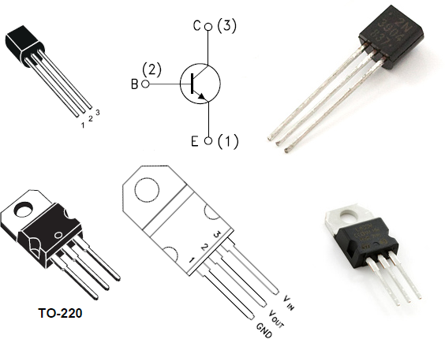

To, který vývod je báze, který kolektor a který emitor, se u jednotlivých typů liší, proto je vždy důležité podívat se do datasheetu.

8.1

Co je to SMT a THT

Kdysi dávno se obvody montovaly ze součástek s drátovými vývody, které se k sobě letovaly. Později přišly takzvané plošné spoje – to je deska, na níž je nanesena vodivá vrstva, nejčastěji mědi, a pomocí ní jsou vytvořené vodivé spoje dle potřeby. Pro každou součástku bylo vyhrazené místo, kam byla připájena, a nebylo potřeba propojovat vývody ručně s rizikem toho, že „se na něco zapomene“. Později, s rozvojem integrace, přišly vícevrstvé plošné spoje. Pak se ukázalo, že vrtání děr je drahé, proto se přešlo k součástkám v pouzdrech, které jsou přizpůsobené pro montáž na povrchu, tedy není nutné prostrkovat přívody vrtanými otvory. Této technologii se říká Surface Mounted Technology – SMT, tedy „technologie povrchové montáže“. Pouzdra, která jsou vhodná pro tuto montáž, se označují SMD (Surface Mounting Design). Starší způsob, s otvory a vývody na prostrčení, dostal název THT – Through Hole Technology.

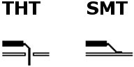

Pro začátečníky je vhodnější technologie THT. Má to hned několik důvodů. Pouzdra pro THT mají dlouhé vývody s většími roztečemi (nejčastěji v rastru 2,54 mm = 0,1 palce) a dobře se s nimi pracuje. Dají se použít v nepájivých polích, dají se i dobře pájet v ruce… Součástky v SMD pouzdrech mají vývody krátké, někdy ani vývody nemají a mají jen pájecí plošky, a tak je musíte (skoro) vždy pájet. Navíc mají menší mezery mezi vývody, a tak jejich ruční pájení vyžaduje lepší vybavení a hlavně cvik.

V SMD pouzdrech se vyrábějí snad všechny diskrétní součástky – rezistory, kondenzátory, diody, tranzistory, LED – i integrované obvody. Některé integrované obvody se vyrábějí pouze v SMD pouzdrech. Platí to zejména pro velmi složité obvody, jako jsou moderní procesory, programovatelná logická pole, miniaturní senzory a další podobné. Výrobci dnes už málokdy navrhují moderní obvody pro THT, a ani je v takových pouzdrech nenabízí. Výjimkou jsou snad jen některé sériové paměti.

8.2

DIP, DIL

U integrovaných obvodů, s nimiž budeme pracovat, budeme nejčastěji používat pouzdra typu DIL či DIP. Jaký je mezi nimi rozdíl?

DIL znamená Dual In-Line. Tedy že vývody jsou uspořádány do dvou (dual) řad (line). Mezi sebou mají rozestup 2,54 mm, řady jsou od sebe vzdáleny trojnásobek či šestinásobek této hodnoty.

DIP znamená Dual In-Line Package. Tedy naprosto totéž jako DIL, jen je tam přidáno slůvko Package, neboli pouzdro. Můžete se setkat i s označením PDIP a CDIP. PDIP znamená Plastic DIP, CDIP je Ceramic DIP. Dnes se většinou používají první, tedy plastová pouzdra, většinou černé barvy. CDIP, keramická pouzdra, bývala kdysi populární, nejčastěji měla bílou barvu, ale dnes už se moc nepoužívají – jsou křehká a někteří uživatelé hovoří o tom, že po mnoha letech přestávají součástky fungovat, protože se pouzdra občas poruší.

Číslovka za označením znamená počet vývodů. DIP14, DIP16, DIP24, DIP28, DIP32 a DIP40 (popřípadě „DILxx“) udávají, že součástka je v pouzdře se 14, 16 atd. vývody.

Pokud se dostanete k pájení, velmi rychle zjistíte, že integrované obvody jsou náchylné na přehřátí. Proto je dobré dávat je do takzvaných patic (či objímek) Sice to někdy sníží spolehlivost, ale zjednoduší to výrazně výměnu poškozených součástek. Integrované obvody s mnoha vývody se totiž snadno zapájí, ale podstatně hůř vypájí.

8.3

Co s těmi ostatními?

Jak jsem už psal – u moderních součástek bývá časté, že je výrobce nenabízí v jiném pouzdru, než pro povrchovou montáž. Ale naštěstí spousta dalších firem nabízí takzvané „breakout moduly“ – což jsou v podstatě malé destičky, na nichž je připájena daná součástka, a mají vyvedené vývody v roztečích, které jsou vhodné pro nepájivá pole.

Mnohé součástky, především senzory, jsou díky tomu dostupné i pro domácí kutily.

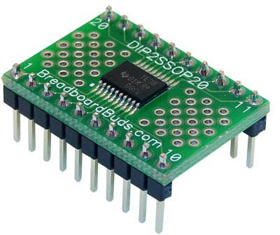

8.3.1

Praktické tipy

Pro svoje pokusy budete potřebovat mít sadu základních součástek, nebudete pokaždé běhat do obchodu, když budete potřebovat tři rezistory.

Už jsem to psal: Udělejte si zásobu součástek. Pro číslicovou techniku bych doporučil mít základní sadu – sepsal jsem ji na konci knihy, v příloze „nákupní seznam“. S takovou sadou součástek budete moct sestavit prototyp libovolného zařízení, nemusíte čekat, až dojdou speciální obvody, můžete vesele testovat, a až pošta doručí vybrané součástky, tak můžete postavit konečně hotové zařízení.

9

Blikač s Arduinem

9

Blikač s Arduinem

Dobře, pojďme si ukázat o něco jednodušší způsob. Arduino jistě znáte…

Neznáte? Tak to rychle napravíme, protože Arduino je fajn pomůcka i nástroj, se kterým ušetříte spoustu součástek, a navíc si zaprogramujete. Ne, vážně, bez znalosti programování v nějakém jazyku, podobném C, Arduino nevyužijete. Na druhou stranu – pokud umíte programovat v čemkoli, co má podobnou syntax, tedy v Javě, JavaScriptu, C#, Lua a dalších jazycích, tak zvládnete i jazyk pro Arduino (říká se mu Wiring).

Knih a výukových materiálů k Arduinu je spousta, takže vás s podrobnostmi odkážu raději na ně (tip: [arduino.cz](http://arduino.cz) má zajímavou knihu jako e-book), tady si řekneme jen pár základních věcí.

9.1

Když se řekne Arduino

tak „se“ má na mysli nejspíš Arduino Uno. Je to dnes nejrozšířenější typ, a díky tomu, že je open-source, tak mohlo vzniknout nepřeberně klonů, které jsou lépe vybavené, levnější, popřípadě obojí.

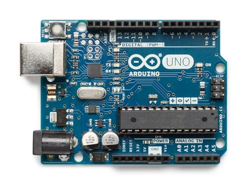

Originální Arduino obsahuje jednočip ATmega328 – to je to velké černé vpravo dole s mnoha vývody. Tento obvod provádí program, který do něj nahrajete, a podle něj umí řídit jednotlivé výstupy (horní a dolní okraj). Dále obsahuje komunikační rozhraní pro sběrnici USB – kovový konektor vlevo nahoře a malý čtvercový obvod napravo od něj. Vlevo dole pak jsou součástky, které se starají o napájení toho všeho. A to je vše.

Neoriginální Arduino může vypadat třeba takhle:

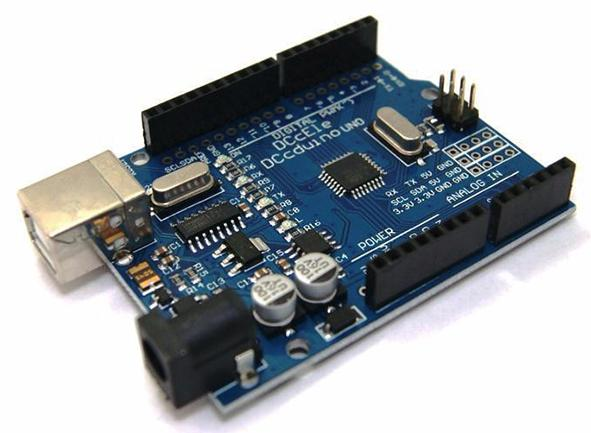

Trénované oko vidí, že procesor je v jiném pouzdru (černý čtverec zhruba uprostřed), a že obvod pro řízení USB je jiný (obdélník místo čtverce).

Pokud Arduino ještě nemáte a přemýšlíte, jaké pořídit, tak mám jeden tip: pořiďte si v českém obchodě originální. Je sice dražší, ale máte mnohem vyšší naději, že bude v pořádku. A máte i záruční lhůtu na případnou opravu. Klon vás vyjde třeba na pětinovou cenu, nebo i nižší, ale může se vám stát, že budete pozorovat „podivné“ chyby v chování – protože třeba výrobce něco nepřipájel, nebo osadil ne zcela perfektní obvody. Mně se podobné chování objevilo asi tak u dvou procent Arduin, ale nikdy nevíte…

Kromě základní verze Uno existuje i Arduino Mega s mnohem větším procesorem (a taky s více vývody):

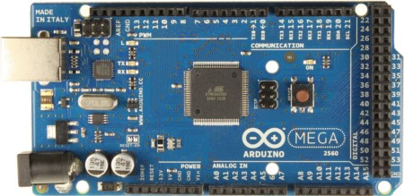

Vidíte, že zleva je to velmi podobné obyčejnému Arduinu, a vpravo je jaksi „navíc“ spousta dalších vývodů a konektorů.

A kromě těchto Arduin je i spousta dalších desek a kitů, které se jmenují všelijak – Seeduino, DCDuino, Funduino, … Společné mají to, že je lze programovat stejně jako základní Arduino, ale liší se ve schopnostech, někdy i v konektorech…

Existují i Arduina, která jsou osazena jiným procesorem, než je Atmel AVR – například procesorem z rodiny ARM:

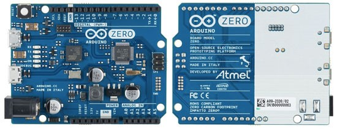

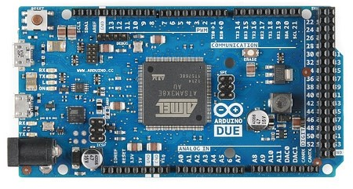

Tato Arduina mají sice stejné vývody, ale vyžadují jiné napětí – ne 5 voltů, ale 3,3 voltu. Později si vysvětlíme, co to znamená, teď si pamatujte: pro začátek tato Arduina nepoužívejte, použijte Uno!

Zajímavá varianta Una je miniaturní Nano. Výhoda tohoto Arduina je, že ho lze zasunout do nepájivého kontaktního pole:

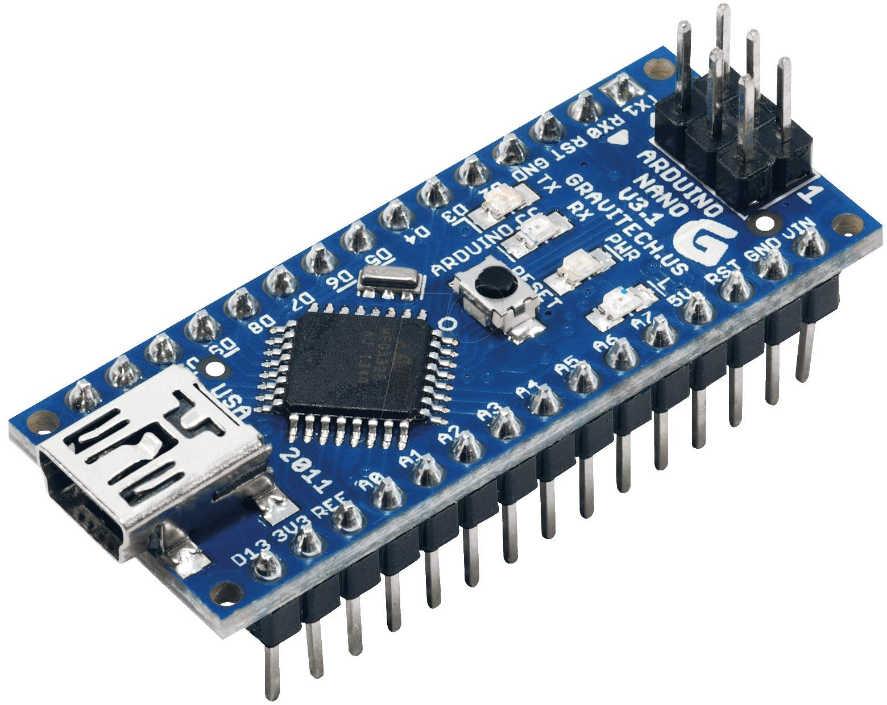

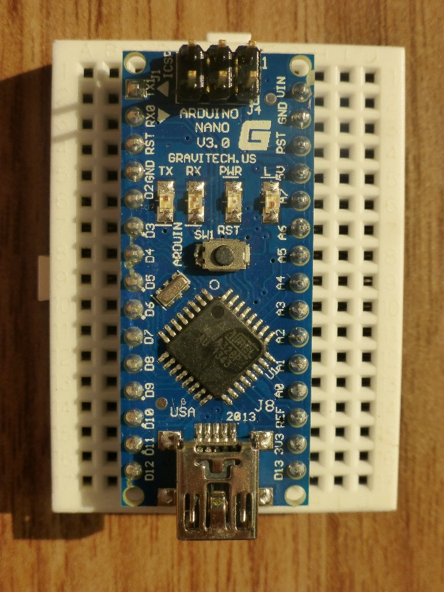

9.2

Programování Arduina

Aby Arduino k něčemu bylo, musí v něm být nějaký program. K programování se používá nástroj, který se trochu honosně jmenuje Arduino IDE – ve skutečnosti jde o textový editor, k němuž je přibalený kompiler pro procesory Atmel AVR a knihovny. Na druhou stranu stačí stáhnout si tento nástroj, propojit Arduino s počítačem přes kabel – a fungujete.

Arduino IDE si stáhnete ze stránek [Arduino.cc](http://Arduino.cc) pro všechny tři hlavní OS – Windows, Linux i macOS.

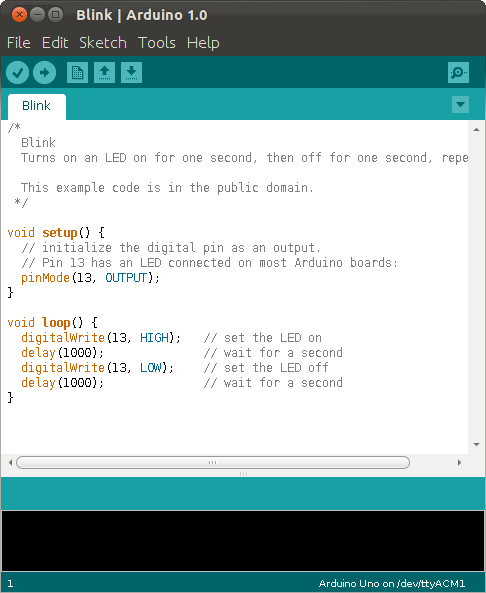

Udělejte to.

Ne, zcela vážně: Vezměte Arduino Uno a propojte ho s počítačem. Hned teď. Originální Arduino nebude vyžadovat žádné ovladače, respektive si je stáhne. Problém může být s neoriginálními Arduiny, ty vyžadují na macOS nebo na starších Windows (7, 8, 8.1) instalaci ovladačů.

Máte? Stáhněte si Arduino IDE, rozbalte (nemusí se instalovat) a spusťte.

Nejdřív jděte do menu Tools, česky Nástroje, tam vyberte podmenu Board – Vývojová deska, a v ní zvolte položku „Arduino / Genuino Uno“. Tedy samozřejmě předpokládám, že máte Arduino Uno, nebo jeho klon. Druhý krok je opět v menu Tools – Nástroje, položka Port. Pokud máte Arduino připojené, měli byste jej vidět v nabídce. Na Windows bude mít označení COMxx (xx je nějaké číslo, klidně COM2, ale i COM37, je to opravdu libovolné). Na Linuxu to bude /dev/ttyněconěco. Pozor, na Linuxu musí být uživatel, pod nímž je spuštěno Arduino IDE, členem skupiny „dialout“. Na Macu to bude něco jako /dev/ttyusbněco.

V menu File je podmenu Examples (česky Soubor – Příklady), a tam naleznete adresář 01 Basics, a v něm příklad, nazvaný Blink. Klikněte na něj, otevře se takzvaný „sketch“ – vlastně zdroják pro Arduino s příponou .ino

9.3

Blikání Arduinem

Vidíte kód, který je hodně jednoduchý, programátoři už určitě větří… Vidíte dvě funkce, setup() a loop(). První se provede po spuštění celého zařízení, a když doběhne, tak se donekonečna volá ta druhá. Nějak takhle – představte si, že tohle je funkce na pozadí:

void main() {

setup();

while(1) loop();

}

Zpátky k příkladu blink. Ve funkci setup() je volaná nějaké funkce pinMode(), která říká, že nějaký výstup má být OUTPUT, a v druhé se pak střídá digitalWrite HIGH a digitalWrite LOW, proložené zpožděním (delay). (Na konci knihy, v přílohách, najdete stručný přehled základních funkcí Arduina).

void setup() {

pinMode(LED_BUILTIN, OUTPUT);

}  

void loop() {

digitalWrite(LED_BUILTIN, HIGH);

delay(1000);

digitalWrite(LED_BUILTIN, LOW);

delay(1000);

}

V horní liště, hned pod menu, je několik tlačítek. To úplně první vlevo zkontroluje, jestli jsou v kódu nějaké chyby. To druhé, vedle něj, s ikonkou šipky, spustí překlad, a po překladu se přeložený kód nahraje do Arduina po USB kabelu.

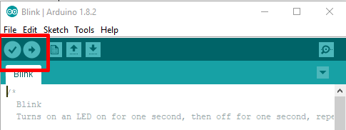

Předpokládám, že máte vše nastavené a propojené, na Arduinu svítí LED, která signalizuje napájení – pojďme na to! Klikněte směle na překlad a nahrání.

Bude to chvilku trvat, zhruba tak dlouho, jak budete číst tento odstavec, a až bude všechno přeloženo, tak se v tom zeleném pruhu pod editorem objeví nápis „Done upload“. V černém poli pod ním pak uvidíte buď lakonické sdělení o tom, kolik program zabírá paměti, nebo nějaké oranžové hlášky, které znamenají chybu.

Nejčastější chyba, věřte tomu nebo ne, je ta, že zapomenete vybrat port a typ desky. Viz výše.

Pokud to všechno proběhlo, tak si všimněte, že na desce bliká LEDka.

To bylo jednoduché, co? Žádný kondenzátor, žádný integrovaný obvod, žádná LED, žádný rezistor… Jenže takhle se nic nedozvíme a nenaučíme. Takže uděláme jeden krok…

9.4

Krok zpět k drátům

Připravte si zase nepájivá kontaktní pole. Připravte si propojovací vodiče. Tentokrát odpojte napájení, vezmete si potřebné napětí přímo z Arduina. Všimněte si na Arduinu dole dvou vývodů, označených GND (ten je zdvojený) a 5 V. GND je i v horní řadě vývodů – je úplně jedno, který použijete, protože uvnitř jsou stejně propojené. A teď připojte tyto dva vývody k napájecím lištám na kontaktním poli. Nějak takto:

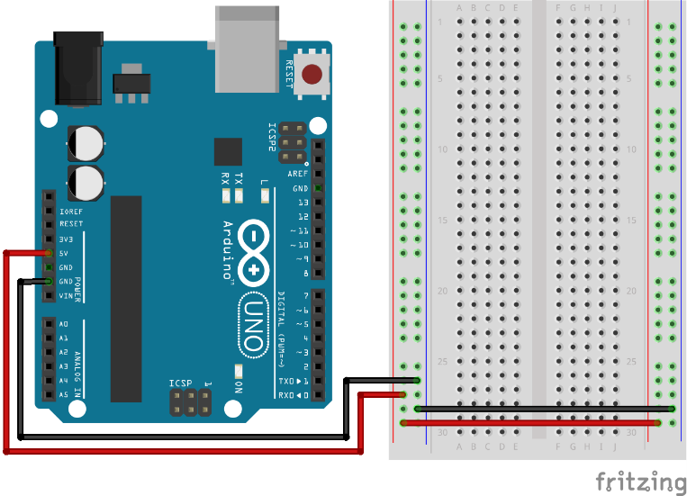

Tak, a teď pokaždé, když Arduino poběží, budete mít na kontaktním poli i potřebné napájecí napětí. Jupí.

Zapojte si LED.

Z minulé kapitoly si jistě pamatujete, že LED má dva vývody a zapojuje se k ní rezistor. Udělejte to podle obrázku:

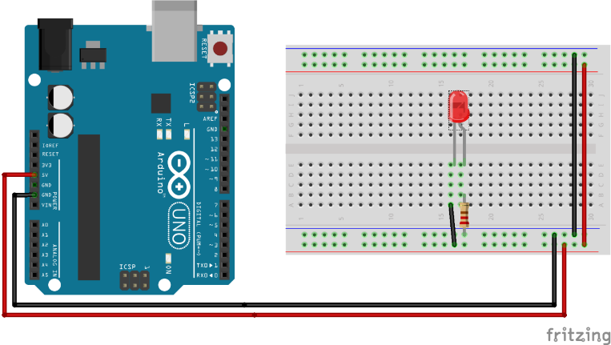

Připojte Arduino k počítači – ani v něm nemusí být nic nahraného. LED by měla svítit. Pokud nesvítí, otočte ji (a tím otočením myslím, že prohodíte její vývody, ne že ji třeba… co já vím… vzhůru nohama, nebo tak něco).

Svítí? Jupí. Teď ji propojte s Arduinem:

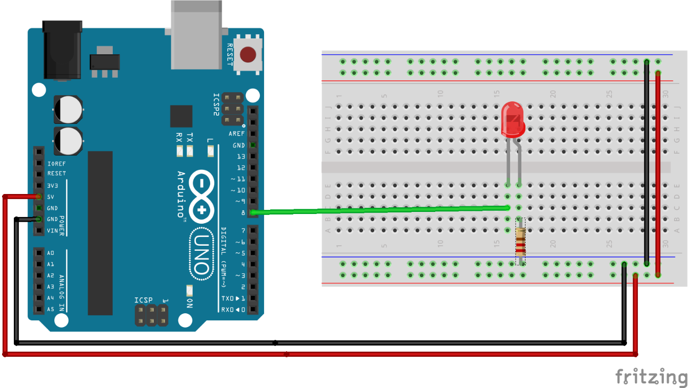

Všimněte si, co přesně jsem nakreslil – vodič, který propojoval LED a kladný pól, jsem odstranil, a místo kladného pólu jsem daný vývod LED zapojil do Arduina, na pin číslo 8\. Proč? No protože jsem se rozhodl, že budu LED ovládat Arduinem. A vy taky!

Máte stále otevřený ten příklad Blink? Tak prosím všude, kde je LED_BUILTIN, napište 8\. Jako že osmičku. Je to na třech místech. Výsledek bude vypadat nějak takhle:

// the setup function runs once when you press reset or power the board

void setup() {

// initialize digital pin LED_BUILTIN as an output.

pinMode(8, OUTPUT);

}  

// the loop function runs over and over again forever

void loop() {

digitalWrite(8, HIGH); // turn the LED on (HIGH is the voltage level)

delay(1000); // wait for a second

digitalWrite(8, LOW); // turn the LED off by making the voltage LOW

delay(1000); // wait for a second

}

Teď přeložte a nahrajte. Pokud vše půjde bez problémů, stane se co? Správně, bude blikat ta naše LED!

Ptáte se, proč právě osmičku? Všimněte si, že v té delší řadě vývodů jsou vývody očíslované od 0 do 13\. Je tu tedy 14 vývodů – pinů, k nimž můžeme připojit téměř cokoli. V praxi se moc nepoužívají vývody 0 a 1, protože přes ně Arduino komunikuje se světem, ale ten zbytek je volný. A já jsem LED připojil do vývodu číslo 8\. Co kdybych ji zapojil do vývodu číslo 9, co by se stalo?

Neptejte se mě, zkuste si to – přepojte vodič z osmičky na devítku, uvidíte sami. Možná bude potřeba ještě něco v programu změnit… ne?

Máte?

Dobře, a teď si zapojte dvě LEDky. Úplně stejné zapojení, druhá LED taky potřebuje rezistor, tak na to nezapomeňte, no a jednu LED připojte k Arduinu na výstup 8, druhou na výstup 9, a zkuste si, aby blikaly na střídačku.

Máte i toto?

Právě jste vytvořili svůj první programovatelný číslicový obvod! Jaký to je pocit?

(Chvilka na opájení se vlastní šikovností…)

Pojďme teď – nebo ne, ještě chvilku se chvalte, jak jste šikovní! Zasloužíte si to!

(Ještě krátká chvilka!)

A teď dojde na lámání chleba. Hello world už máme, tak teď následují ty protivné prozaické otázky: Proč to svítí? Proč to obráceně nesvítí? Co je to těch 5 voltů? Proč zrovna pět? A jak je možné, že já tady napíšu nějaká písmena, z toho se stane nějaký kód, a ten se nějak nahraje do té součástky? A jak se tam jako nahraje? Kam se tam nahraje? A jak ta součástka pozná, že má zrovna blikat LEDkou?

Ale ještě, než si to řekneme, zkuste si cvičení pro bystré hlavy: Zapojte dvě LED na jeden vývod Arduina tak, aby při stavu HIGH svítila jedna, a při stavu LOW svítila druhá! Napadá vás, jak to udělat?

9.5

Arduino a EduShield

Arduino je skvělá věc k demonstrování základů číslicové techniky. Někteří vyučující postupují jako já v této knize: dají lidem do ruky hrst součástek a nechají je zapojovat a zkoumat. Což je fajn, když je dost času. Pokud ale děláte třeba půldenní workshop s dvaceti lidmi, tak brzy zjistíte, že někdo prohodí vodiče, otočí součástku, vytvoří zkrat, součástku tak zničí a pak se diví, že mu to nefunguje tak, jak mu od tabule vyprávíte…

Na kurzech Arduina jsme proto sáhli k jednoduchému řešení: vytvořili jsme destičku s několika základními součástkami, které jsou ozkoušené, zapojené a připravené k testům. Tuto destičku jsme nazvali EduShield. Vyrábí a dodává ji CZ.NIC. Podrobnosti, včetně příkladů a firmware naleznete na GitHubu:

[github.com/arduino-edushield](https://github.com/arduino-edushield)

EduShield můžete použít i vy k ověření některých zapojení.

EduShield obsahuje následující periferie:

•

Tlačítko, připojené na pin 2,

•

RGB LED, připojenou na piny 5 (zelená), 6 (modrá) a 9 (červená),

•

Tři barevné LED: zelená (pin 13), červená (pin 16) a oranžová (pin 17),

•

Fotorezistor na vstupu A0,

•

Termistor na vstupu A1,

•

Hodiny reálného času a displej, obojí připojené na sběrnici I2C.

Nebojte se, že zatím některým termínům nerozumíte. Během dalších kapitol pochopíte.

Já budu EduShield občas zmiňovat, když narazíme na nějaký příklad, který se na něm dá dobře demonstrovat. K pochopení výkladu ale není nezbytně nutné, abyste jej měli.

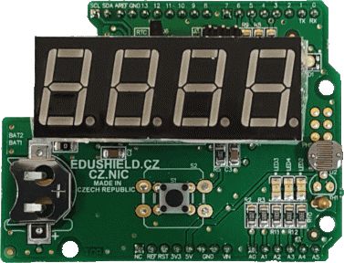

10

Fotorezistor

10

Fotorezistor

Už jsme si ukázali svítící diody, tedy součástky, které mění elektrický proud na světlo. Nastal čas podívat se na součástku s opačnou funkcí, tedy takovou, která reaguje na světlo. Už vás asi nepřekvapí, že takových je celá řada. Já začnu tou nejjednodušší, fotorezistorem.

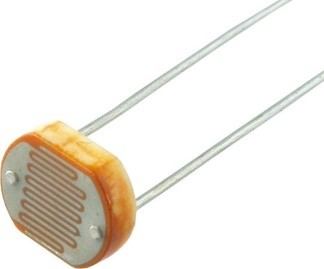

Jak název napovídá, půjde o nějaké spojení světla a rezistoru. Fotorezistor funguje velmi podobně jako rezistor, jen s tím rozdílem, že se jeho odpor mění podle toho, kolik světla na něj dopadá. Čím víc světla, tím nižší odpor.

Všimněte si, že fotorezistor má průhledný kryt – logicky, protože musí propouštět světlo – pod kterým je vidět struktura, připomínající vlnovku. Ta je tvořena polovodičem. Světlo, dopadající na polovodič, zvyšuje množství volných elektronů, které tak mohou sloužit jako přenosové médium. Větší množství světla znamená víc volných elektronů, a tedy vyšší vodivost.

U fotorezistorů se udává nejčastěji odpor při osvětlení 10 luxů a teplotě 25 °C (označuje se R10lx) a u těch nejčastějších a nejlevnějších, kterých koupíte za pětikorunu celý sáček, to bývá okolo 10 kΩ. Bez dalších znalostí, například přesného typu nebo kalibrace, se moc nehodí na přesné měření osvitu, ale to ve spoustě aplikací nevadí. Třeba pro automatické spínání osvětlení nebývá potřeba přesně stanovit, že se má spustit při 28 luxech a vypnout při 37 luxech. Stejně tak například u optických závor (zařízení, které reaguje na přerušení paprsku) nám stačí vědět, jestli světlo dopadá, nebo nedopadá (a tedy jestli je odpor nízký / vysoký).

Pojďte si to zkusit, jestli to funguje tak, jak si představujete. Co když zapojíte takový fotorezistor místo obyčejného rezistoru do série s LED?

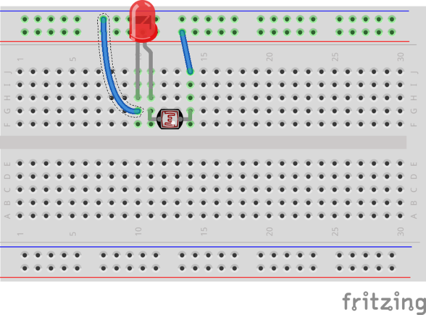

LED bude svítit, ovšem když zastíníte fotorezistor prstem, její jas se sníží!

10.1

Obrácená logika

Je hezké, že LED svítí, když je fotorezistor osvícen, ale co když to chcete obráceně, tedy aby se LED rozsvítila tím víc, čím je větší tma? To bude užitečnější, že?

Jak na to? Vlastně potřebujete, aby větší množství světla znamenalo menší napětí na diodě… Použijte k tomu známý rezistorový dělič:

Ve tmě je odpor fotorezistoru R1 velký, takže proud teče přes rezistor R2 do LED a ta svítí. Pokud na fotorezistor posvítíte, jeho odpor klesne, víc proudu poteče přes něj do země, napětí na LED tak poklesne…

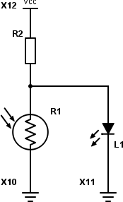

Jak velký by měl být rezistor R2? To si můžete spočítat podle odporu fotorezistoru R1 v závislosti na osvětlení. Nejjednodušší je změřit si odpor fotorezistoru ve tmě a za osvětlení. U mého to bylo zhruba 20 kΩ ve tmě a 200 Ω při přímém osvětlení. Pak jsem si nasimuloval „šero“, tedy úroveň, při níž bych chtěl, aby se LED rozsvítila. Bylo to okolo 10 kΩ.

Teď už stačí spočítat dělič napětí tak, aby při „šeru“ byly na diodě právě 2 volty (to je hranice rozsvěcení pro červené LED, pamatujete?) Pokud to celé napájím pěti volty, tak musím zvolit R2 tak velký, aby při R1 = 10 000 bylo napětí 2 V.

Vzorec si jistě pamatujete – U1 = U . (R1 / Rx), kde Rx = R1 + R2\. Po dosazení: 2 = 5 . (10 000 / (10 000 + R2))

Po úpravách: R2 = (U × R1 / U1) – R1

Vychází mi 15 kΩ. Vám taky? S rezistorem R2 o velikosti 15k tedy budou „za šera“ na LED dva volty, a LED začne svítit. Teda – teoreticky. Můžete si zkusit přijít na důvod, proč to zpochybňuju, za chvíli se k tomu vrátím.

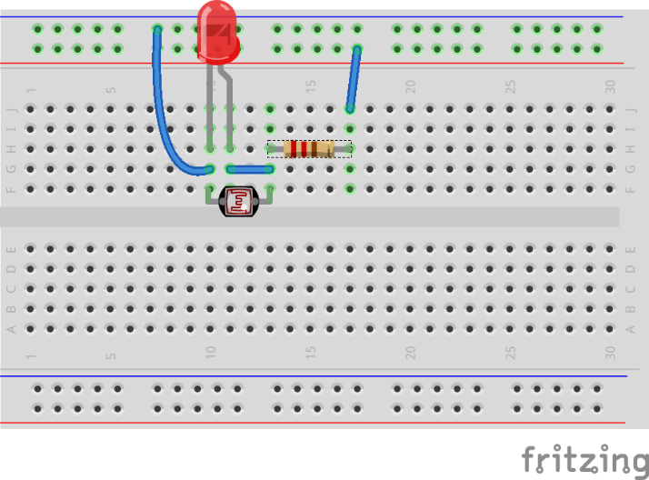

V praxi bych udělal ještě jednu úpravu: na místě R2 bych použil nastavitelný rezistor – tedy potenciometr, nebo menší variantu: trimr.

10.2

Trimry

Celým jménem „potenciometrické trimry“ jsou vlastně potenciometry, tedy rezistory s proměnným odporem, ovšem bez té osy, kterou se dá točit prstem. Místo toho mají jen malý výřez.

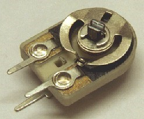

Takový trimr se nastavuje při oživování zařízení pomocí malého šroubováku. Nastaví se tak, aby zařízení správně fungovalo, a pak se s ním už nehýbe.

U našeho „spínače osvětlení“ bych tuto součástku použil, protože pomocí ní snadno nastavím úroveň osvětlení, při níž má obvod sepnout, a navíc, když si někdy v budoucnu usmyslím, že by mi víc vyhovovala jiná úroveň osvětlení, tak můžu obvod snadno přenastavit, nemusím měnit rezistor.

10.3

Lepší řešení detektoru tmy

Všimněte si, že u výše uvedeného zapojení jste limitováni odporem R2 – jeho velikost 15 kΩ znamená, že i když bude absolutní tma, tak do diody může téct maximálně 0,33 mA. Což je hodně málo. Když odpor zmenšíte, bude zase LED svítit i při větším osvětlení, takže se nakonec dostanete do stavu, kdy LED ve tmě svítí víc, a na světle svítí míň. Což tedy není nic moc.

Kéž by tak byl způsob, jak malým proudem, co proteče z R2, sepnout velký proud pro LED, že?

Moment, co že jsem to právě napsal? Malým proudem sepnout větší proud? Kde jsem tohle už psal? To bylo – no ano, to bylo v kapitole o tranzistoru.

Připomenu teorii: Tranzistor sepne tehdy, když je na jeho přechodu báze-emitor napětí větší než 0,7 voltu. Pak stačí malý proud k tomu, aby vedl násobně větší proud ve směru kolektor-emitor.

Upravme naše zapojení tak, že využije tranzistor ke spínání LED. Budeme muset upravit hodnotu R2 tak, aby při našem limitu „šero“ bylo na bázi 0,7 voltu (místo 2 V) – vychází to na cca 62 kΩ.

Teoretický výsledek je fajn, ale nejlepší bude na místě R2 použít trimr 100k, a ten přesně nastavit podle požadované úrovně osvětlení.

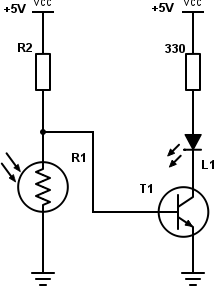

Za naprosté a absolutní tmy (nereálné, já vím) poteče rezistorem R2 proud 0,08 mA (uvažuju hodnotu R2 rovnou 62k). Pokud použijeme např. tranzistor BC547B s proudovým zesilovacím činitelem okolo 300, může při 0,08 mA bází téct kolektorem (a tedy LEDkou) až 24 mA, což je dost (ve skutečnosti bude proud omezen rezistorem 330R na 15 mA).

Tady bych chtěl upozornit na důležitou věc: Takovéhle výpočty jsou orientační. Sice pro většinu aplikací stačí, ale pokud se dostanete blíž k limitním hodnotám, například k velkým proudům skrz kolektor, posunou se i jiné hodnoty mimo „standardně uvažované hodnoty“. Pro takové to domácí kutění je to dostatečné, ale snažte se vždy pohybovat v rozumných mezích a nejít, jak se říká, až na krev. Pak se součástky mohou chovat výrazně jinak. Vždy se proto podívejte do datasheetu, jaké jsou mezní hodnoty – nejčastěji pro protékající proud a připojené napětí.

10.4

Fotorezistor a Arduino

Jeden z nejčastěji připojovaných senzorů k Arduinu je právě fotorezistor. Je levný, jednoduchý na obsluhu, tak co by ne, že?

Pro takovéhle typy snímačů, které nemají digitální výstup (třeba jako tlačítko), ale (nejčastěji) mění svůj odpor, má Arduino speciální vstupy – analogové A0 až A5\. Funkce analogRead() dokáže zjistit, jaké napětí je na tomto vstupu, a převést ho na škálu hodnot 0 až 1023.

Nula samozřejmě znamená, že daný vstup má úroveň země. Ale kolik je maximum, tedy těch 1023?

To je správná otázka. Odpověď zní: 1023 je hodnota, která je naměřená tehdy, když je na analogovém vstupu takzvané referenční napětí!

Odpověď jak od chytré horákyně, že? A kolik je tedy to referenční napětí?

Většinou, pokud není určeno jinak, to je napájecí napětí, tedy zhruba 5 voltů. Zhruba píšu proto, že toto napětí může kolísat, a u některých typů Arduin může být třeba 3,3 voltů. U Arduina UNO ale bude zhruba těch 5 voltů.

Můžete ale použít vnitřní zdroj referenčního napětí 1,1 voltu.

No a konečně můžete říct, že si referenční napětí, ne vyšší než 5 V, vytvoříte nějak sami a přivedete ho na vstup AREF. Jak si ho vytvoříte? Buď nějakým stabilizátorem, nebo specializovanou součástkou – generátorem referenčního napětí. Dělají se například přesné generátory 1,023 voltu – pak naměřená hodnota odpovídá velmi přesně milivoltům.

Ale to jsem trochu odbočil. Pokud k Arduinu připojujete třeba fotorezistor nebo podobnou součástku (například termistor, což je rezistor, jehož odpor je závislý na teplotě), používá se většinou některý z analogových vstupů, a součástku zapojujete v sérii s rezistorem, jako napěťový dělič. Analogový vstup totiž měří napětí, nikoli proud. Kdybyste zapojili třeba jen fotorezistor na + 5 voltů, tak by se se změnou odporu měnil proud, ale napětí by bylo stále 5 voltů.

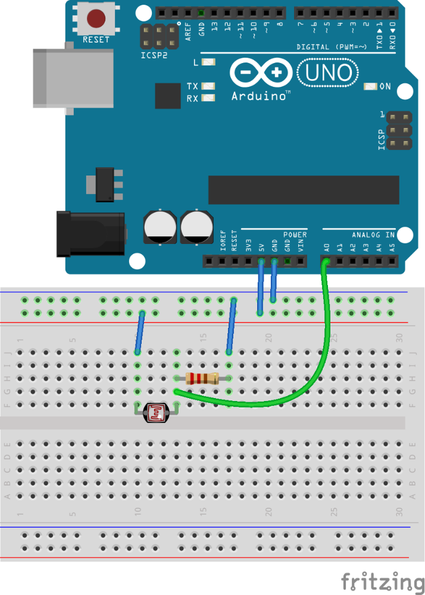

Když si fotorezistor takto zapojíte, zjistíte, že při velmi silném osvětlení funkce analogRead(A0) vrátí téměř 1023, ve tmě klesne – nikoli na nulu, protože odpor fotorezistoru nebude nekonečný, takže napětí neklesne k ideální nule, ale klesne hodně nízko.

void setup () {

Serial.begin(9600);

}

void loop() {

int a = analogRead(A0);

Serial.println(a);

}

Když tento program napíšete do Arduino IDE a nahrajete do Arduina, bude měřit napětí na vstupu A0 a vypisovat ho na sériovou konzoli. Sériová konzole je způsob, jakým Arduino může posílat údaje do připojeného počítače. Princip popíšu později, teď stačí, abyste věděli, že v Arduino IDE je v menu Nástroje (Tools) položka Sériový monitor (Serial Monitor). Když ji vyberete, otevře se nové okno, a v něm se vypisuje to, co Arduino pošle funkcí Serial.println().

Všimněte si, že ve funkci Setup volám Serial.begin(9600). Tato funkce zajistí zapnutí této komunikace a nastavení přenosové rychlosti. Toto číslo je velmi důležité – přenosová rychlost, s jakou Arduino pracuje, musí být shodná s přenosovou rychlostí, jakou komunikuje počítač.

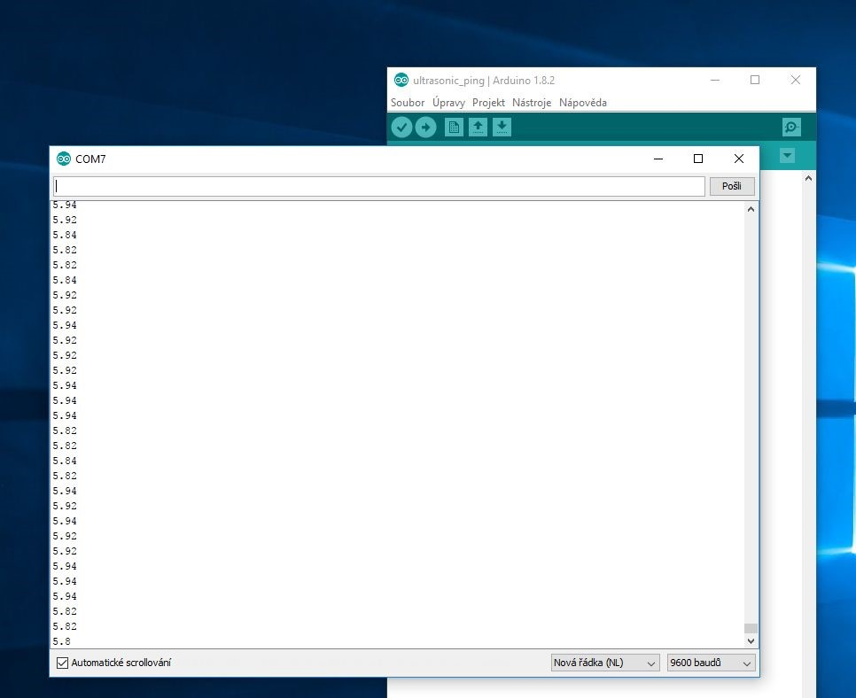

Ta se nastavuje v Sériovém monitoru vpravo dole – všimněte si hodnoty „9600 baudů“.

Postavte si teď přesně takový detektor tmy, jako předtím, ale tentokrát s Arduinem. Vlastně moment – vy jste si ho už postavili, to na předchozím obrázku, to je přesně on! Použijete LED, která je v Arduinu zapojena na výstupu 13, a máte to! Teď stačí v nekonečné smyčce loop() opakovat stále dokola totéž: Přečíst analogový stav na vstupu A0, a podle načtené hodnoty LED buď rozsvítit, nebo zhasnout. Buď metodou pokus-omyl, nebo vypsáním naměřených hodnot zjistíte, která hodnota je pro vás už „dostatečná tma“, a pokud načtete víc, LED zhasnete, pokud míň, LED rozsvítíte. Takhle jednoduché to bude.

Když použijete EduShield, tak nemusíte ani nic zapojovat. EduShield má totiž na sobě fotorezistor zapojený přesně tak, jak jsem právě popsal.

11

Termistor

11

Termistor

Už několikrát jsem tu zmínil v nejrůznějších obměnách větu „… a odpor závisí i na teplotě“. U většiny součástek je to vlastnost nevítaná, ale někdy se hodí – třeba pro měření teploty. Vyrábí se k tomu speciální součástky – rezistory s odporem, závislým na teplotě, zvané termistory.

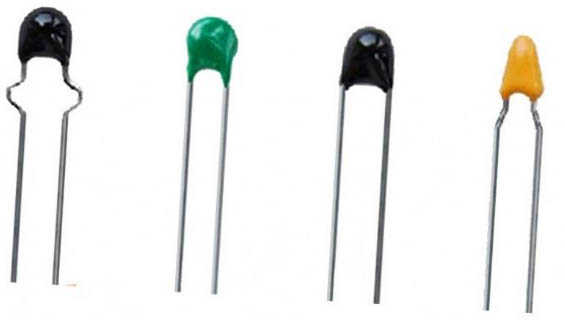

Termistory jsou dvojího typu – jedny, ty běžnější, fungují tak, že s rostoucí teplotou jejich odpor klesá (označují se jako NTC), druhé, označované PTC, svůj odpor s rostoucí teplotou zvyšují.

Pokud máte po ruce termistor, zapojte si jej místo fotorezistoru k Arduinu. Zbytek zůstane tak, jak byl. Nechte si vypisovat naměřenou hodnotu a zkuste termistor zahřát – například tak, že ho chytnete do prstů.

V EduShieldu je také termistor, ale zapojený na vstup A1.

Po načtení získáte celé číslo v rozmezí 0 až 1023\. Jak přepočítat toto číslo na skutečnou teplotu? No, není to úplně triviální. Vzorec (jmenuje se Steinhartův-Hartův, Steinhart-Hart Equation) vypadá takto:

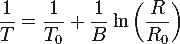

„Magické“ hodnoty B, R0 a T0 naleznete v datasheetu k danému termistoru. T0 je referenční pokojová teplota 25 °C, R0 je odpor rezistoru při této teplotě (například 10 000 ohmů) a B je teplotní koeficient (například u termistoru, který je v EduShieldu, je to 3950).

Pro přepočet na stupně Celsia je zapotřebí nejprve z naměřené úrovně napětí spočítat odpor termistoru (musíme znát odpor druhého rezistoru v děliči napětí), a dosadit tento odpor do výše uvedeného vzorce. Což s Arduinem samozřejmě lze, ale je to docela náročný výpočet, který používá desetinná čísla atd.

Proto se používá podobný fígl, jako u měření světla – většinou potřebujete něco udělat při nějaké hodnotě teploty, tak stačí zjistit, že při dané teplotě je naměřená hodnota například 700, takže i bez přepočtu můžete říct: Pokud překročí hodnota 700, tak se něco stane.

Pokud ale chcete třeba vytvořit teploměr, který ukazuje teplotu, nezbyde vám, než přepočítávat naměřenou hodnotu výše uvedeným vzorcem na stupně. Anebo jít jinou cestou, třeba použít sofistikovanější součástku…

12

LM35

12

LM35

LM35 je přesný teploměr, který vypadá trochu jako tranzistor. Dva krajní vývody jsou zem a napájecí napětí, prostřední vývod je měřicí. Napětí na něm je přímo úměrné teplotě – jednomu stupni Celsia odpovídá 10 milivoltů. Při teplotě 0 °C je na tomto výstupu 0, při 100 °C je na vývodu přesně 1 volt.

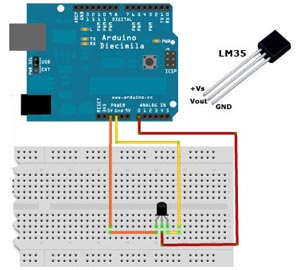

Teplotu pak spočítáte jednoduše, pomocí vzorce:

temp = (5.0 * analogRead(tempPin) * 100.0) / 1024;

Magické konstanty 5.0 a 1024 jsou maximum (5 V) a hodnota, kterou při tomto maximu naměříte (1024).

V praxi těžko budete měřit teploty nad 100 °C, takže se dá předpokládat, že napětí na měřicím výstupu nepřesáhne 1 volt. Můžete tedy přepnout referenční napětí pro převodník (pamatujete?) na vnitřní zdroj 1,1 V, pomocí funkce analogReference. Zvýšíte tím i přesnost měření.

Vzorec se tedy lehce změní. Maximum (1023) není 5 voltů, ale 1,1\. Když 1,1 podělíte 1024 (to je rozsah měření), zjistíte, že nárust hodnoty o 1 odpovídá nárustu napětí o 1,0742 mV (u pěti voltů to bylo 4,88 mV). Pokud jednomu stupni Celsia odpovídá 10 mV, znamená to, že odpovídá hodnotě zhruba 9,31 (10 / 1,0742). Pokud naměřená hodnota vzroste o 9,31, znamená to, že teplota vzrostla o jeden stupeň. Zkuste si to sami:

float tempC;

int reading;

int tempPin = A0;  

void setup() {

analogReference(INTERNAL);

Serial.begin(9600);

}  

void loop(){

reading = analogRead(tempPin);

tempC = reading / 9.31;

Serial.println(tempC);

delay(1000);

}

13

„Jak naučit kámen počítat“

13

„Jak naučit kámen počítat“

Seriál s tímto názvem vycházel v časopise Věda a technika mládeži někdy v polovině 80\. let minulého století. Postupně vysvětloval, jak je možné, že z kusu křemenu může postupně vzniknout celý počítač. Já si název vypůjčil pro tuto kapitolu.

Když jsem přemýšlel nad tím, kdo je vlastně modelový čtenář této knihy, měl jsem před očima velmi přesný obraz: na kurzech a školeních za mnou chodili programátoři a říkali: „Já bych tak rád zkusil něco s elektronikou, ale nevím, nerozumím tomu, nechápu, bojím se…“

Jeden z nich mi položil i skvělou otázku, která stála vlastně na začátku celých úvah o této knize. Programoval hry a říkal: „Já vím, jak to naprogramuju, pak vím, že jsou nějaké knihovny, tomu pořád rozumím, překladačem to přeložím – a co se děje pak? Jsou to nějaká čísla? Jak se uloží? Kam? A jak ten procesor ví, co má udělat? To vůbec netuším… jen vím, že pak někde úplně dole jsou dráty a elektrony…“

A tahle kniha je vlastně obšírnější odpovědí na tento dotaz. Jen jsme začali od konce, od těch elektronů a drátů. Teď už to bude jen jednodušší, slibuju.

13.1

Stavebnice

Vždycky zájemcům říkám, že není čeho se bát. Že to všechno, co mají ve svém počítači, jsou vlastně tytéž tranzistory a rezistory, jen poskládané do větších a větších funkčních celků.

Z několika tranzistorů je poskládané takzvané logické hradlo. To je součástka, která dělá právě jednu logickou funkci. K nim se dostaneme vzápětí. Několik logických hradel dohromady dává větší celek – kombinační obvody či sekvenční obvody. Multiplexory, demultiplexory, dekodéry, registry, čítače, klopné obvody, sčítačky… Nebojte, za chvíli si vysvětlíme, co jednotlivé výrazy znamenají. Tyto obvody se opět dají kombinovat do větších celků – mnoho registrů spolu s datovými multiplexory a adresními dekodéry tvoří paměť. Několik sčítaček a hradel spolu s multiplexory vytvoří aritmeticko-logickou jednotku. Čítače zapojené za sebou dají třeba „programový čítač“ (PC). Když zkombinujeme registry, čítače, aritmeticko-logickou jednotku a dobře navržené dekodéry, získáme mikroprocesor. Jednoduché registry s posíleným výstupem vytvoří obvody pro vstup a výstup… Z toho všeho pak můžeme poskládat vlastní počítač. A věřte tomu, že váš domácí počítač vypadá uvnitř přesně tak, jak jsem popsal – každý z těch obvodů, který v něm vidíte, když ho rozmontujete, se uvnitř skládá z logických celků, které se skládají z jednodušších obvodů, které se skládají z elementárních hradel, které se skládají z tranzistorů… Vážně!

Pojďme tedy nejprve na ta hradla a logické funkce.

13.2

Logické funkce

Programátoři vědí, nebo by alespoň měli vědět, že máme tři základní logické funkce, totiž AND, OR a NOT.

Moment, moment, neotočil tu někdo víc stran najednou? Ještě v minulé kapitole tranzistory a volty, a najednou logické funkce? Neuteklo mi něco? Pojďme radši popořadě…