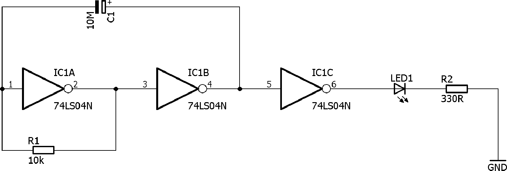
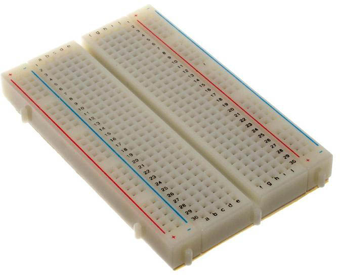
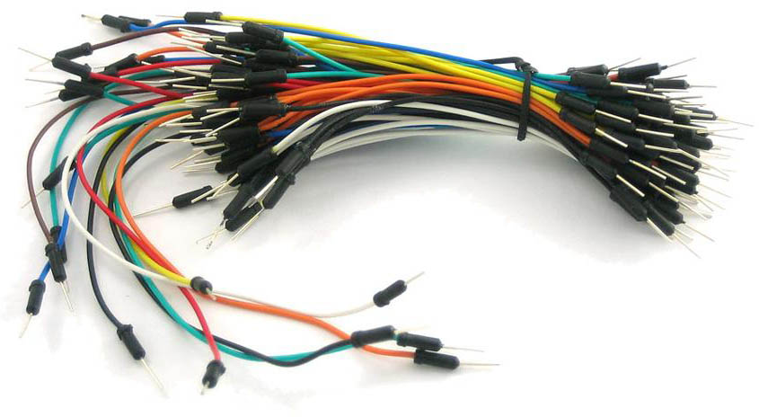
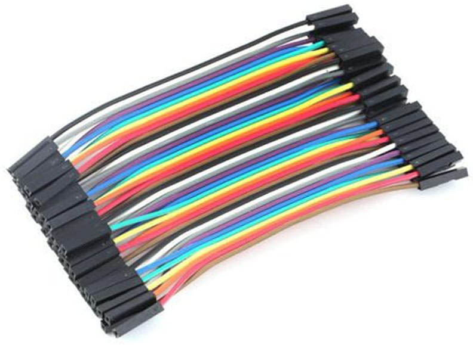
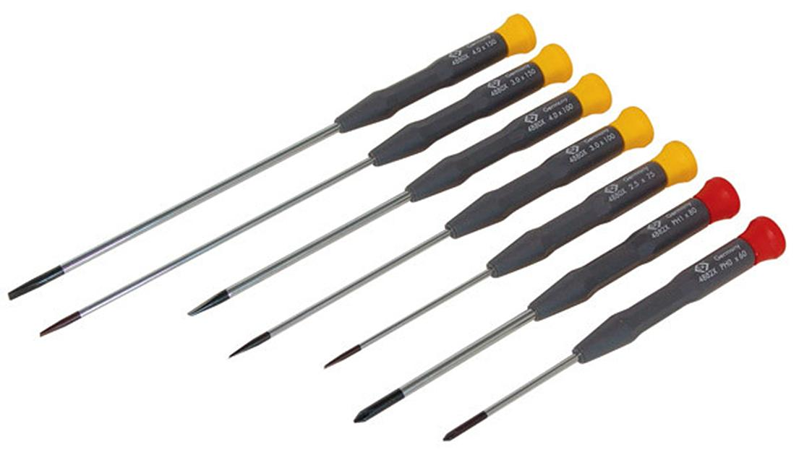
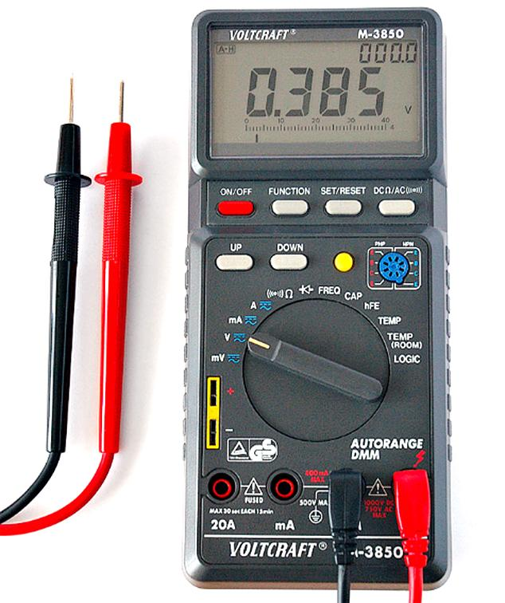
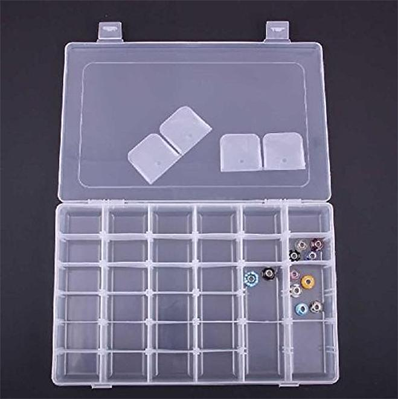
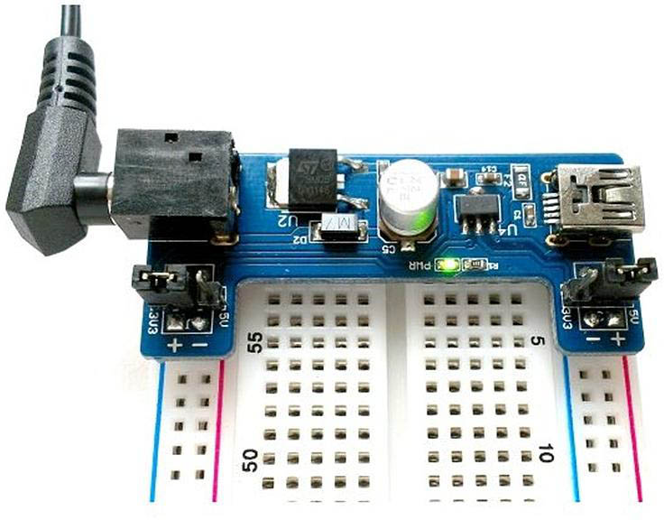
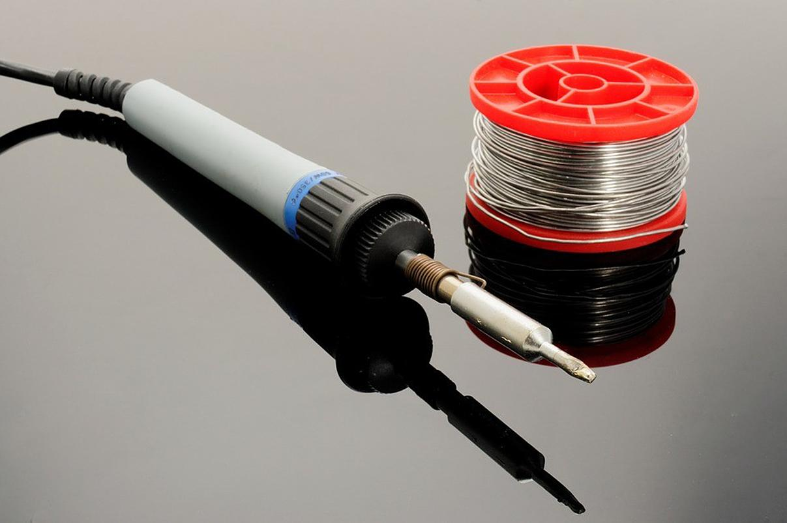

# Obsah {#obsah}

[Poděkování](../podekovani.md)

[Předmluva vydavatele](../predmluva_vydavatele.md)

Předmluva mentora

Výmluvy místo předmluvy

1 Budu velkým elektronikem a budu stavět hrozně cool obvody!

1.1 Blikač

[1.2 „Dílna“](#520365470321849-1_2___Dilna)

1.3 Kde nakoupit součástky?

[1.4 Nákupní seznam: Součástky pro blikač](#520365470321849-1_4_Nakupni_seznam__Soucastky_pr_2)

[1.4.1 LED](141.md)

[1.4.2 Rezistory](142.md)

[1.4.3 Kondenzátory](143.md)

[1.4.4 Integrované obvody](144.md)

2 Postavte si blikač – teď už to snad půjde lépe

[2.1 Který rezistor je ten pravý?](144.md#520365470321849-2_1_Ktery_rezistor_je_ten_pravy_2)

[2.2 Měření multimetrem](144.md#520365470321849-2_2_Mereni_multimetrem_2)

[2.3 LED podrobněji](144.md#520365470321849-2_3_LED_podrobneji)

3 Hlava, koleno, zem…

[3.1 „Nemá to něco společného s atomy?“](144.md#520365470321849-3_1___Nema_to_neco_spolecneho_s_2)

3.2 Napětí

3.3 Proud

3.4 Vodič a nevodič

3.5 Odpor

3.6 Měření, měření!

3.7 Ohmův zákon

3.8 Výkon

[3.9 … a malé opáčko](144.md#520365470321849-3_9_____a_male_opacko)

[3.9.1 Násobky a podíly](391.md)

3.10 Zkratky u značení

[3.11 Vyvolená čísla](391.md#520365470321849-3_11_Vyvolena_cisla)

3.12 Pro lepší představu

3.13 Střídavý proud

3.14 Zkrat

[3.15 Multimetr jako zkrat?](391.md#520365470321849-3_15_Multimetr_jako_zkrat_2)

[3.16 Elektromagnetická indukce](391.md#520365470321849-3_16_Elektromagneticka_indukce_2)

3.17 Značky pro schémata

[3.17.1 Kroužek, nebo ne?](3171.md)

[4 Zdroje napětí](3171.md#520365470321849-4_Zdroje_napeti_2)

[4.1 Společná zem](3171.md#520365470321849-4_1_Spolecna_zem)

[5 Vedle sebe, za sebou](3171.md#520365470321849-5_Vedle_sebe__za_sebou_2)

[5.1 Svítilna s LEDkou](3171.md#520365470321849-5_1_Svitilna_s_LEDkou)

5.2 Sériové zapojení

[5.3 Dělič napětí](3171.md#520365470321849-5_3_Delic_napeti)

5.4 Paralelní zapojení

5.5 Kirchhof 2

[5.6 Baterie sériově – paralelně](3171.md#520365470321849-5_6_Baterie_seriove___paralelne_2)

5.7 Potenciometr

5.8 Úbytek napětí na LED

[5.9 Co jsou vlastně ty diody zač?](3171.md#520365470321849-5_9_Co_jsou_vlastne_ty_diody_zac_2)

5.10 Datasheet

6 Základní elektronické součástky

[6.1 Rezistor](3171.md#520365470321849-6_1_Rezistor)

6.2 Kondenzátor

[6.3 Cívka](3171.md#520365470321849-6_3_Civka)

6.4 Transformátor

[6.4.1 DC měnič](641.md)

[6.4.2 Stabilizátor](642.md)

[6.4.3 7805](643.md)

7 Polovodiče

7.1 P-N přechod

[7.2 Dioda](643.md#520365470321849-7_2_Dioda)

7.3 Tranzistor

[7.4 Rozsvítíme prstem LED!](643.md#520365470321849-7_4_Rozsvitime_prstem_LED_2)

[7.4.1 Více světla!](741.md)

[7.5 Tranzistor řízený polem (FET)](741.md#520365470321849-7_5_Tranzistor_rizeny_polem__FET_2)

7.6 Šoupejte nožkou…

7.7 MOSFET

[7.7.1 Co je to CMOS?](771.md)

7.8 A to je všechno s polovodiči?

8 Pouzdra elektronických součástek

8.1 Co je to SMT a THT

8.2 DIP, DIL

8.3 Co s těmi ostatními?

[8.3.1 Praktické tipy](771.md#520365470321849-8_3_1_Prakticke_tipy)

9 Blikač s Arduinem

[9.1 Když se řekne Arduino](771.md#520365470321849-9_1_Kdyz_se_rekne_Arduino_2)

9.2 Programování Arduina

9.3 Blikání Arduinem

[9.4 Krok zpět k drátům](771.md#520365470321849-9_4_Krok_zpet_k_dratum)

9.5 Arduino a EduShield

10 Fotorezistor

10.1 Obrácená logika

[10.2 Trimry](771.md#520365470321849-10_2_Trimry)

10.3 Lepší řešení detektoru tmy

10.4 Fotorezistor a Arduino

11 Termistor

[12 LM35](771.md#520365470321849-12_LM35_2)

[13 „Jak naučit kámen počítat“](771.md#520365470321849-13___Jak_naucit_kamen_pocitat_3)

13.1 Stavebnice

13.2 Logické funkce

[13.2.1 Digitální, nebo analogové?](1321.md)

[13.2.2 Dvojková soustava](1322.md)

[13.2.3 Šestnáctková soustava](1323.md)

[13.2.4 Zpátky k technice](1324.md)

[13.3 TTL a CMOS](1324.md#520365470321849-13_3_TTL_a_CMOS)

[13.3.1 Propojení CMOS a TTL](1331.md)

13.4 Operace s bity

13.5 Booleova algebra, výroková logika

[13.6 Logika v číslicové technice](1331.md#520365470321849-13_6_Logika_v_cislicove_technice_2)

13.7 U-káz-ka! U-káz-ka!

13.8 Tlačítko a přepínač

13.9 Pull Up a Pull Down

[13.10 Pomalé tlačítko](../1310.md)

[13.11 Schmittův obvod](../1311.md)

13.12 Blokovací kondenzátor

13.13 Buzení z Arduina

14 Kombinační logika

[14.1 De Morganův zákon](../1313.md#520365470321849-14_1_De_Morganuv_zakon)

14.2 XOR

14.3 Logické funkce dvou proměnných

[14.4 Vícevstupová hradla](../1313.md#520365470321849-14_4_Vicevstupova_hradla_2)

14.5 Mimochodem, když máme NAND, co ty ostatní?

14.6 Zjednodušování logických výrazů

14.7 AND-OR-INVERT

14.8 Multiplexor

14.9 Proč slučujeme přes OR?

14.10 Dekodér (demultiplexor) „1-z-N“

14.11 Vícebitové varianty

14.12 Otevřený kolektor, třetí stav, OE

14.13 Dekodéry

14.14 Pojďme, budeme už fakt něco počítat!

14.15 Aritmeticko-logická jednotka (ALU)

15 Sedmisegmentovky LED

[15.1 Víc sedmisegmentovek…](../1415/README.md#520365470321849-15_1_Vic_sedmisegmentovek_2)

16 Jak vypadá hradlo uvnitř

16.1 Proč zapojovat blokovací kondenzátory k napájení

[16.2 Negované signály](../1415/README.md#520365470321849-16_2_Negovane_signaly)

16.3 MOS, CMOS

[17 „Plnou parou vzad!“ – „Ale jak daleko?“](../1415/README.md#520365470321849-17___Plnou_parou_vzad_______Ale_3)

17.1 Ještě pípat!

[18 Zpětná vazba](../1415/README.md#520365470321849-18_Zpetna_vazba_2)

18.1 Astabi-cože?

18.2 Blikač

[18.3 Krystalový oscilátor DIL](../1415/README.md#520365470321849-18_3_Krystalovy_oscilator_DIL_2)

[18.4 Monostabilní klopný obvod](../1415/README.md#520365470321849-18_4_Monostabilni_klopny_obvod_2)

18.5 Detektor pohybu

18.6 Bistabilní klopný obvod R-S

[18.6.1 Klopný obvod s hradly NAND](../1415/1861.md)

[18.7 Zakázané kombinace, zpětná vazba, …](../1415/1861.md#520365470321849-18_7_Zakazane_kombinace__zpetna_2)

[18.8 Hodiny](../1415/1861.md#520365470321849-18_8_Hodiny)

18.9 Synchronní / Asynchronní

[18.10 Symbol pro klopný obvod](../1810.md)

[18.11 Reálný klopný obvod D: 7474](../1811.md)

18.12 Reálný latch 7475

19 Panna, nebo orel?

19\. 1 Náhoda? Nemyslím si…

[19.1.1 Jaké hodnoty RC zvolit, když vím jen to, že součin má být XYZ?](../19_1_nahoda_nemyslim_si/1911.md)

[19.2 Střída](../19_1_nahoda_nemyslim_si/1911.md#520365470321849-19_2_Strida)

[19.3 PWM](../19_1_nahoda_nemyslim_si/1911.md#520365470321849-19_3_PWM)

19.4 Dělení kmitočtů

[19.4.1 Násobení kmitočtu?](../19_1_nahoda_nemyslim_si/1911.md#520365470321849-19_4_1_Nasobeni_kmitoctu)

[19.5 Klopný obvod T](../19_1_nahoda_nemyslim_si/1911.md#520365470321849-19_5_Klopny_obvod_T)

19.6 Klopný obvod J-K

20 Čítače

20.1 Čítač s nulováním

20.2 Čítače v praxi

20.3 Hrací kostka

[20.3.1 Reálná kostka](../19_1_nahoda_nemyslim_si/2031.md)

[20.3.2 Vyjádření logických výrazů](../19_1_nahoda_nemyslim_si/2032.md)

[20.3.3 Montážní OR](../19_1_nahoda_nemyslim_si/2033.md)

[20.3.4 Zobrazovací obvod hrací kostky](../19_1_nahoda_nemyslim_si/2034.md)

[20.3.5 Dekodér hrací kostky](../19_1_nahoda_nemyslim_si/2035.md)

20.4 Další čítače

20.5 Ještě nějaké čítače?

[20.5.1 Johnsonův kód](../19_1_nahoda_nemyslim_si/2051.md)

[20.5.2 Grayův kód](../19_1_nahoda_nemyslim_si/2052.md)

[20.6 Rotační enkodér](../19_1_nahoda_nemyslim_si/2052.md#520365470321849-20_6_Rotacni_enkoder)

[20.7 Čítač s dekodérem 1-z-10 typu 744017](../19_1_nahoda_nemyslim_si/2052.md#520365470321849-20_7_Citac_s_dekoderem_1_z_10_ty_2)

20.8 Počítadlo k autodráze

21 Posuvné registry

22 Paralelní a sériová rozhraní

22.1 Buzení displeje ze sedmisegmentovek

22.2 Posuvný řadič SIPO 74HCT595

23 Sériová komunikace

23.1 Sériová sběrnice SPI

23.2 Sériová sběrnice I2C

23.3 Prakticky…

23.4 EduShield a displej

23.5 RS-232, UART, Serial…

23.6 Převodník USB na sériové rozhraní

[23.7 1-Wire](../19_1_nahoda_nemyslim_si/2052.md#520365470321849-23_7_1_Wire)

[24 Paměti](../19_1_nahoda_nemyslim_si/2052.md#520365470321849-24_Pameti_2)

[24.1 7489 – 64 bitů RAM](../19_1_nahoda_nemyslim_si/2052.md#520365470321849-24_1_7489___64_bitu_RAM)

[24.2 Dynamická RAM](../19_1_nahoda_nemyslim_si/2052.md#520365470321849-24_2_Dynamicka_RAM)

24.3 ROM, PROM a další

24.4 To nejlepší z obou světů

24.5 Několik tipů k pamětem

24.6 Jak se zapisuje do EEPROM či FLASH?

[24.7 Sériové paměti](../19_1_nahoda_nemyslim_si/2052.md#520365470321849-24_7_Seriove_pameti)

[25 Sériová paměť prakticky](../19_1_nahoda_nemyslim_si/2052.md#520365470321849-25_Seriova_pamet_prakticky_4)

[26 Hodiny reálného času](../19_1_nahoda_nemyslim_si/2052.md#520365470321849-26_Hodiny_realneho_casu_2)

27 Paměťové karty

28 Logický analyzátor, logická sonda

29 Elektronika a svět kolem nás

[29.1 Ovládáme přírodu elektronikou](../19_1_nahoda_nemyslim_si/2052.md#520365470321849-29_1_Ovladame_prirodu_elektronik)

[29.1.1 Elektromagnety](../19_1_nahoda_nemyslim_si/2911.md)

[29.1.2 Motory](../19_1_nahoda_nemyslim_si/2912.md)

[29.1.3 Relé](../19_1_nahoda_nemyslim_si/2913.md)

[29.1.4 Darlington, FET, Tyristor](../19_1_nahoda_nemyslim_si/2914.md)

[29.1.5 Servo](../19_1_nahoda_nemyslim_si/2915.md)

[29.1.6 Krokový motor](../19_1_nahoda_nemyslim_si/2916.md)

[29.1.7 Světlo](../19_1_nahoda_nemyslim_si/2917.md)

[29.1.8 Peltierův článek, topná spirála](../19_1_nahoda_nemyslim_si/2918.md)

[29.1.9 Reproduktor](../19_1_nahoda_nemyslim_si/2919.md)

[29.2 Příroda ovládá elektroniku](../19_1_nahoda_nemyslim_si/2919.md#520365470321849-29_2_Priroda_ovlada_elektroniku_2)

[29.2.1 Tlačítka a klávesy](../19_1_nahoda_nemyslim_si/2921.md)

[29.2.2 Dotyk](../19_1_nahoda_nemyslim_si/2922.md)

[29.2.3 Světlo – fotorezistor, fotodioda, line tracking](../19_1_nahoda_nemyslim_si/2923.md)

[29.2.4 Magnetismus](../19_1_nahoda_nemyslim_si/2924.md)

[29.2.5 Otáčení, posun](../19_1_nahoda_nemyslim_si/2925.md)

[29.2.6 Poloha, zrychlení](../19_1_nahoda_nemyslim_si/2926.md)

[29.2.7 Zvuk](../19_1_nahoda_nemyslim_si/2927.md)

[29.2.8 Teplota, vlhkost](../19_1_nahoda_nemyslim_si/2928.md)

[29.2.9 Vzdálenost](../19_1_nahoda_nemyslim_si/2929.md)

[29.2.10 Tlak](../19_1_nahoda_nemyslim_si/29210.md)

[29.2.11 Plyn](../19_1_nahoda_nemyslim_si/29211.md)

[29.2.12 GPS](../19_1_nahoda_nemyslim_si/29212.md)

[29.2.13 Pohyb osob (PIR)](../19_1_nahoda_nemyslim_si/29213.md)

[30 Meteostanice](../19_1_nahoda_nemyslim_si/29213.md#520365470321849-30_Meteostanice_2)

[30.1 Výběr součástek](../19_1_nahoda_nemyslim_si/29213.md#520365470321849-30_1_Vyber_soucastek)

[30.2 Špinavej trik](../19_1_nahoda_nemyslim_si/29213.md#520365470321849-30_2_Spinavej_trik)

30.3 Stavíme z polotovarů

[31 Bezdrátový přenos dat](../19_1_nahoda_nemyslim_si/29213.md#520365470321849-31_Bezdratovy_prenos_dat_4)

31.1 Vysílání na 433 MHz

31.2 nRF24L01+

32 Procesory, počítače, mikrořadiče

[32.1 Mikroprocesor 8080A](../19_1_nahoda_nemyslim_si/29213.md#520365470321849-32_1_Mikroprocesor_8080A_2)

[32.1.1 Ready / Wait](../19_1_nahoda_nemyslim_si/3211.md)

[32.1.2 Hold (DMA)](../19_1_nahoda_nemyslim_si/3212.md)

[32.2 Přerušení](../19_1_nahoda_nemyslim_si/3212.md#520365470321849-32_2_Preruseni)

[32.2.1 Nemaskovatelné přerušení](../19_1_nahoda_nemyslim_si/3221.md)

[32.3 Periferie](../19_1_nahoda_nemyslim_si/3221.md#520365470321849-32_3_Periferie)

[32.4 Složitější periferie](../19_1_nahoda_nemyslim_si/3221.md#520365470321849-32_4_Slozitejsi_periferie_2)

32.5 Jednočipový mikropočítač

[31.5.1 Harvard vs von Neumann](../19_1_nahoda_nemyslim_si/3221.md#520365470321849-31_5_1_Harvard_vs_von_Neumann)

[32.6 Atmel AVR](../19_1_nahoda_nemyslim_si/3221.md#520365470321849-32_6_Atmel_AVR)

[32.6.1 RISC](../19_1_nahoda_nemyslim_si/3221.md#520365470321849-32_6_1_RISC)

[32.6.2 Vnitřní uspořádání ATmega328](../19_1_nahoda_nemyslim_si/3262.md)

32.7 Další mikrokontroléry

[32.7.1 ARM](../19_1_nahoda_nemyslim_si/3271.md)

[32.7.2 PIC](../19_1_nahoda_nemyslim_si/3272.md)

[32.7.3 8051/8052](../19_1_nahoda_nemyslim_si/3273.md)

32.8 Tak málo nožiček…

[32.9 Programování jednočipů](../19_1_nahoda_nemyslim_si/3273.md#520365470321849-32_9_Programovani_jednocipu_2)

[33 Displeje](../19_1_nahoda_nemyslim_si/3273.md#520365470321849-33_Displeje_2)

33.1 Znakový displej 1602, 2004

33.2 Grafický displej 12864

33.3 Další displeje

33.4 Bezdrátový displej k naší meteostanici

[34 Klávesnice](../19_1_nahoda_nemyslim_si/3273.md#520365470321849-34_Klavesnice_2)

34.1 Šetříme vývody

34.2 Připojujeme klávesnici od PC

34.3 Matice tlačítek

[34.4 Postavte si třeba… kalkulačku?](../19_1_nahoda_nemyslim_si/3273.md#520365470321849-34_4_Postavte_si_treba____kalkul_2)

35 Osm tlačítek na třech vodičích

[35.1 Multiplexior / Demultiplexor](../19_1_nahoda_nemyslim_si/3273.md#520365470321849-35_1_Multiplexior___Demultiplexo_2)

[35.2 PISO a SPI](../19_1_nahoda_nemyslim_si/3273.md#520365470321849-35_2_PISO_a_SPI)

[35.3 Analogová cesta](../19_1_nahoda_nemyslim_si/3273.md#520365470321849-35_3_Analogova_cesta)

[35.4 R-2R](../19_1_nahoda_nemyslim_si/3273.md#520365470321849-35_4_R_2R)

36 Joystick

37 ESP8266 WiFi

37.1 Moduly ESP8266

37.2 Převodník napěťových úrovní

[37.3 WeMos D1 Mini, NodeMCU](../19_1_nahoda_nemyslim_si/3273.md#520365470321849-37_3_WeMos_D1_Mini__NodeMCU_2)

37.4 Bezdrátový teploměr s WiFi

[37.5 Instalace podpory ESP8266 do Arduino IDE](../19_1_nahoda_nemyslim_si/3273.md#520365470321849-37_5_Instalace_podpory_ESP8266_d_2)

37.6 WiFi Manager

37.7 Klient / server?

[38 Low Power](../19_1_nahoda_nemyslim_si/3273.md#520365470321849-38_Low_Power_2)

38.1 Solární články

39 Sigfox

39.1 Co je to Sigfox?

39.2 Cloudový teploměr se Sigfoxem

39.3 Co s daty v Sigfoxu?

[40 Šťastnou cestu…](../19_1_nahoda_nemyslim_si/3273.md#520365470321849-40_Stastnou_cestu_2)

[Přílohy](../prilohy.md)

[Nástroje a weby](../nastroje_aweby.md)

Nákupní seznam začínajícího hobby elektronika

EduShield

Nahrání firmware do EduShieldu

Turris Omnia pro experimenty s elektronikou

[Karnaughova mapa](../karnaughova_mapa.md)

„Dobré rady nad zlato“ na jednom místě

1

Budu velkým elektronikem a budu stavět hrozně cool obvody!

1

Budu velkým elektronikem a budu stavět hrozně cool obvody!

Naučit číslicovou techniku, říkáte? A základy elektroniky, říkáte? Však to není žádná složitá věc, to zvládneme. A ať se zbytečně nezdržujeme, tak rovnou začneme blikačem, ne?

Tuhle kapitolu můžete klidně vzít zlehka, letem světem, a později se k ní vrátit. Pokud nechápete, o čem je v ní řeč, nevadí. Zkuste si ji i tak alespoň přečíst, jak se říká, nasucho… Nebojte, hned za chvíli bude všechno jasnější!

Jako programátoři začínají známým „Hello world“, tak se v elektronice používá blikání světlem. To je takový základ, který by každý měl znát, a kterým se vždycky začíná. Pojďme si to postavit, je to snadné.

1.1

Blikač

Blikač můžeme postavit mnoha způsoby a použít k tomu nejrůznější součástky. Dřív se používaly tranzistory, my se k nim taky dostaneme, ale pro začátek zvolíme složitější součástku, totiž integrovaný obvod. Konkrétně to bude obvod 7404 – vyrábí ho celá řada výrobců v nejrůznějších obměnách, my použijeme libovolný z nich – tedy 74LS04, 7404, 74HC04\. Obvod se skládá z šesti invertorů, využijeme z nich polovinu, tedy tři. K tomu připojíme rezistor, elektrolytický kondenzátor, a jako indikaci použijeme LED s rezistorem v sérii. Takto:

[eknh.cz/ledblik](https://eknh.cz/ledblik)

Zapojení je velmi jednoduché, s danými hodnotami kmitá zhruba na frekvenci 4,5 Hz, takže záblesky jsou dobře vidět prostým okem. Postavte si ho na nepájivém kontaktním poli…

Nebo něco není jasné?

Cože? Že nic není jasné? Že nevíte, co je integrovaný obvod, co znamenají ty značky, co je to to nepájivé kontaktní pole, co je rezistor, a vlastně z toho vysvětlení nechápete vůbec nic?

Tak to jste tu správně!

Začneme od počátku. Nebojte, ten blikač si postavíme za chviličku, jen si nejdřív řekneme, co je co a jak na to.

1.2

„Dílna“

Být programátorem je velmi snadné. Stačí vám k tomu počítač a židle. Ani ten stůl není potřeba, zvládnete to totiž na koleni. Doslova. S elektronikou je to trochu těžší – minimálně ten stůl potřebujete, protože pracujete s malými součástkami a nechcete, aby vám padaly na koberec.

Neříkám, že potřebujete hned dílnu s ponkem a spoustou přístrojů, ale něco přeci jen mít musíte. V téhle knize vám budu ukazovat základy elektroniky, a budu se snažit, abyste se při tom neměli šanci ani zranit, ani zničit vybavení bytu. Bude vám stačit jen místo na stole, dostupná zásuvka, pořádné světlo a pár nástrojů a pomůcek. Něco z toho možná doma máte, pokud ne, tak to pořídíte v libovolném obchodě, ať už kamenném, nebo internetovém. Pár tipů najdete v další kapitole.

Co tedy nakoupit? V první řadě nepájivé kontaktní pole. Anglicky se tomu říká breadboard, a je to deska s maticí otvorů, které jsou vždy po pěti propojené. Do těchto otvorů zasunujete vývody součástek a spojujete je pomocí drátků, pokud nevyjdou vývody do správné pětice. Díky tomu nemusíte pracovat s páječkou, a zároveň je zapojený obvod snadno rozebiratelný, takže můžete zapojení sestavovat a opět rozmontovávat bez rizika, že součástky třeba nadměrnou tepelnou zátěží poškodíte.

K nepájivému kontaktnímu poli je vhodná i sada propojovacích vodičů. V zásadě můžete použít jakýkoli izolovaný drát s tloušťkou kolem 0,3 mm, ale doporučím koupit speciální vodiče pro nepájivá kontaktní pole. Tyto vodiče mají na koncích plastové koncovky, díky kterým se snáze zastrkávají i vytahují. V ČR jsou z nějakého důvodu nehorázně drahé, ale pokud je koupíte přes internet z e-shopů v zahraničí, můžete se dostat na zlomek ceny. Hledejte jumper wire nebo dupont wire.

Když už budete kupovat propojovací vodiče, kupte si nejen „male-male“, tedy „samec-samec“, ale i „male-female“ a „female-female“. Tedy vodiče, které mají na jednom či obou koncích dutinky. Budou se hodit pro připojování modulů k Arduinu.

Budete potřebovat občas malý šroubovák, plochý i křížový – asi všichni máme nějaký takový doma, ale zde zdůrazňuju to „malý“. Nebo si rovnou vezměte celou sadu. Hodí se vám i plochá pinzeta. Nekupujte si nejlevnější z obyčejného plechu, u nich se snadno stane, že se ohnou a nedrží a jsou pak na vyhození. A pokud nemáte oči jako ostříž, oceníte lupu.

Další nezbytná věc jsou malé kleště, ideálně dvoje – jedny štípačky, jedny „obyčejné“. Po čase přijdete na to, že se vám budou hodit i kleště pro odizolování kabelů. Teď to ještě nezbytné není.

Co nezbytné je, to je multimetr. Kdysi se prodával krásný měřicí přístroj, jmenoval se Avomet a byl nehorázně drahý. Dnes si můžete koupit taky drahé meřicí přístroje, ale ze začátku vám naprosto bez problémů postačí digitální multimetr, který najdete v každém hobbymarketu. Multimetr je zařízení, které vám umožňuje měřit napětí, proud, odpor, a někdy i další veličiny. Multimetr je nezbytný, protože, jak se říká, bez měření není vědění! Sice existují způsoby, jak si podobná měřidla vyrobit či nahradit, ale do začátku je lepší si jedno prostě koupit.

CC-BY-SA, autor André Karwath

Když už budete v tom hobbymarketu, kupte si i takové plastové krabičky, které se prodávají na různé šroubky a drobné věci, nebo kufřík s přihrádkami. Do nich si můžete dávat součástky, které se vám nebudou válet všude možně, nebudou se vám ztrácet a nešlápnete na ně.

Aby bylo vůbec co měřit, potřebujete zdroj. My naštěstí budeme pracovat s elektronikou, která si vystačí s nízkým napětím pěti voltů. Je několik možných způsobů, jak toto napětí získat. Můžete si koupit laboratorní zdroj, ale ten stojí nemalé peníze. Můžete použít plochou baterii nebo tři monočlánky – ty dohromady dají jen 4,5 V, ale to většinou stačí. Na druhou stranu jsou tyto baterie velmi nepraktické, protože se po čase vybijí a můžete je zahodit. Nejvhodnější způsob, který vám doporučím, je použít nabíječku, která má konektor USB. USB totiž používá právě těch 5 voltů, takže nemusíme řešit stabilizaci napětí, zároveň dává i dostatečně velký proud, s nímž můžeme použít i některé náročné komponenty, jako displeje nebo bezdrátové komunikační moduly. Já používám přesně takový adaptér, a k němu speciální nástavec do nepájivého kontaktního pole. Další možnost, trochu nouzová, je použít Arduino nebo Raspberry a brát si napětí z něj.

Všimněte si, že jsem nezmínil páječku. Zatím ji nepotřebujete, základní zapojení si postavíte i bez ní. Až jednou přijde doba, kdy se bez ní neobejdete, tak vám doporučím – nekupujte si pistolovou trafopáječku, kupte si takovou, kde je stojánek a regulace teploty. Nemusí to stát majlant, nejlevnější stačí. A když už jsme u toho: ten přístroj je páječka, ačkoli tomu kdekdo říká pájka. Pájka je ve skutečnosti ta kovová slitina, kterou se letuje, čili pájí, a té se lidově říká cín, i když cín je jen jedna ze složek…

To je opravdu všechno. S tímhle vybavením se můžete pustit do objevování tajů elektřiny, elektroniky, mikroelektroniky, číslicové techniky – jak chcete… Teď už stačí jen nakoupit součástky.

1.3

Kde nakoupit součástky?

Tohle je docela podstatná kapitola. Kde nakoupit součástky a nástroje?

V České republice existují kamenné obchody se součástkami. Nejsou zdaleka v každém městě, ale naštěstí mívají i e-shop, takže si vybrané součástky můžete nechat poslat poštou. Velká výhoda těchto obchodů je, že vám součástky dojdou poměrně rychle – třeba do týdne. Další výhoda je při nákupu dražšího vybavení (pro tuto knihu dražší vybavení není potřeba, ale třeba jednou…) – máte ze zákona záruku na zakoupené zboží.

V ČR asi nejlépe fungují obchody GM Elektro, GES, TME a Tipa. Tyto obchody udržují široký sortiment, od objímek a drátů přes součástky až po nástroje, přístroje a další vybavení dílny.

Některé součástky lze nakoupit i ze zahraničních e-shopů, jako je Mouser a Digikey, ale tady je potřeba počítat s vyšším poštovným, které může být klidně i 1 500 Kč.

Specializované internetové obchody (Sparkfun, Adafruit, Seeedstudio) nabízejí spoustu velmi zajímavých součástek, senzorů a dalšího vybavení, ale problémem může být vyšší cena, vyšší poštovné, a občas i zdržení a další poplatky na celnici (clo + DPH).

Poslední možnost, kde nakoupit součástky ve velkém množství a levně, jsou obří internetové servery [ebay.com](http://ebay.com) a [aliexpress.com](http://aliexpress.com), oba plné čínských prodejců součástek a různých klonů. Zde je potřeba určité obezřetnosti – někdy můžete koupit funkčně ekvivalentní věc, a jindy získáte klon, který bude špatně dílensky provedený, bude se přehřívat, nebude fungovat spolehlivě… Předem nelze říct. Na druhou stranu většina těchto obchodů má poštovné zdarma, a za cenu, za jakou koupíte v českém kamenném obchodě tři LED, máte z těchto obchodů celý sáček se stovkou kusů (100 pcs).

Další nevýhodou těchto obchodů je delší dodací lhůta – čekáte dva až šest týdnů. Já sám jsem si zde nakoupil většinu základních součástek, jako jsou rezistory, kondenzátory, LED, propojovací vodiče, nepájivá kontaktní pole, tlačítka… Upřímně – i kdybych měl z balíčku stovky tlačítek deset procent kazových, tak je s klidným svědomím vyhodím, protože celý balíček i s poštovným stál 25 Kč. Což je zhruba cena tří kusů týchž tlačítek v kamenném obchodě.

Ovšem samozřejmě můžete zapomenout na záruku. Vadné zboží zde těžko vyreklamujete (anebo se vám to při jeho ceně nevyplatí). U menších součástek však nebývá problém napsat obchodníkovi, ten nabídne raději refundaci peněz nebo zaslání nové sady, než aby přišel o zákazníka a dostal negativní hodnocení.

Na druhou stranu zažíváte až absurdní pocity, když si zde koupíte za cca dvacetikorunu svazek 75 propojovacích vodičů pro nepájivé kontaktní pole, a pak vidíte, že za tentýž svazek (i fotka odpovídá) chce nejmenovaný český internetový obchod okolo sto dvaceti korun. Podobné situace jsou s různými „sety“ a „začátečnickými kity“, kde je většinou taková všehochuť součástek a komponent – rezistory a kondenzátory různých hodnot, několik různobarevných LED atd. V českých obchodech není problém za takovou sadu dát i několik tisíc korun, z Číny vás to bude stát třeba okolo dvou set Kč. Ale zase platí: počkáte si delší čas. Pokud chcete koupit něco rychle, připlaťte si a objednejte v ČR.

A pokud vám aspoň trochu leží na srdci osud lidí, kteří se tu nějak snaží povzbuzovat kutilskou tvorbu, tak aspoň občas nakupte u nich (HW Kitchen, Hobbyrobot apod.) Ceny jsou vyšší, ale pokud tyto obchody nepřežijí, bude to škoda.

1.4

Nákupní seznam: Součástky pro blikač

Bez součástek se neobejdete. Bez součástek si ani nebliknete, ani nezapípáte, bez součástek neuděláte nic. Nebudete potřebovat žádné složité ani drahé ani příliš náročné. Do začátku vám jich stačí jen několik základních, které vás nepřijdou na víc než na několik desítek korun.