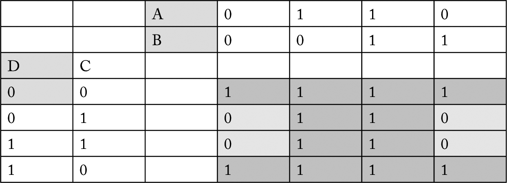
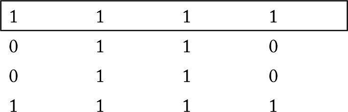
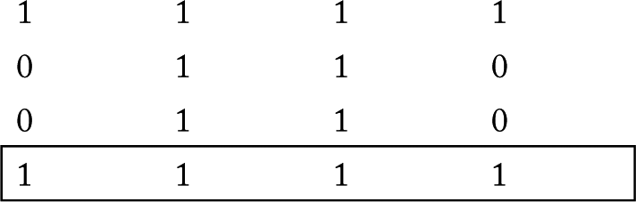
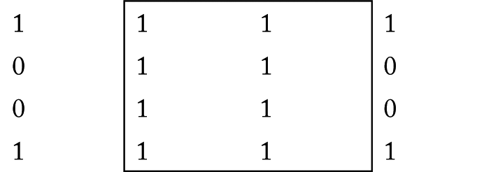
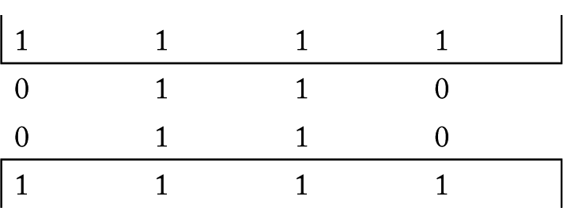
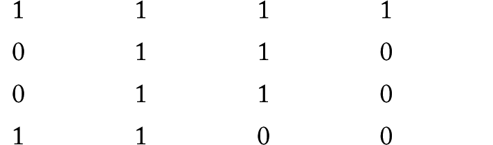
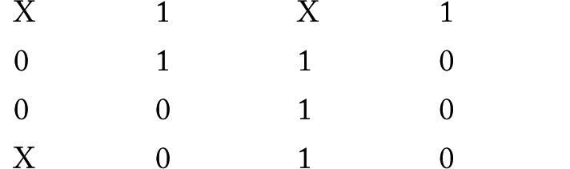

## Karnaughova mapa {#karnaughova-mapa}

Myslím si, že Karnaughova mapa je užitečná pomůcka, když se snažíte přijít na to, jak poskládat ze základních hradel AND, OR a NOT nějakou logickou funkci, kterou máte zadanou například ve formě tabulky, někdy i neúplné, a není to na první pohled patrné. Ideální jsou Karnaughovy mapy pro hledání funkcí tří nebo čtyř proměnných.

Představte si, že máte zadanou funkci čtyř proměnných pomocí tabulky:

| D | C | B | A | Y |
| --- | --- | --- | --- | --- |
| 0 | 0 | 0 | 0 | 1 |
| 0 | 0 | 0 | 1 | 1 |
| 0 | 0 | 1 | 0 | 1 |
| 0 | 0 | 1 | 1 | 1 |
| 0 | 1 | 0 | 0 | 0 |
| 0 | 1 | 0 | 1 | 1 |
| 0 | 1 | 1 | 0 | 0 |
| 0 | 1 | 1 | 1 | 1 |
| 1 | 0 | 0 | 0 | 1 |
| 1 | 0 | 0 | 1 | 1 |
| 1 | 0 | 1 | 0 | 1 |
| 1 | 0 | 1 | 1 | 1 |
| 1 | 1 | 0 | 0 | 0 |
| 1 | 1 | 0 | 1 | 1 |
| 1 | 1 | 1 | 0 | 0 |
| 1 | 1 | 1 | 1 | 1 |

Možná vidíte pravidelnost ve výsledcích a dokážete si logickou funkci odvodit sami. Ale pokud ne (a pravděpodobně bez cviku nevidíte nic), tak nastává čas pro kreslení mapy.

Mapa má tolik políček, aby pokryla všechny kombinace – tedy pro čtyři proměnné to je 16 polí v matici 4 × 4\. Sloupce budou řízené podle proměnných A a B, řádky podle C a D, ovšem platí jedno důležité pravidlo: každý řádek (sloupec) se liší od svých sousedních řádků (sloupců) liší pouze v hodnotě jedné proměnné: 00 – 01 – 11 – 10

Do mapy zapíšete požadované hodnoty – viz tabulka nahoře. Teď musíte najít takzvané „smyčky“ – oblasti se samými jedničkami, které zabírají dvě, čtyři nebo osm sousedících buňek. Ano, trochu to připomíná Tetris, ale ty tvary jsou jen „úsečka“ a „obdélník“. Snažte se najít co největší plochy. Smyčky se mohou překrývat.

Při hledání smyček můžete přecházet i přes hrany tabulky – jako by se jednalo o nekonečné opakování, takže například v hořejší tabulce můžete udělat smyčku osmi prvků, která zahrnuje první a poslední řádek.

Když máte smyčky hotové a pokryté všechny jedničky, můžete každé smyčce přiřadit její výraz. Například pro smyčku, tvořenou prvním řádkem (CD = 00) by to bylo „NOT C AND NOT D“ – tedy pokud je C = 0 a zároveň D = 0, je výsledek 1.

Smyčka čtyř buněk v posledním řádku je D = 1 AND C = 0, tedy D AND NOT C.

Smyčka tvořená prostředními dvěma sloupci platí pro stavy AB = 10 a 11\. Protože se B mění, můžeme ho zanedbat a říct jen, že výsledek bude 1, když je A = 1.

Je výhodné spojit první a poslední řádek do smyčky. Pak platí, že smyčka je aktivní pro C = 0 (D se mění, ignorujeme ho). Pro takovou smyčku tedy platí výraz NOT C.

No a teď můžeme jednotlivé výrazy spojit pomocí OR: A OR NOT C

Jednoduché to bylo? Dobře, zkuste složitější:

Máte? Správnou odpověď najdete níže.

Karnaughova mapa se hodí i v situacích, kdy funkce není zadána úplně, respektive zadavateli je jedno, jestli při určité kombinaci bude na výstupu 0, nebo 1\. Pak takové nezadané hodnoty zapíšete jako X a můžete si vybrat: Když se vám hodí takové políčko do smyčky, tak ho zahrňte a považujte za jedničku, když se nikam nehodí, považujte ho za 0 a ignorujte ho.

V takovémto případě zvolím jednu smyčku v prvním řádku (NOT C AND NOT D), jednu smyčku ve třetím sloupci (A AND B) a jednu smyčku 2 × 2 v horní části tabulky (NOT D AND A)

A správná odpověď na testovací příklad? Zvolil bych tyto smyčky: NOT C AND NOT B, NOT C AND NOT D a C AND A
