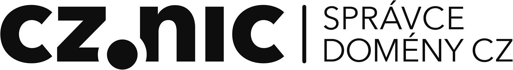

# Table of Contents {#table-of-contents}

[Poděkování](#pod-kov-n)

[Předmluva vydavatele](predmluva_vydavatele.md)

Předmluva mentora

Výmluvy místo předmluvy

1 Budu velkým elektronikem a budu stavět hrozně cool obvody!

1.1 Blikač

[1.2 „Dílna“](obsah/README.md#520365470321849-1_2___Dilna)

1.3 Kde nakoupit součástky?

[1.4 Nákupní seznam: Součástky pro blikač](obsah/README.md#520365470321849-1_4_Nakupni_seznam__Soucastky_pr_2)

[1.4.1 LED](obsah/141.md)

[1.4.2 Rezistory](obsah/142.md)

[1.4.3 Kondenzátory](obsah/143.md)

[1.4.4 Integrované obvody](obsah/144.md)

2 Postavte si blikač – teď už to snad půjde lépe

[2.1 Který rezistor je ten pravý?](obsah/144.md#520365470321849-2_1_Ktery_rezistor_je_ten_pravy_2)

[2.2 Měření multimetrem](obsah/144.md#520365470321849-2_2_Mereni_multimetrem_2)

[2.3 LED podrobněji](obsah/144.md#520365470321849-2_3_LED_podrobneji)

3 Hlava, koleno, zem…

[3.1 „Nemá to něco společného s atomy?“](obsah/144.md#520365470321849-3_1___Nema_to_neco_spolecneho_s_2)

3.2 Napětí

3.3 Proud

3.4 Vodič a nevodič

3.5 Odpor

3.6 Měření, měření!

3.7 Ohmův zákon

3.8 Výkon

[3.9 … a malé opáčko](obsah/144.md#520365470321849-3_9_____a_male_opacko)

[3.9.1 Násobky a podíly](obsah/391.md)

3.10 Zkratky u značení

[3.11 Vyvolená čísla](obsah/391.md#520365470321849-3_11_Vyvolena_cisla)

3.12 Pro lepší představu

3.13 Střídavý proud

3.14 Zkrat

[3.15 Multimetr jako zkrat?](obsah/391.md#520365470321849-3_15_Multimetr_jako_zkrat_2)

[3.16 Elektromagnetická indukce](obsah/391.md#520365470321849-3_16_Elektromagneticka_indukce_2)

3.17 Značky pro schémata

[3.17.1 Kroužek, nebo ne?](obsah/3171.md)

[4 Zdroje napětí](obsah/3171.md#520365470321849-4_Zdroje_napeti_2)

[4.1 Společná zem](obsah/3171.md#520365470321849-4_1_Spolecna_zem)

[5 Vedle sebe, za sebou](obsah/3171.md#520365470321849-5_Vedle_sebe__za_sebou_2)

[5.1 Svítilna s LEDkou](obsah/3171.md#520365470321849-5_1_Svitilna_s_LEDkou)

5.2 Sériové zapojení

[5.3 Dělič napětí](obsah/3171.md#520365470321849-5_3_Delic_napeti)

5.4 Paralelní zapojení

5.5 Kirchhof 2

[5.6 Baterie sériově – paralelně](obsah/3171.md#520365470321849-5_6_Baterie_seriove___paralelne_2)

5.7 Potenciometr

5.8 Úbytek napětí na LED

[5.9 Co jsou vlastně ty diody zač?](obsah/3171.md#520365470321849-5_9_Co_jsou_vlastne_ty_diody_zac_2)

5.10 Datasheet

HRADLA, VOLTY, JEDNOČIPY

Úvod do bastlení

Martin Malý

Vydavatel:

CZ.NIC, z. s. p. o.

Milešovská 5, 130 00 Praha 3

Edice CZ.NIC

www.nic.cz

1\. vydání, Praha 2017

Kniha vyšla jako 16\. publikace v Edici CZ.NIC.

ISBN 978-80-88168-24-9

© 2017 Martin Malý

Toto autorské dílo podléhá licenci Creative Commons

([creativecommons.org/licenses/by-nd/3.0/cz/](http://creativecommons.org/licenses/by-nd/3.0/cz/)),

a to za předpokladu, že zůstane zachováno označení autora díla a prvního vydavatele díla, sdružení CZ.NIC, z. s. p. o. Dílo může být překládáno a následně šířeno v písemné či elektronické formě na území kteréhokoliv státu.

#### Poděkování {#pod-kov-n}