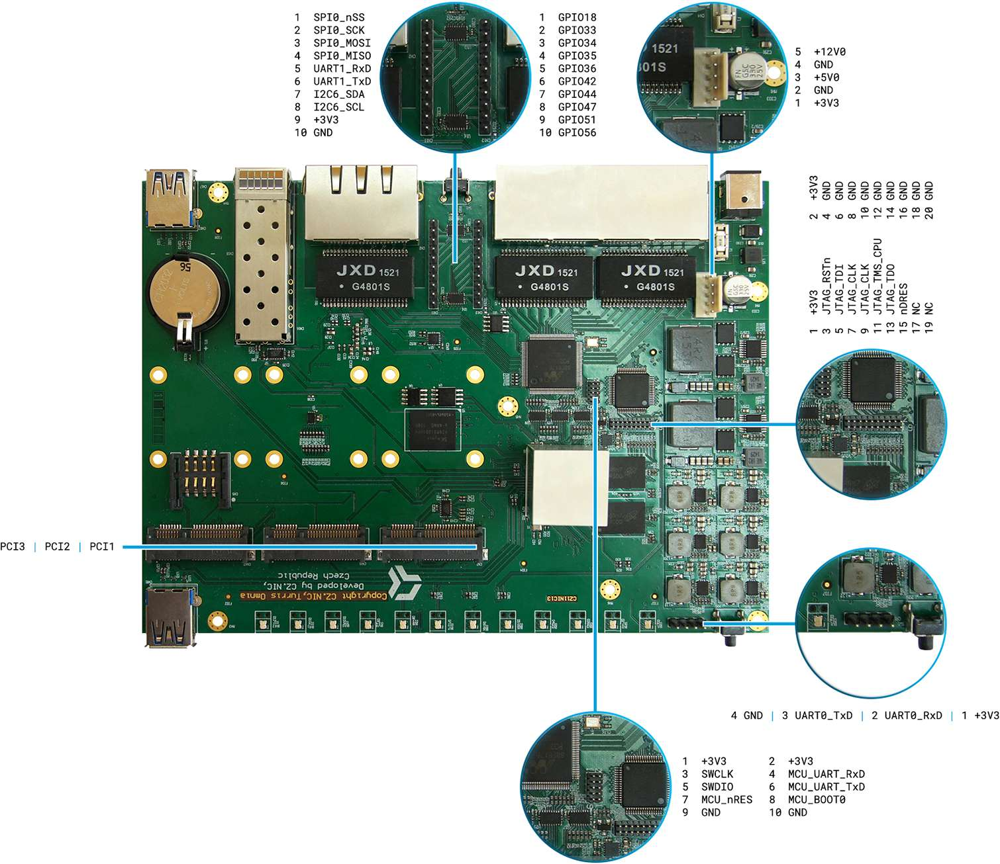

# Turris Omnia pro experimenty s elektronikou {#turris-omnia-pro-experimenty-s-elektronikou}

Sdružení CZ.NIC, vydavatel této knihy, vyrábí a dodává routery s označením Turris Omnia. Tyto routery jsou navrženy jako jednodeskové počítače s procesorem ARM, na kterých běží distribuce Linuxu, založená na OpenWrt. Na rozdíl od většiny routerů, které jsou koncipovány jako uzavřené zařízení, jsou routery Turris otevřené. Díky této otevřenosti s nimi můžete pracovat jako třeba s Raspberry Pi – pomocí SSH konzoly se k nim připojíte jako k jinému počítači s Linuxem, a můžete instalovat balíčky, spouštět programy, nastavovat konfiguraci (ale nezapomeňte, že při tom všem musí router ještě vyřizovat veškerý internetový provoz)…

Otevřená koncepce vedla konstruktéry k tomu, že u první várky Omnií, připravené především pro kampaň na IndieGoGo, vyvedli některé signály z procesoru na speciální aplikační konektor (viz [www.turris.cz/doc/_media/omnia-pinout.png](https://www.turris.cz/doc/_media/omnia-pinout.png)):

Těmito výstupy jsou vybaveny 1 GB modely, v době psaní knihy jsou stále ještě k dispozici. Do budoucna se budou dodávat pouze 2 GB verze.

Vidíte, že máte k dispozici napájecí napětí 3,3 V (dejte pozor a nepřipojte omylem zařízení, které posílá 5 voltů), 10 univerzálních pinů (GPIO), sběrnici SPI, sběrnici I2C a sériové rozhraní UART.

Nejjednodušší použití těchto portů nabízí programovací jazyk Python. Viz dokumentace ([www.turris.cz/doc/cs/howto/gpio](https://www.turris.cz/doc/cs/howto/gpio)). Pokud chcete začít klasickým „LED BLINK“ příkladem, můžete postupovat podle tohoto návodu.

Připojte LED mezi pin GPIO18 a zem. Nezapomeňte na omezovací rezistor! U Turrisu Omnia můžete odebírat proud z GPIO výstupu max. 5 mA, takže rezistor by měl mít minimálně 660 ohmů. Zvolte ale vyšší, třeba 2k2.

Pomocí kódu v Pythonu pak můžete bliknout:

import turris_gpio as gpio

gpio.setmode(gpio.BCM)

gpio.setup(18, gpio.OUT)

gpio.output(18, True)

time.sleep(10)

gpio.output(18, False)

gpio.cleanup()

Další příklady naleznete v dokumentaci.

K Omnii lze připojit například jeden bezdrátový modul nRF24L01 (přes rozhraní SPI) a vytvořit si tak „domácí bezdrátový hub“, s nímž budou komunikovat další čidla, používající tentýž typ modulů.

Bohužel je ve firmware, který je dostupný v době psaní knihy, zakázané rozhraní SPI. K jeho použití je zapotřebí upravený soubor /boot/dtb. Do budoucna by to mělo být jinak, proto doporučuju intenzivně sledovat aktuální verzi dokumentace. Existuje i řešení, které nasimuluje SPI rozhraní na volných GPIO portech ([blog.jfila.cz/2014/11/zprovozneni-spi-na-openwrt.html](http://blog.jfila.cz/2014/11/zprovozneni-spi-na-openwrt.html))

Turris Omnia tedy umožňuje připojení různých senzorů a komunikačních zařízení „napřímo“. Pomocí vlastních obslužných programů pak s těmito senzory můžete pracovat. Podpora a dokumentace jsou ale v době psaní této knihy poměrně skoupé na informace a pro úplného začátečníka bych proto Omnii jako platformu na experimenty nedoporučoval.